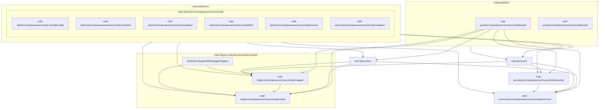

```mermaid
flowchart TD
    subgraph mall-admin/src/
        subgraph mall-admin/src/main/java/com/macro/mall/
            mall-admin/src/main/java/com/macro/mall/config/[mall-admin/src/main/java/com/macro/mall/config/]
            mall-admin/src/main/java/com/macro/mall/controller/[mall-admin/src/main/java/com/macro/mall/controller/]
            mall-admin/src/main/java/com/macro/mall/dao/[mall-admin/src/main/java/com/macro/mall/dao/]
            mall-admin/src/main/java/com/macro/mall/dto/[mall-admin/src/main/java/com/macro/mall/dto/]
            mall-admin/src/main/java/com/macro/mall/service/[mall-admin/src/main/java/com/macro/mall/service/]
            mall-admin/src/main/java/com/macro/mall/validator/[mall-admin/src/main/java/com/macro/mall/validator/]
        end
    end
    mall-common/src/main/java/com/macro/mall/common/[mall-common/src/main/java/com/macro/mall/common/]
    mall-demo/src/[mall-demo/src/]
    subgraph mall-mbg/src/main/java/com/macro/mall/
        MyBatisCodegenWithSwaggerSupport[MyBatisCodegenWithSwaggerSupport]
        mall-mbg/src/main/java/com/macro/mall/mapper/[mall-mbg/src/main/java/com/macro/mall/mapper/]
        mall-mbg/src/main/java/com/macro/mall/model/[mall-mbg/src/main/java/com/macro/mall/model/]
    end
    subgraph mall-portal/src/
        mall-portal/src/main/java/com/macro/mall/portal/[mall-portal/src/main/java/com/macro/mall/portal/]
        mall-portal/src/test/java/com/macro/mall/portal/[mall-portal/src/test/java/com/macro/mall/portal/]
    end
    mall-search/src/[mall-search/src/]
    mall-security/src/main/java/com/macro/mall/security/[mall-security/src/main/java/com/macro/mall/security/]

    %% 依赖关系
    mall-admin/src/ --> mall-common/src/main/java/com/macro/mall/common/
    mall-admin/src/ --> mall-mbg/src/main/java/com/macro/mall/mapper/
    mall-admin/src/ --> mall-mbg/src/main/java/com/macro/mall/model/
    mall-admin/src/ --> mall-security/src/main/java/com/macro/mall/security/
    mall-admin/src/ --> mall-search/src/
    mall-admin/src/ --> mall-demo/src/

    mall-portal/src/main/java/com/macro/mall/portal/ --> mall-common/src/main/java/com/macro/mall/common/
    mall-portal/src/main/java/com/macro/mall/portal/ --> mall-mbg/src/main/java/com/macro/mall/mapper/
    mall-portal/src/main/java/com/macro/mall/portal/ --> mall-mbg/src/main/java/com/macro/mall/model/
    mall-portal/src/main/java/com/macro/mall/portal/ --> mall-security/src/main/java/com/macro/mall/security/
    mall-portal/src/main/java/com/macro/mall/portal/ --> mall-search/src/
    mall-portal/src/ --> mall-demo/src/

    mall-search/src/ --> mall-common/src/main/java/com/macro/mall/common/
    mall-search/src/ --> mall-mbg/src/main/java/com/macro/mall/mapper/
    mall-search/src/ --> mall-mbg/src/main/java/com/macro/mall/model/

    mall-demo/src/ --> mall-common/src/main/java/com/macro/mall/common/
    mall-demo/src/ --> mall-mbg/src/main/java/com/macro/mall/mapper/
    mall-demo/src/ --> mall-security/src/main/java/com/macro/mall/security/

    mall-security/src/main/java/com/macro/mall/security/ --> mall-common/src/main/java/com/macro/mall/common/

    mall-mbg/src/main/java/com/macro/mall/mapper/ --> mall-mbg/src/main/java/com/macro/mall/model/
    MyBatisCodegenWithSwaggerSupport --> mall-mbg/src/main/java/com/macro/mall/model/
    MyBatisCodegenWithSwaggerSupport --> mall-mbg/src/main/java/com/macro/mall/mapper/
```