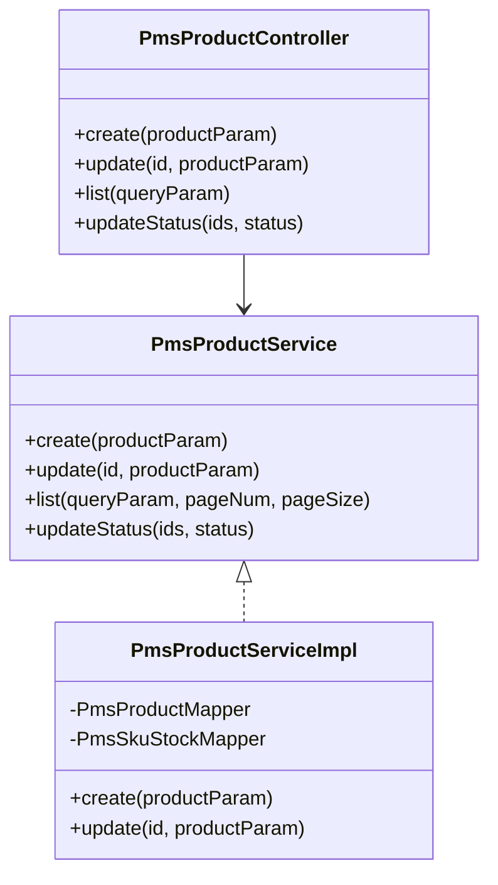
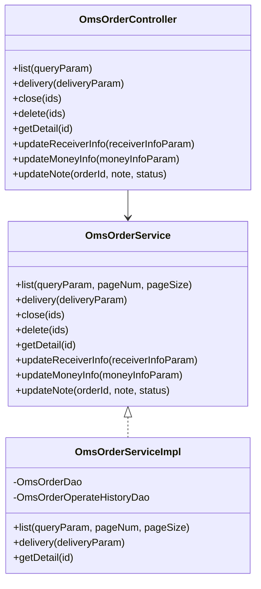
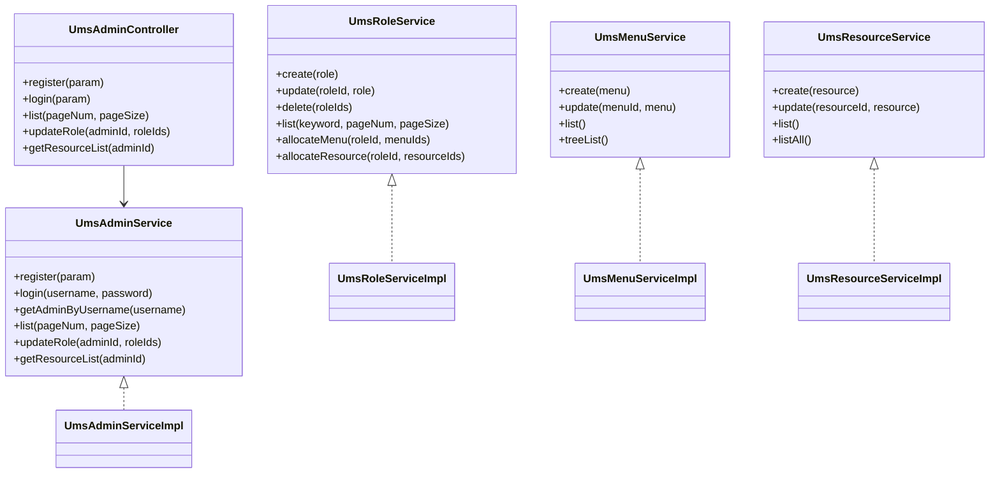
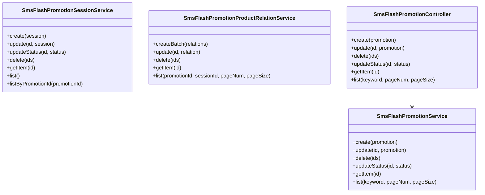
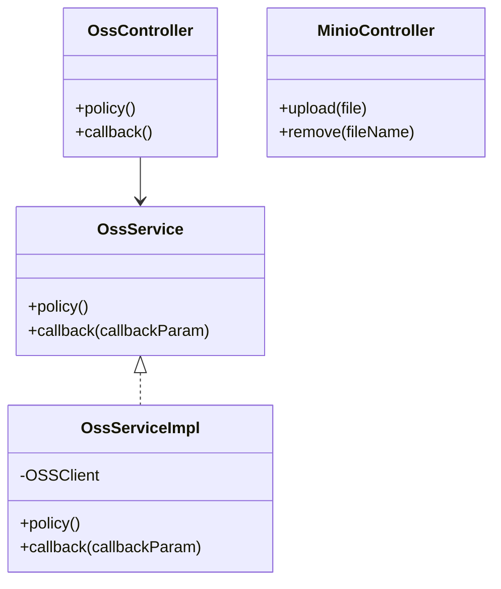

# mall-admin后台管理模块

## 1. 模块所在目录

该模块包含以下目录：

- `mall-admin/src/main/java/com/macro/mall/dao/`
- `mall-admin/src/main/java/com/macro/mall/dto/`
- `mall-admin/src/main/java/com/macro/mall/validator/`
- `mall-admin/src/main/java/com/macro/mall/config/`
- `mall-admin/src/main/java/com/macro/mall/controller/`
- `mall-admin/src/main/java/com/macro/mall/service/`
- `mall-admin/src/main/java/com/macro/mall/service/impl/`
- `mall-admin/src/main/java/com/macro/mall/bo/`

## 2. 模块介绍

> 核心模块

mall-admin后台管理模块是商城系统的核心支撑，涵盖后台管理系统的配置管理、数据访问、业务服务实现、接口控制器及数据传输对象。该模块支持商品、订单、权限、促销、会员、内容推荐等核心业务功能，实现了高内聚与模块化管理，确保系统的统一入口和业务集中处理。

该模块采用分层架构设计，集成了统一的配置管理、标准化的业务逻辑处理及严密的数据校验机制。通过整合各领域核心服务接口和数据传输对象，提升了代码复用性、一致性和维护效率。模块注重接口规范化与集中管理，支持多维度业务扩展与高效的前后端协作，保障系统的稳定性、可扩展性和高效运营。

## 3. 职责边界

mall-admin后台管理模块主要负责商城后台系统的核心业务管理与服务实现，包括商品、订单、权限、促销、会员及内容推荐等关键业务功能的配置管理、数据访问、业务逻辑处理、接口控制及数据传输对象封装。该模块专注于后台管理系统的高内聚与模块化设计，提供统一的配置管理、安全认证、业务流程标准化及数据校验机制，确保系统的稳定性和维护性。mall-admin模块不涉及前台用户交互、商品搜索及支付等功能，这些职责分别由mall-portal门户系统模块和mall-search搜索模块承担。同时，mall-common基础模块负责提供通用基础设施支持，mall-security模块承担安全认证与权限控制，mall-mbg模块负责标准化的数据模型与代码生成。模块间通过清晰的接口和服务契约进行协作，保持职责的单一性和边界的明确性，确保系统各部分功能分工合理、互不干扰，支持系统的可扩展性和高效运营。

## 4. 同级模块关联

在mall-admin后台管理模块中，涉及到商城系统的后台管理核心业务功能，涵盖商品、订单、权限、促销、会员、内容推荐等。为了实现整体系统的高效协同与模块化管理，mall-admin模块与多个同级模块存在紧密的关联，这些关联模块涵盖了基础设施、安全认证、门户展示、搜索服务以及系统演示等方面，形成了完整的电商系统架构生态。

### 4.1 mall-common基础模块

**模块介绍**
mall-common基础模块提供了项目通用的基础配置、接口响应规范、异常管理、日志采集及Redis服务等基础设施。该模块确保了业务模块在开发和运行过程中的统一规范与高复用性，是整个商城系统的基础支撑，保障了上层业务模块的稳定性和一致性。

### 4.2 mall-mbg代码生成与数据模型模块

**模块介绍**
mall-mbg代码生成与数据模型模块封装了电商系统核心业务数据模型及其关联关系。该模块提供基于MyBatis的标准Mapper接口和自动代码生成支持，实现了数据访问层的标准化与高效维护，极大简化了数据库操作和实体类的管理，促进了系统开发效率。

### 4.3 mall-security安全模块

**模块介绍**
mall-security安全模块构建了基于Spring Security的安全认证与权限控制体系。模块包含JWT认证、动态权限管理、安全异常统一处理及缓存异常监控等功能，有效提升系统的安全性和灵活性，支撑mall-admin后台管理模块的安全访问和权限管理需求。

### 4.4 mall-portal门户系统模块

**模块介绍**
mall-portal门户系统模块构建了商城门户系统的全栈体系，涵盖领域模型、配置管理、业务服务、数据访问、REST接口及异步组件。它支持会员、订单、支付、促销、内容展示等前端核心业务需求，为商城的前端展示和用户交互提供了完整的技术保障和业务支持。

### 4.5 mall-search搜索模块

**模块介绍**
mall-search搜索模块实现了基于Elasticsearch的商品搜索服务。模块涵盖数据结构定义、数据访问层、业务逻辑及系统配置，提供了高效、灵活的搜索及索引管理能力，满足商城系统对商品搜索的性能和准确性要求，提升用户搜索体验。

### 4.6 mall-demo演示模块

**模块介绍**
mall-demo演示模块是基于Spring Boot的电商演示应用。该模块包含配置管理、业务服务、验证注解及REST控制器，展示和验证商城系统主要功能的使用和实现方式，便于开发者理解和快速上手商城系统的各项功能模块。

## 5. 模块内部架构

mall-admin后台管理模块作为商城系统的**核心模块**，内部结构采用了高度模块化的设计，明确划分了职责层次，确保系统的高内聚与易维护性。该模块涵盖系统配置、数据访问、业务逻辑实现、服务接口定义、控制器层以及数据传输对象等子模块，形成了完整的后台管理体系，支撑商品、订单、权限、促销、会员、内容推荐等核心业务功能的统一管理。

### 子模块及其职责

- **数据访问层模块**：负责商城后台各类业务实体的数据库访问操作，包括商品及其属性、分类、批量持久化和复杂查询，实现数据访问层的聚合与优化。

- **业务逻辑实现模块**：整合商城系统核心业务逻辑实现，涵盖商品、订单、促销、权限、会员、优惠券、内容推荐等功能，提供统一、标准化的服务实现层。

- **业务服务接口模块**：定义商城后台管理系统各核心业务和支持服务的服务接口，规范商品、订单、促销、权限、会员、内容推荐及对象存储等模块的业务契约，支持模块化开发与扩展。

- **控制器层模块**：提供商城后台管理系统的RESTful接口统一入口，涵盖商品、订单、权限、促销、内容推荐及对象存储等核心业务的增删改查及管理，方便前后端协作和业务流程统一。

- **数据传输对象（DTO）模块**：统一封装商城各业务领域的数据传输对象，规范参数和结果结构，支持前后端及服务间的数据交互，提升接口一致性和系统可维护性。

- **系统配置模块**：集中管理商城后台系统的Spring相关配置，包括对象存储、安全认证、跨域策略、MyBatis集成及API文档配置，提高配置的统一性和可维护性。

- **数据校验模块**：提供基于javax.validation框架的自定义校验注解及实现，用于业务字段或参数的声明式有效性验证，确保数据安全和一致性。

### 模块内部架构示意图

```mermaid
graph TD
    subgraph mall-admin后台管理模块
        Config[系统配置模块]
        Validator[数据校验模块]
        DAO[数据访问层模块]
        ServiceIntf[业务服务接口模块]
        ServiceImpl[业务逻辑实现模块]
        Controller[控制器层模块]
        DTO[数据传输对象（DTO）模块]
    end

    Config --> ServiceImpl
    Validator --> ServiceImpl
    DAO --> ServiceImpl
    ServiceIntf --> ServiceImpl
    ServiceImpl --> Controller
    DTO --> Controller
    DTO --> ServiceImpl
    Controller -->|调用REST接口| Frontend[前端系统]
    ServiceImpl --> DAO

    style mall-admin后台管理模块 fill:#f9f,stroke:#333,stroke-width:1px

    note right of Config: 集中管理Spring配置，包括OSS、CORS、安全认证等
    note right of Validator: 自定义校验注解，确保数据有效性
    note right of DAO: 聚合数据库访问，支持复杂查询和批量操作
    note right of ServiceIntf: 规范业务接口，支持模块化扩展
    note right of ServiceImpl: 实现核心业务逻辑，保障业务一致性
    note right of Controller: 提供RESTful接口，支持前后端交互
    note right of DTO: 统一参数和结果封装，提升接口规范
```

该架构通过明显的层次划分和模块职责定义，保证了mall-admin后台管理模块的**高内聚性**和**易扩展性**，同时支持系统的稳定运行和高效开发。

## 6. 核心功能组件

mall-admin后台管理模块包含多个**核心功能组件**，涵盖商品管理、订单管理、权限管理、促销活动管理、内容推荐以及对象存储服务等。**这些组件实现了系统的高内聚和模块化管理**，支持后台业务的全面操作与维护，确保了商城后台的高效运行和扩展性。主要核心功能组件包括：

### 6.1 商品管理组件

商品管理组件负责商品的创建、更新、查询及状态管理，涵盖商品基础信息、属性、分类、品牌及SKU库存等多个维度。该组件通过统一的业务逻辑处理，整合了商品多维度数据的持久化与维护，提升了代码复用性和业务一致性。



**Sources Files**

`mall-admin/src/main/java/com/macro/mall/controller/PmsProductController.java`

`mall-admin/src/main/java/com/macro/mall/service/PmsProductService.java`

`mall-admin/src/main/java/com/macro/mall/service/impl/PmsProductServiceImpl.java`

`mall-admin/src/main/java/com/macro/mall/dao/PmsProductDao.java`

`mall-admin/src/main/java/com/macro/mall/dao/PmsSkuStockDao.java`

`mall-admin/src/main/java/com/macro/mall/service/PmsSkuStockService.java`

`mall-admin/src/main/java/com/macro/mall/service/impl/PmsSkuStockServiceImpl.java`


### 6.2 订单管理组件

订单管理组件实现订单生命周期的全流程管理，包括订单查询、发货、关闭、删除、退货申请及退货原因管理。该组件支持订单详细信息的获取、操作历史记录维护以及订单设置功能，保障订单及售后流程的统一和规范。



**Sources Files**

`mall-admin/src/main/java/com/macro/mall/controller/OmsOrderController.java`

`mall-admin/src/main/java/com/macro/mall/service/OmsOrderService.java`

`mall-admin/src/main/java/com/macro/mall/service/impl/OmsOrderServiceImpl.java`

`mall-admin/src/main/java/com/macro/mall/dao/OmsOrderDao.java`

`mall-admin/src/main/java/com/macro/mall/dao/OmsOrderOperateHistoryDao.java`

`mall-admin/src/main/java/com/macro/mall/dto/OmsOrderDetail.java`


### 6.3 权限管理组件

权限管理组件统一管理后台用户、角色、菜单、资源及资源分类，支持权限分配、角色管理、菜单树维护及资源权限的增删改查。该组件提升权限体系的集中性和一致性，便于权限分配及后台用户管理的流程优化。



**Sources Files**

`mall-admin/src/main/java/com/macro/mall/controller/UmsAdminController.java`

`mall-admin/src/main/java/com/macro/mall/service/UmsAdminService.java`

`mall-admin/src/main/java/com/macro/mall/service/UmsRoleService.java`

`mall-admin/src/main/java/com/macro/mall/service/UmsMenuService.java`

`mall-admin/src/main/java/com/macro/mall/service/UmsResourceService.java`

`mall-admin/src/main/java/com/macro/mall/service/impl/UmsAdminServiceImpl.java`

`mall-admin/src/main/java/com/macro/mall/service/impl/UmsRoleServiceImpl.java`

`mall-admin/src/main/java/com/macro/mall/service/impl/UmsMenuServiceImpl.java`

`mall-admin/src/main/java/com/macro/mall/service/impl/UmsResourceServiceImpl.java`


### 6.4 促销活动管理组件

促销活动管理组件涵盖限时购活动、活动场次及商品关联关系管理，实现促销活动的全流程管理。该组件支持活动的创建、编辑、删除、状态变更及分页查询，集成了秒杀活动场次及商品关联的业务逻辑，促进促销活动的统一管理。



**Sources Files**

`mall-admin/src/main/java/com/macro/mall/controller/SmsFlashPromotionController.java`

`mall-admin/src/main/java/com/macro/mall/service/SmsFlashPromotionService.java`

`mall-admin/src/main/java/com/macro/mall/service/SmsFlashPromotionSessionService.java`

`mall-admin/src/main/java/com/macro/mall/service/SmsFlashPromotionProductRelationService.java`

`mall-admin/src/main/java/com/macro/mall/service/impl/SmsFlashPromotionServiceImpl.java`

`mall-admin/src/main/java/com/macro/mall/service/impl/SmsFlashPromotionSessionServiceImpl.java`

`mall-admin/src/main/java/com/macro/mall/service/impl/SmsFlashPromotionProductRelationServiceImpl.java`


### 6.5 对象存储管理组件

对象存储管理组件统一管理MinIO和阿里云OSS文件的上传、删除、策略生成及回调处理。该组件提供一站式接口，简化文件上传授权和回调流程，支持多种存储服务的统一维护和扩展。



**Sources Files**

`mall-admin/src/main/java/com/macro/mall/controller/OssController.java`

`mall-admin/src/main/java/com/macro/mall/service/OssService.java`

`mall-admin/src/main/java/com/macro/mall/service/impl/OssServiceImpl.java`

`mall-admin/src/main/java/com/macro/mall/controller/MinioController.java`

`mall-admin/src/main/java/com/macro/mall/dto/OssCallbackParam.java`

`mall-admin/src/main/java/com/macro/mall/dto/OssPolicyResult.java`

`mall-admin/src/main/java/com/macro/mall/dto/OssCallbackResult.java`
