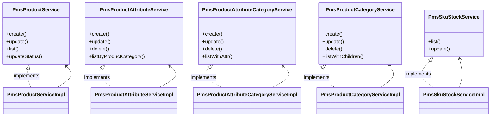
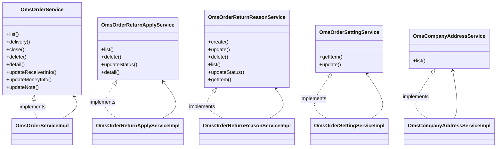
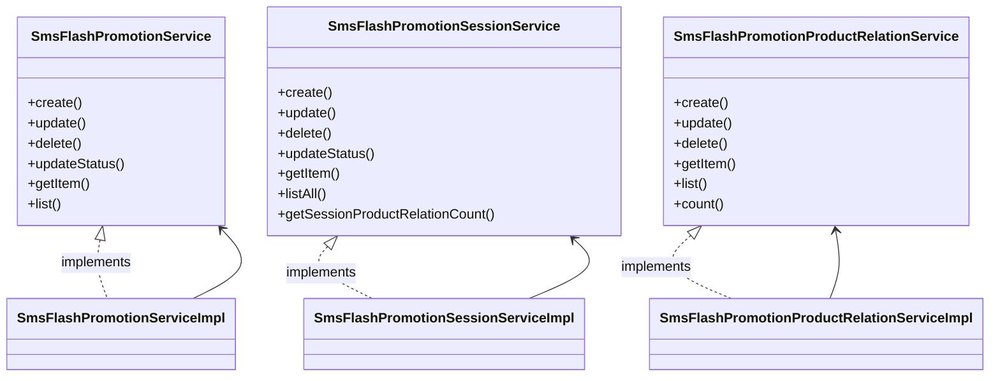
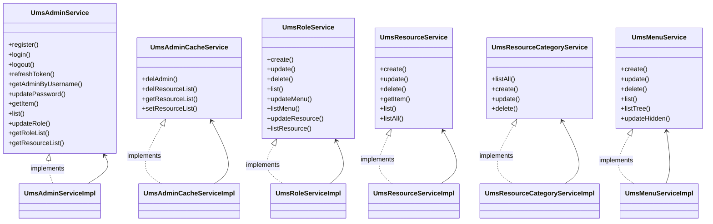
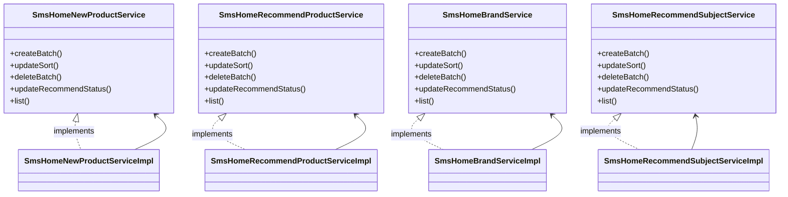

# 业务服务接口模块

## 1. 模块所在目录

该模块位于项目的 `mall-admin/src/main/java/com/macro/mall/service/` 目录下。

## 2. 模块介绍

> 非核心模块

业务服务接口模块定义了商城后台管理系统中各核心业务和支持服务的服务接口，规范了商品、订单、促销、权限、会员、内容推荐及对象存储等模块的业务契约，支持模块化开发与扩展。该模块实现了多领域核心业务的一体化管理，提升了系统的复用性、一致性和维护效率。

模块通过整合和统一管理各领域的服务接口，提供了统一的增删改查、批量操作、分页查询和状态管理功能，增强了接口的复用性和系统一致性。其设计注重模块化和标准化，便于后续功能扩展和多实现支持，为商城后台系统的高效运营和灵活业务响应奠定了坚实基础。

## 3. 职责边界

业务服务接口模块主要负责定义和规范商城后台管理系统中核心业务和支持服务的服务接口，涵盖商品、订单、促销、权限、会员、内容推荐及对象存储等关键领域的业务契约，实现各模块业务操作的统一抽象和集中管理。该模块不负责具体的业务实现逻辑、数据访问操作或安全认证功能，这些由相应的业务实现模块（如mall-admin）、数据模型层（mall-mbg）及安全模块（mall-security）承担。业务服务接口模块通过规范化接口与这些实现模块协同工作，确保业务服务契约的一致性和复用性，同时与基础设施模块（mall-common）和搜索模块（mall-search）保持职责分离，避免职责重叠。通过明确的接口边界，该模块促进了商城系统各核心业务与支持服务的模块化开发、可维护性及扩展性，保障整体系统结构的清晰和高效运营。

## 4. 同级模块关联

在商城后台管理系统中，业务服务接口模块作为非核心模块，定义了各核心业务和支持服务的服务接口，规范了商品、订单、促销、权限、会员、内容推荐及对象存储等模块的业务契约。为了保障系统的高内聚和模块化管理，业务服务接口模块与多个同级模块紧密相关，共同支撑商城系统的稳定运行和业务拓展。

### 4.1 mall-common基础模块

**模块介绍**

mall-common基础模块提供了项目通用的基础配置、接口响应规范、异常管理、日志采集及Redis服务等基础设施。该模块确保了业务模块的统一规范和高复用性，是系统稳定性和一致性的基础支撑。

### 4.2 mall-mbg代码生成与数据模型模块

**模块介绍**

mall-mbg代码生成与数据模型模块封装了电商系统核心业务数据模型及其关联关系，提供基于MyBatis的标准Mapper接口和自动代码生成支持。该模块实现了数据访问层的标准化与高效维护，支持业务服务接口模块的业务逻辑实现。

### 4.3 mall-security安全模块

**模块介绍**

mall-security安全模块构建了基于Spring Security的安全认证与权限控制体系，包含JWT认证、动态权限管理、安全异常统一处理及缓存异常监控。该模块提升了系统的安全性和灵活性，保障业务服务接口模块中涉及的权限和认证功能的安全执行。

### 4.4 mall-admin后台管理模块

**模块介绍**

mall-admin后台管理模块涵盖了后台管理系统的配置管理、数据访问、业务服务实现、接口控制器及数据传输对象。该模块支持商品、订单、权限、促销、会员、内容推荐等核心业务功能，实现了高内聚与模块化管理，是业务服务接口模块的主要实现载体。

### 4.5 mall-portal门户系统模块

**模块介绍**

mall-portal门户系统模块构建了商城门户系统的全栈体系，包括领域模型、配置管理、业务服务、数据访问、REST接口及异步组件。该模块支持会员、订单、支付、促销、内容展示等前端核心业务需求，与业务服务接口模块共同实现系统的业务闭环。

### 4.6 mall-search搜索模块

**模块介绍**

mall-search搜索模块实现了基于Elasticsearch的商品搜索服务，涵盖数据结构定义、数据访问层、业务逻辑及系统配置。该模块提供高效、灵活的搜索及索引管理能力，是业务服务接口模块在商品搜索功能中的重要配套模块。

### 4.7 mall-demo演示模块

**模块介绍**

mall-demo演示模块基于Spring Boot，包含配置管理、业务服务、验证注解及REST控制器。它展示和验证了商城系统主要功能的使用和实现方式，辅助业务服务接口模块的功能演示和测试。

## 5. 模块内部架构

业务服务接口模块**定义了商城后台管理系统中各核心业务和支持服务的服务接口**，通过统一规范商品、订单、促销、权限、会员、内容推荐及对象存储等模块的业务契约，支撑模块化开发与扩展。该模块聚焦于接口层的抽象，明确各领域服务的业务操作协议，提升系统的复用性和可维护性。

该模块**不包含子模块**，其内部架构主要由多个业务服务接口组成，这些接口分别对应商城的主要业务领域，如商品管理、订单管理、促销活动、权限控制、会员服务、内容推荐及核心支持服务等。每个接口定义了该领域的核心增删改查及业务操作方法，服务实现类则具体封装业务逻辑并调用数据访问层完成持久化操作。

整体来看，业务服务接口模块构成了后台管理系统业务层的统一契约层，**通过接口与实现分离的设计，提高了系统模块的内聚性和扩展性**，支持多业务场景下的灵活调用与维护。

```mermaid
graph TD
    A[业务服务接口模块]
    %% 核心业务接口
    A --> B[PmsProductService]
    A --> C[OmsOrderService]
    A --> D[SmsCouponService]
    A --> E[UmsAdminService]
    A --> F[SmsHomeAdvertiseService]
    %% 支持服务接口
    A --> G[OssService]
    A --> H[UmsAdminCacheService]
    %% 其他业务接口
    A --> I[PmsBrandService]
    A --> J[SmsFlashPromotionService]
    A --> K[UmsRoleService]
    A --> L[SmsHomeRecommendProductService]
    %% 实现类
    B --> B1[PmsProductServiceImpl]
    C --> C1[OmsOrderServiceImpl]
    D --> D1[SmsCouponServiceImpl]
    E --> E1[UmsAdminServiceImpl]
    F --> F1[SmsHomeAdvertiseServiceImpl]
    G --> G1[OssServiceImpl]
    H --> H1[UmsAdminCacheServiceImpl]
    I --> I1[PmsBrandServiceImpl]
    J --> J1[SmsFlashPromotionServiceImpl]
    K --> K1[UmsRoleServiceImpl]
    L --> L1[SmsHomeRecommendProductServiceImpl]

    style A fill:#f9f,stroke:#333,stroke-width:2px
    style B,C,D,E,F,G,H,I,J,K,L fill:#bbf,stroke:#333,stroke-width:1px
    style B1,C1,D1,E1,F1,G1,H1,I1,J1,K1,L1 fill:#bfb,stroke:#333,stroke-width:1px
```

## 6. 核心功能组件

业务服务接口模块定义了多个核心功能组件，涵盖了商城后台管理系统中商品管理、订单处理、促销活动、权限控制和内容推荐等关键业务领域。该模块通过统一的服务接口规范，实现了业务契约的标准化与模块化，支持系统的高复用性和灵活扩展性。本章节重点介绍以下五个核心功能组件：商品管理服务、订单管理服务、促销活动管理服务、权限管理服务以及内容推荐管理服务。

### 6.1 商品管理服务

商品管理服务是商城后台的基础核心功能，负责商品信息、属性、分类及库存的维护与管理。该组件提供商品的创建、更新、状态批量修改和分页查询等功能，支持商品属性及属性分类的统一操作，商品分类的层级管理，以及SKU库存的精细化控制。通过该服务，商城能够实现商品数据的全面管理，确保商品信息的准确性和完整性。

**Sources Files**  
`mall-admin/src/main/java/com/macro/mall/service/PmsProductService.java`  
`mall-admin/src/main/java/com/macro/mall/service/PmsProductServiceImpl.java`  
`mall-admin/src/main/java/com/macro/mall/service/PmsProductAttributeService.java`  
`mall-admin/src/main/java/com/macro/mall/service/PmsProductAttributeServiceImpl.java`  
`mall-admin/src/main/java/com/macro/mall/service/PmsProductAttributeCategoryService.java`  
`mall-admin/src/main/java/com/macro/mall/service/PmsProductAttributeCategoryServiceImpl.java`  
`mall-admin/src/main/java/com/macro/mall/service/PmsProductCategoryService.java`  
`mall-admin/src/main/java/com/macro/mall/service/PmsProductCategoryServiceImpl.java`  
`mall-admin/src/main/java/com/macro/mall/service/PmsSkuStockService.java`  
`mall-admin/src/main/java/com/macro/mall/service/PmsSkuStockServiceImpl.java`

### 6.2 订单管理服务

订单管理服务组件涵盖订单的全生命周期管理，包括订单的分页查询、批量操作（发货、关闭、删除）、订单详情获取及订单相关信息（收货人、费用、备注）的更新。此外，退货申请与退货原因的管理同样纳入此组件，确保订单售后服务流程的规范化和高效处理。该组件通过事务管理保障数据一致性和操作的原子性。

**Sources Files**  
`mall-admin/src/main/java/com/macro/mall/service/OmsOrderService.java`  
`mall-admin/src/main/java/com/macro/mall/service/OmsOrderServiceImpl.java`  
`mall-admin/src/main/java/com/macro/mall/service/OmsOrderReturnApplyService.java`  
`mall-admin/src/main/java/com/macro/mall/service/OmsOrderReturnApplyServiceImpl.java`  
`mall-admin/src/main/java/com/macro/mall/service/OmsOrderReturnReasonService.java`  
`mall-admin/src/main/java/com/macro/mall/service/OmsOrderReturnReasonServiceImpl.java`  
`mall-admin/src/main/java/com/macro/mall/service/OmsOrderSettingService.java`  
`mall-admin/src/main/java/com/macro/mall/service/OmsOrderSettingServiceImpl.java`  
`mall-admin/src/main/java/com/macro/mall/service/OmsCompanyAddressService.java`  
`mall-admin/src/main/java/com/macro/mall/service/OmsCompanyAddressServiceImpl.java`

### 6.3 促销活动管理服务

促销活动管理服务负责商城限时购秒杀活动及其关联商品的维护。该组件支持限时购活动的增删改查、状态修改，促销场次的管理操作，以及促销商品与场次的关联关系维护。通过该服务，商城能够灵活管理促销活动的生命周期和商品参与情况，提升促销效果和运营效率。

**Sources Files**  
`mall-admin/src/main/java/com/macro/mall/service/SmsFlashPromotionService.java`  
`mall-admin/src/main/java/com/macro/mall/service/SmsFlashPromotionServiceImpl.java`  
`mall-admin/src/main/java/com/macro/mall/service/SmsFlashPromotionSessionService.java`  
`mall-admin/src/main/java/com/macro/mall/service/SmsFlashPromotionSessionServiceImpl.java`  
`mall-admin/src/main/java/com/macro/mall/service/SmsFlashPromotionProductRelationService.java`  
`mall-admin/src/main/java/com/macro/mall/service/SmsFlashPromotionProductRelationServiceImpl.java`

### 6.4 权限管理服务

权限管理服务涵盖后台管理员用户的注册、登录、权限分配及缓存管理，角色的创建与权限关联管理，资源和资源分类的维护，以及后台菜单的管理。该组件构建了后台管理系统的完整权限控制体系，支持基于JWT的认证与鉴权，缓存优化用户权限数据访问，保障系统安全性和性能。

**Sources Files**  
`mall-admin/src/main/java/com/macro/mall/service/UmsAdminService.java`  
`mall-admin/src/main/java/com/macro/mall/service/UmsAdminServiceImpl.java`  
`mall-admin/src/main/java/com/macro/mall/service/UmsAdminCacheService.java`  
`mall-admin/src/main/java/com/macro/mall/service/UmsAdminCacheServiceImpl.java`  
`mall-admin/src/main/java/com/macro/mall/service/UmsRoleService.java`  
`mall-admin/src/main/java/com/macro/mall/service/UmsRoleServiceImpl.java`  
`mall-admin/src/main/java/com/macro/mall/service/UmsResourceService.java`  
`mall-admin/src/main/java/com/macro/mall/service/UmsResourceServiceImpl.java`  
`mall-admin/src/main/java/com/macro/mall/service/UmsResourceCategoryService.java`  
`mall-admin/src/main/java/com/macro/mall/service/UmsResourceCategoryServiceImpl.java`  
`mall-admin/src/main/java/com/macro/mall/service/UmsMenuService.java`  
`mall-admin/src/main/java/com/macro/mall/service/UmsMenuServiceImpl.java`

### 6.5 内容推荐管理服务

内容推荐管理服务专注于商城首页的内容推荐模块，涵盖新品推荐、人气推荐、品牌推荐和专题推荐的批量管理、排序控制、状态更新及分页查询等操作。该组件通过统一接口实现首页内容的集中管理，提升内容运营效率和用户体验。

**Sources Files**  
`mall-admin/src/main/java/com/macro/mall/service/SmsHomeNewProductService.java`  
`mall-admin/src/main/java/com/macro/mall/service/SmsHomeNewProductServiceImpl.java`  
`mall-admin/src/main/java/com/macro/mall/service/SmsHomeRecommendProductService.java`  
`mall-admin/src/main/java/com/macro/mall/service/SmsHomeRecommendProductServiceImpl.java`  
`mall-admin/src/main/java/com/macro/mall/service/SmsHomeBrandService.java`  
`mall-admin/src/main/java/com/macro/mall/service/SmsHomeBrandServiceImpl.java`  
`mall-admin/src/main/java/com/macro/mall/service/SmsHomeRecommendSubjectService.java`  
`mall-admin/src/main/java/com/macro/mall/service/SmsHomeRecommendSubjectServiceImpl.java`
