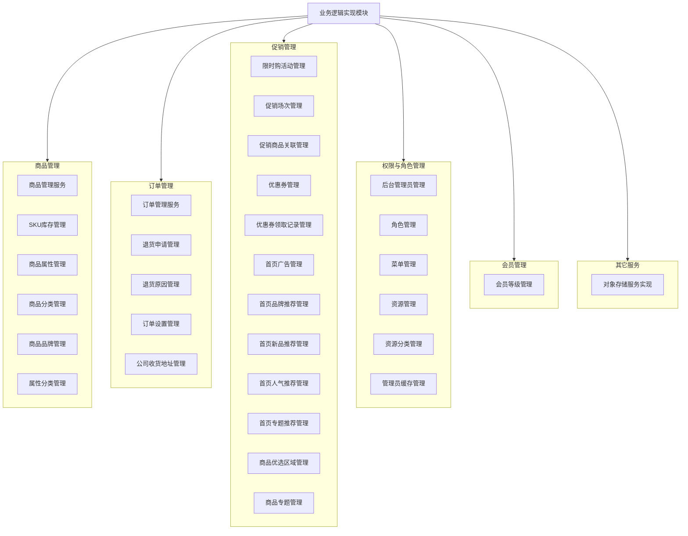
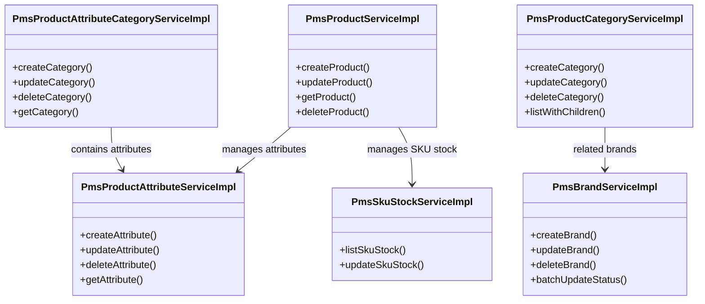
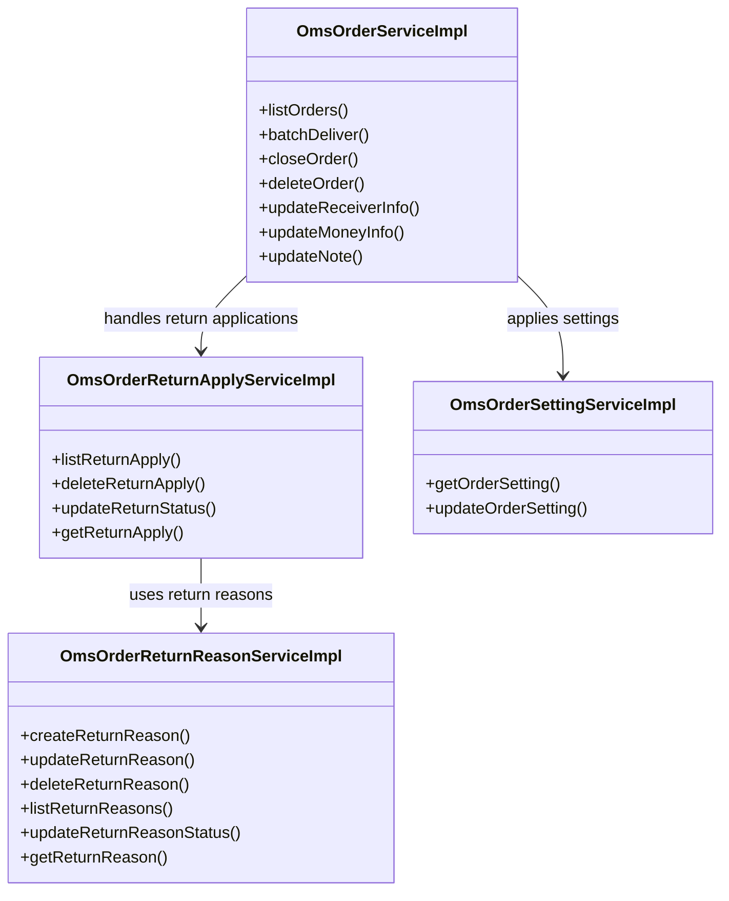
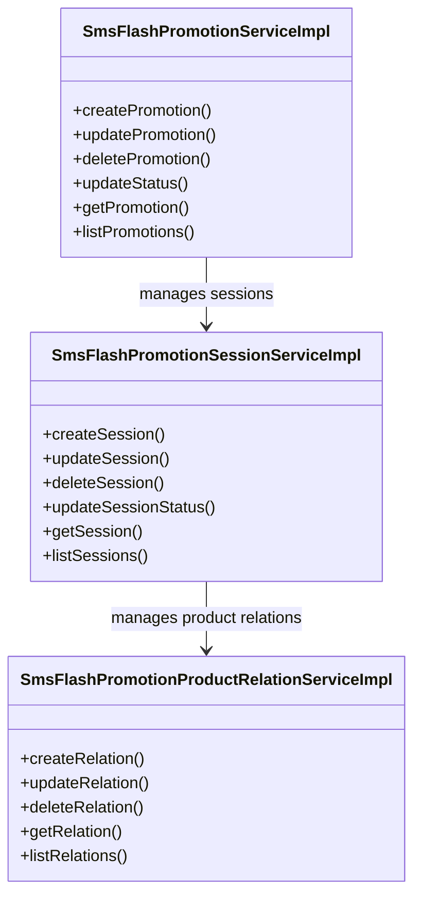
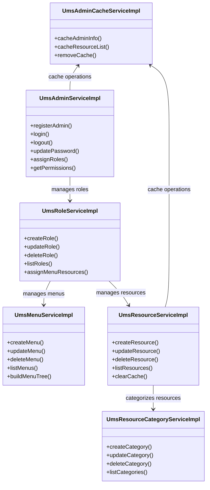
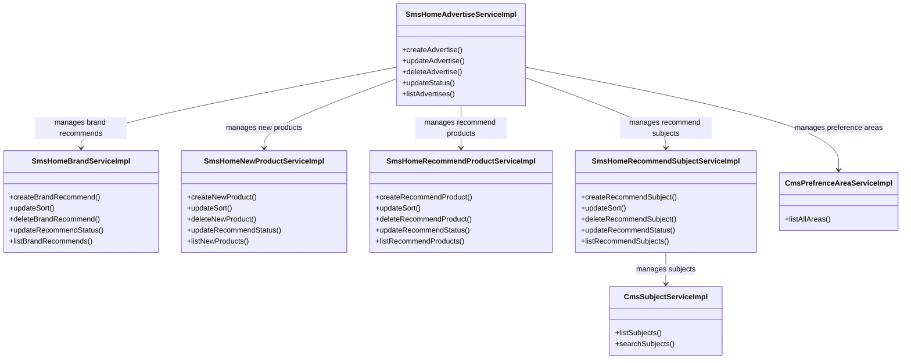

# 业务逻辑实现模块

## 1. 模块所在目录

该模块位于项目的 `mall-admin/src/main/java/com/macro/mall/service/impl/` 目录下。

## 2. 模块介绍

> 非核心模块

业务逻辑实现模块负责整合商城系统的核心业务逻辑，涵盖商品、订单、促销、权限、会员、优惠券及内容推荐等关键功能。该模块提供统一且标准化的服务实现层，确保各业务环节的高效协同和一致性，支持商城系统的稳定运行与业务扩展。

模块设计注重业务逻辑的集中管理与复用，通过统一处理多维度数据和流程，提升系统维护效率和业务一致性。其技术架构支持批量操作、分页过滤、状态控制及层级管理，便于扩展和维护，强化了模块的标准化、可扩展性和高可维护性。

## 3. 职责边界

业务逻辑实现模块专注于商城系统核心业务逻辑的统一实现，涵盖商品管理、订单处理、促销活动、权限控制、会员服务、优惠券管理及内容推荐等关键功能，提供标准化的服务实现层以提升系统一致性和维护效率。该模块不负责基础设施建设、数据模型定义、安全认证与权限底层框架、前端界面展示以及搜索服务等职责，这些由mall-common、mall-mbg、mall-security、mall-portal及mall-search等模块分别承担。通过明晰的职责划分，业务逻辑实现模块聚焦于业务流程与规则的封装，依赖于其他模块提供的底层支持与接口，确保系统架构的高内聚与低耦合，便于后续扩展和高效运营。

## 4. 同级模块关联

业务逻辑实现模块作为商城系统非核心模块，承担着整合核心业务逻辑的职责，涉及商品、订单、促销、权限、会员、优惠券及内容推荐等多个业务领域。与之相关的同级模块涵盖了系统的基础设施、安全保障、后台管理及门户展示等方面，彼此协同支持商城系统的高效运行与维护。以下为与业务逻辑实现模块实际关联的同级模块介绍。

### 4.1 mall-common基础模块

**模块介绍**
mall-common基础模块提供了项目通用的基础配置、接口响应规范、异常管理、日志采集及Redis服务等基础设施。它为业务逻辑实现模块提供了统一规范和高复用性的底层支持，确保各业务模块间的一致性与稳定性。

### 4.2 mall-mbg代码生成与数据模型模块

**模块介绍**
该模块封装了电商系统核心业务的数据模型及其关联关系，提供基于MyBatis的标准Mapper接口和自动代码生成支持。它为业务逻辑实现模块的数据访问层提供了标准化和高效维护的基础，促进数据模型与业务逻辑的紧密结合。

### 4.3 mall-security安全模块

**模块介绍**
mall-security安全模块构建了基于Spring Security的安全认证与权限控制体系，涵盖JWT认证、动态权限管理及安全异常统一处理等功能。它为业务逻辑实现模块提供了安全保障，确保业务操作的合规性和系统的安全性。

### 4.4 mall-admin后台管理模块

**模块介绍**
mall-admin后台管理模块涵盖后台系统的配置管理、数据访问、业务服务实现、接口控制器及数据传输对象，支持商品、订单、权限、促销、会员和内容推荐等核心业务功能。业务逻辑实现模块的具体业务逻辑实现与该模块紧密配合，共同完成系统的核心业务管理。

### 4.5 mall-portal门户系统模块

**模块介绍**
该模块构建了商城门户系统的全栈体系，包含领域模型、配置管理、业务服务、数据访问及REST接口等，支持会员、订单、支付、促销和内容展示等前端核心业务需求。业务逻辑实现模块提供的统一服务实现层为门户系统模块的前端功能提供坚实的后端支持。

### 4.6 mall-search搜索模块

**模块介绍**
mall-search搜索模块基于Elasticsearch实现商品搜索服务，涵盖数据结构定义、数据访问层和业务逻辑。业务逻辑实现模块与搜索模块协作，确保商品及相关数据的完整性和一致性，提升搜索的准确性和响应效率。

### 4.7 mall-demo演示模块

**模块介绍**
mall-demo演示模块基于Spring Boot，包含配置管理、业务服务及REST控制器，旨在展示和验证商城系统主要功能的实现。业务逻辑实现模块的服务实现为演示模块提供真实的业务逻辑支持，助力功能演示和测试。

## 5. 模块内部架构

业务逻辑实现模块作为商城系统的非核心模块，**整合了商城系统核心业务逻辑的多项关键功能**，涵盖商品、订单、促销、权限、会员、优惠券以及内容推荐等多个领域。该模块通过统一、标准化的服务实现层，确保各业务子系统的高效协同和一致性，提升整体维护效率和业务复用性。

该模块当前**不包含独立的子模块划分**，其内部结构主要由多个服务实现类组成，这些类高度聚焦于各业务领域的具体功能实现。业务服务层通过不同的实现类承担各自职责，包括商品信息管理、订单处理、促销活动管理、权限控制、会员体系维护、优惠券管理及内容推荐展示等。各实现类均注重封装核心业务逻辑，屏蔽底层数据访问细节，促进代码复用和系统扩展。

以下Mermaid示意图展示了业务逻辑实现模块的组织结构及关键组件，体现了各业务领域服务实现类之间的模块化分工与协作关系：

该架构图反映了业务逻辑实现模块的核心组成部分以及各关键服务实现类的职责分布，体现了模块内高内聚、职责明确的设计理念。通过这种结构，模块能够支持商城系统的多样化业务需求，同时保持良好的扩展性和维护性。

## 6. 核心功能组件

业务逻辑实现模块整合了商城系统的多个关键业务领域，涵盖了商品管理、订单处理、促销活动、权限控制及内容推荐等多个核心功能组件。模块通过统一和标准化的服务实现层，提升了系统的业务一致性和维护效率。以下将详细介绍其中的主要核心功能组件，包括商品管理、订单管理、促销管理、权限管理和内容推荐管理。

### 6.1 商品管理

商品管理组件负责处理商品的基础信息、属性管理、SKU库存以及品牌和分类的维护。它实现了商品的创建、更新、查询与删除等核心业务逻辑，支持商品属性分类的增删改查以及SKU库存的批量管理，确保商品信息的多维度数据一致性和持久化。

**Sources Files**
`mall-admin/src/main/java/com/macro/mall/service/impl/PmsProductServiceImpl.java`
`mall-admin/src/main/java/com/macro/mall/service/impl/PmsProductAttributeServiceImpl.java`
`mall-admin/src/main/java/com/macro/mall/service/impl/PmsProductAttributeCategoryServiceImpl.java`
`mall-admin/src/main/java/com/macro/mall/service/impl/PmsSkuStockServiceImpl.java`
`mall-admin/src/main/java/com/macro/mall/service/impl/PmsBrandServiceImpl.java`
`mall-admin/src/main/java/com/macro/mall/service/impl/PmsProductCategoryServiceImpl.java`

### 6.2 订单管理

订单管理组件涵盖订单的生命周期管理，包括订单的创建、查询、状态变更、发货、关闭及删除等核心业务操作。同时，订单退货申请和退货原因管理也是该组件的重要组成部分，确保订单相关的退货流程操作规范且可追溯。

**Sources Files**
`mall-admin/src/main/java/com/macro/mall/service/impl/OmsOrderServiceImpl.java`
`mall-admin/src/main/java/com/macro/mall/service/impl/OmsOrderReturnApplyServiceImpl.java`
`mall-admin/src/main/java/com/macro/mall/service/impl/OmsOrderReturnReasonServiceImpl.java`
`mall-admin/src/main/java/com/macro/mall/service/impl/OmsOrderSettingServiceImpl.java`

### 6.3 促销管理

促销管理组件主要负责限时购（秒杀）活动的创建与维护，包括促销活动、场次管理及商品与场次的关联。该组件支持促销活动的状态变更、场次管理以及商品的批量关联操作，方便统一管理商城的促销流程。

**Sources Files**
`mall-admin/src/main/java/com/macro/mall/service/impl/SmsFlashPromotionServiceImpl.java`
`mall-admin/src/main/java/com/macro/mall/service/impl/SmsFlashPromotionSessionServiceImpl.java`
`mall-admin/src/main/java/com/macro/mall/service/impl/SmsFlashPromotionProductRelationServiceImpl.java`

### 6.4 权限管理

权限管理组件实现后台管理员、角色、菜单、资源及资源分类的统一业务逻辑。它支持管理员的注册、登录、角色分配、权限分配以及权限资源和菜单的维护，确保系统权限体系的完整性和灵活扩展。

**Sources Files**
`mall-admin/src/main/java/com/macro/mall/service/impl/UmsAdminServiceImpl.java`
`mall-admin/src/main/java/com/macro/mall/service/impl/UmsRoleServiceImpl.java`
`mall-admin/src/main/java/com/macro/mall/service/impl/UmsMenuServiceImpl.java`
`mall-admin/src/main/java/com/macro/mall/service/impl/UmsResourceServiceImpl.java`
`mall-admin/src/main/java/com/macro/mall/service/impl/UmsResourceCategoryServiceImpl.java`
`mall-admin/src/main/java/com/macro/mall/service/impl/UmsAdminCacheServiceImpl.java`

### 6.5 内容推荐管理

内容推荐管理组件集中实现商城首页广告、品牌推荐、新品推荐、人气推荐商品和专题推荐等推荐展示的核心业务逻辑。它支持推荐内容的批量增删改查、排序管理、推荐状态控制及分页过滤，提升首页及专题推荐内容的维护效率和业务一致性。

**Sources Files**
`mall-admin/src/main/java/com/macro/mall/service/impl/SmsHomeAdvertiseServiceImpl.java`
`mall-admin/src/main/java/com/macro/mall/service/impl/SmsHomeBrandServiceImpl.java`
`mall-admin/src/main/java/com/macro/mall/service/impl/SmsHomeNewProductServiceImpl.java`
`mall-admin/src/main/java/com/macro/mall/service/impl/SmsHomeRecommendProductServiceImpl.java`
`mall-admin/src/main/java/com/macro/mall/service/impl/SmsHomeRecommendSubjectServiceImpl.java`
`mall-admin/src/main/java/com/macro/mall/service/impl/CmsSubjectServiceImpl.java`
`mall-admin/src/main/java/com/macro/mall/service/impl/CmsPrefrenceAreaServiceImpl.java`
