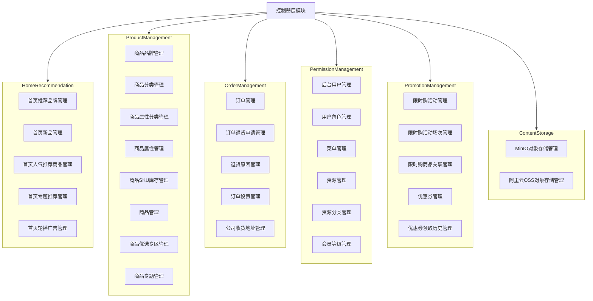
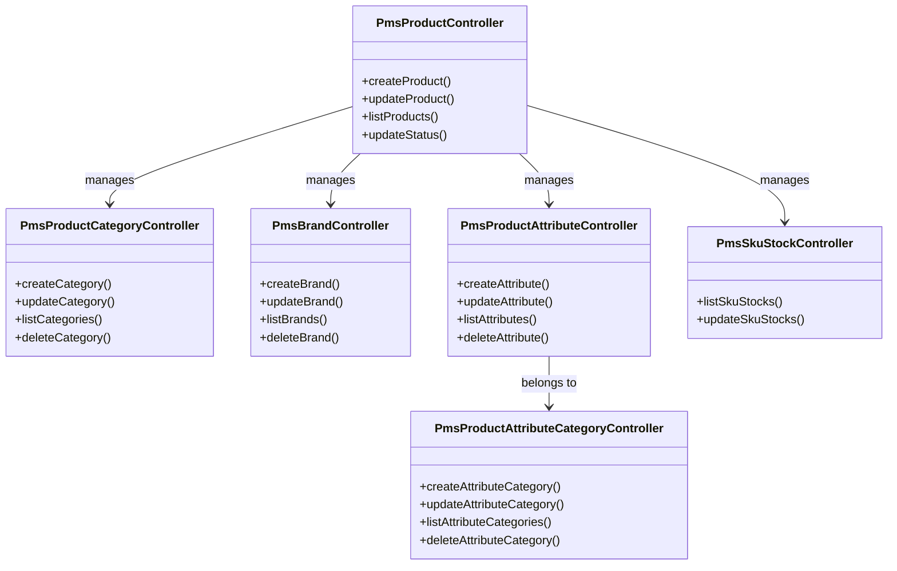
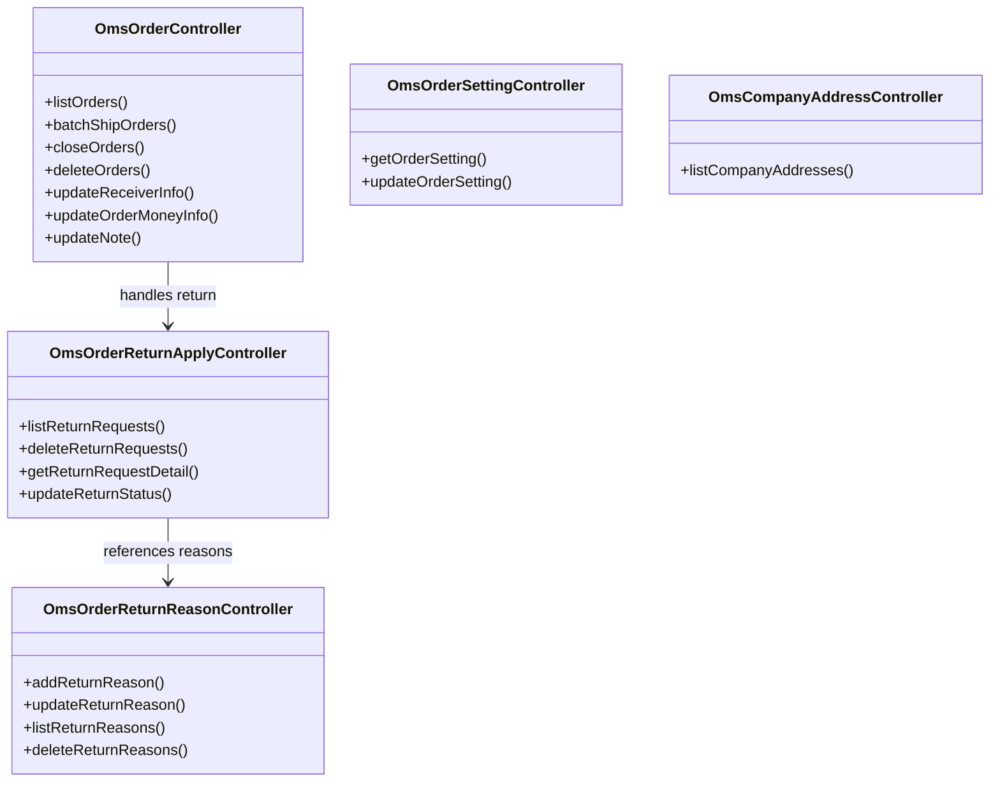
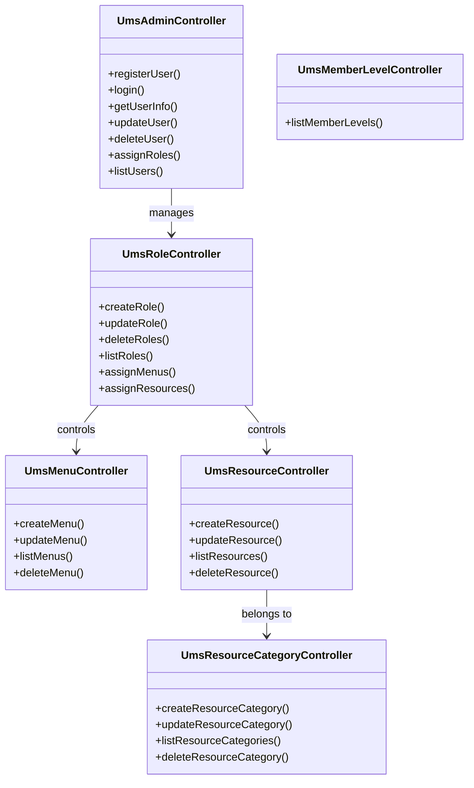
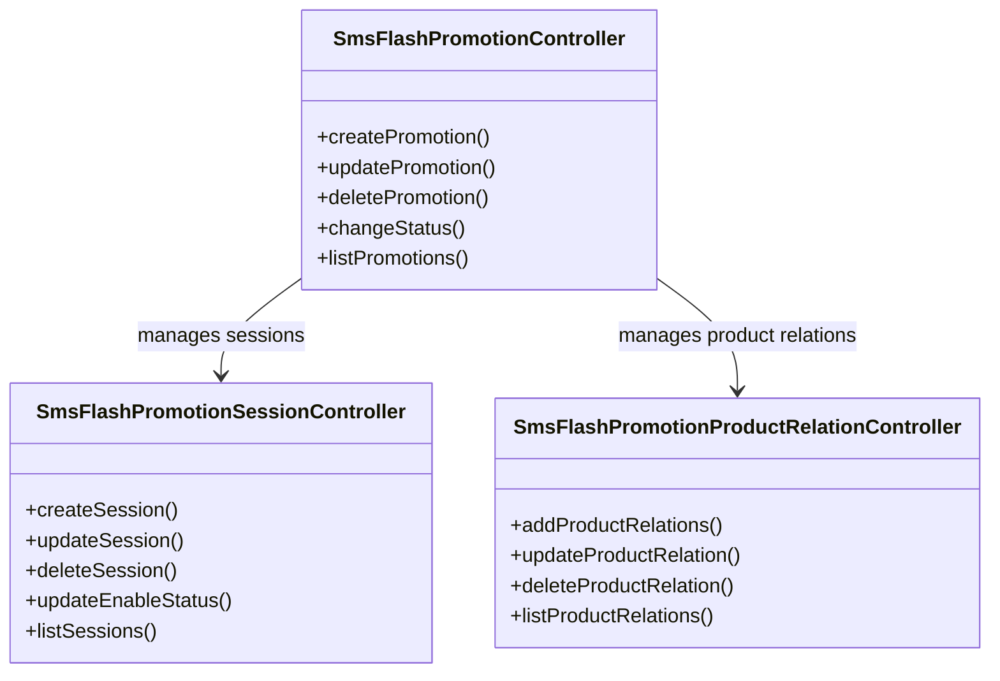
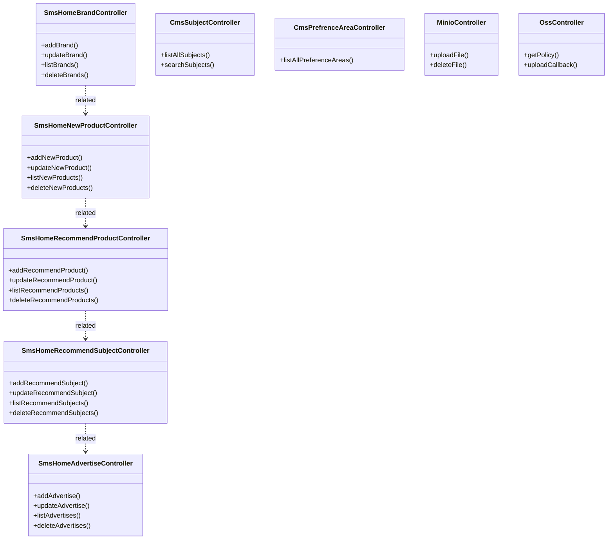

# 控制器层模块

## 1. 模块所在目录

该模块位于项目的 `mall-admin/src/main/java/com/macro/mall/controller/` 目录下。

## 2. 模块介绍

> 非核心模块

控制器层模块为商城后台管理系统提供统一的RESTful接口入口，涵盖商品、订单、权限、促销、内容推荐及对象存储等核心业务的增删改查及管理功能。该模块通过整合各类业务控制器，方便前后端协作及业务流程的统一管理，提升系统整体的操作效率和用户体验。

该模块采用统一接口设计理念，通过合并多个业务领域的管理接口，实现了首页推荐内容、商品管理、订单及售后流程、权限体系、促销活动、优惠券管理、内容运营及对象存储等功能的集中式管理。此种设计不仅提升了代码复用性和模块一致性，也简化了前端调用逻辑和后端维护难度，增强了系统的可扩展性和可维护性。

## 3. 职责边界

控制器层模块专注于提供商城后台管理系统的RESTful接口统一入口，负责涵盖商品、订单、权限、促销、内容推荐及对象存储等核心业务的增删改查及管理操作，支持前后端协作和业务流程统一。该模块不负责具体业务逻辑实现、数据模型定义、安全认证及权限控制，也不涉及前台用户交互和搜索功能，其业务实现分别由mall-admin后台管理模块、mall-mbg代码生成与数据模型模块、mall-security安全模块、mall-portal门户系统模块及mall-search搜索模块承担。控制器层模块通过整合多维度管理接口，实现接口的统一和高效调用，确保业务模块边界清晰，职责单一且与其他模块保持良好的协作关系，提升系统的模块化、可维护性和扩展性。

## 4. 同级模块关联

控制器层模块作为商城后台管理系统的RESTful接口统一入口，紧密关联多个同级模块，这些模块共同支持系统的核心业务功能，包括基础设施、数据模型、安全认证、后台管理、门户系统、搜索服务及演示应用。通过与这些模块的协作，控制器层模块实现了高效的业务流程整合和模块化管理。

### 4.1 mall-common基础模块

**模块介绍**

mall-common基础模块提供了项目通用的基础配置、接口响应规范、异常管理、日志采集及Redis服务等基础设施。该模块确保了业务模块间的统一规范和高复用性，为控制器层模块提供了稳定且一致的基础支持，保障系统整体的健壮性和扩展性。

### 4.2 mall-mbg代码生成与数据模型模块

**模块介绍**

mall-mbg代码生成与数据模型模块封装了电商系统核心业务的数据模型及其关联关系。它提供基于MyBatis的标准Mapper接口和自动代码生成支持，实现了数据访问层的标准化与高效维护。控制器层模块依赖此模块提供的数据模型及访问接口，确保业务数据操作的规范和一致。

### 4.3 mall-security安全模块

**模块介绍**

mall-security安全模块构建了基于Spring Security的安全认证与权限控制体系，包含JWT认证、动态权限管理、安全异常统一处理及缓存异常监控。该模块显著提升了系统的安全性和灵活性，为控制器层模块提供了全面的安全保障和权限控制能力。

### 4.4 mall-admin后台管理模块

**模块介绍**

mall-admin后台管理模块涵盖后台管理系统的配置管理、数据访问、业务服务实现、接口控制器及数据传输对象。它支持商品、订单、权限、促销、会员、内容推荐等核心业务功能，实现了高内聚与模块化管理。控制器层模块即为该模块中的接口控制层，承担了业务接口的统一整合和对外服务职责。

### 4.5 mall-portal门户系统模块

**模块介绍**

mall-portal门户系统模块构建了商城门户系统的全栈体系，包括领域模型、配置管理、业务服务、数据访问、REST接口及异步组件。该模块支持会员、订单、支付、促销、内容展示等前端核心业务需求，控制器层模块通过RESTful接口为门户系统提供后台业务支持，促进前后端的协同发展。

### 4.6 mall-search搜索模块

**模块介绍**

mall-search搜索模块实现了基于Elasticsearch的商品搜索服务，涵盖数据结构定义、数据访问层、业务逻辑及系统配置。它为控制器层模块提供了高效、灵活的搜索及索引管理能力，支持商城系统的商品检索和相关业务查询功能。

### 4.7 mall-demo演示模块

**模块介绍**

mall-demo演示模块是基于Spring Boot的电商演示应用，包含配置管理、业务服务、验证注解及REST控制器。该模块展示和验证商城系统主要功能的使用和实现方式，为控制器层模块的功能实现和测试提供了良好参考与支持。

## 5. 模块内部架构

控制器层模块作为商城后台管理系统的**RESTful接口统一入口**，承担着连接前端请求与后端业务逻辑的桥梁作用。该模块集成了商品、订单、权限、促销、内容推荐及对象存储等多个核心业务领域的增删改查及管理功能，旨在通过统一的接口规范和集中化管理，提升系统的模块化水平和业务流程的协同效率。

该模块**不包含子模块**，其内部由多个功能明确的控制器类组成，各控制器基于Spring MVC框架，分别负责不同业务领域的请求处理。具体包括首页推荐内容管理、商品管理、订单及售后管理、权限管理、促销活动管理、优惠券管理、内容专题管理以及对象存储接口管理等关键业务。通过将这些细分业务的控制层接口整合至同一模块内，确保了系统接口的规范性、一致性和高复用性，便于前后端协作及后续维护扩展。

### 模块内部架构示意图

上述架构图展示了控制器层模块的组织结构，各个控制器类根据业务领域进行归类，形成相互独立且职责明确的功能分区。该设计有助于**提升代码复用性、维护性和模块内聚性**，并为前端系统提供了统一、规范的接口访问入口。

## 6. 核心功能组件

控制器层模块提供了商城后台管理系统的多个**核心功能组件**，涵盖了商品管理、订单管理、权限管理、促销活动管理、内容推荐管理以及对象存储管理等多个领域。通过这些组件，模块实现了**RESTful接口的统一入口**，显著提升了系统的模块化程度和业务流程的统一性，有效支持了前后端的协作和维护工作。以下为该模块的几个主要核心功能组件介绍及其架构示意。

### 6.1 商品管理组件

商品管理组件负责商品相关的全维度管理，包括商品分类、品牌、属性、SKU库存及商品本体的增删改查等功能。该组件通过统一的控制器接口，支持多维度商品信息的维护和查询，极大提升了开发效率和模块一致性，便于业务的扩展和后续维护。

**Sources Files**  
`mall-admin/src/main/java/com/macro/mall/controller/PmsProductController.java`  
`mall-admin/src/main/java/com/macro/mall/controller/PmsProductCategoryController.java`  
`mall-admin/src/main/java/com/macro/mall/controller/PmsBrandController.java`  
`mall-admin/src/main/java/com/macro/mall/controller/PmsProductAttributeController.java`  
`mall-admin/src/main/java/com/macro/mall/controller/PmsProductAttributeCategoryController.java`  
`mall-admin/src/main/java/com/macro/mall/controller/PmsSkuStockController.java`

### 6.2 订单管理组件

订单管理组件整合了订单管理、退货申请、退货原因、订单设置及公司收货地址的管理接口，支持订单及售后流程的全链路管理。该组件通过统一接口集中管理订单生命周期内的各项业务，提高了前后端协作效率和业务流程的优化程度。

**Sources Files**  
`mall-admin/src/main/java/com/macro/mall/controller/OmsOrderController.java`  
`mall-admin/src/main/java/com/macro/mall/controller/OmsOrderReturnApplyController.java`  
`mall-admin/src/main/java/com/macro/mall/controller/OmsOrderReturnReasonController.java`  
`mall-admin/src/main/java/com/macro/mall/controller/OmsOrderSettingController.java`  
`mall-admin/src/main/java/com/macro/mall/controller/OmsCompanyAddressController.java`

### 6.3 权限管理组件

权限管理组件统一管理后台用户、角色、菜单、资源、资源分类及会员等级等权限相关模块。它整合了权限体系中的用户身份、角色授权和资源访问控制，提升了权限管理的集中性与一致性，优化了权限分配、菜单配置与用户管理流程。

**Sources Files**  
`mall-admin/src/main/java/com/macro/mall/controller/UmsAdminController.java`  
`mall-admin/src/main/java/com/macro/mall/controller/UmsRoleController.java`  
`mall-admin/src/main/java/com/macro/mall/controller/UmsMenuController.java`  
`mall-admin/src/main/java/com/macro/mall/controller/UmsResourceController.java`  
`mall-admin/src/main/java/com/macro/mall/controller/UmsResourceCategoryController.java`  
`mall-admin/src/main/java/com/macro/mall/controller/UmsMemberLevelController.java`

### 6.4 促销活动管理组件

促销活动管理组件涵盖限时购活动、活动场次及商品关联的全流程管理接口。该组件实现了创建、管理、关联与查询促销活动的功能，实现了限时购促销活动的集中式管理与业务流程的优化。

**Sources Files**  
`mall-admin/src/main/java/com/macro/mall/controller/SmsFlashPromotionController.java`  
`mall-admin/src/main/java/com/macro/mall/controller/SmsFlashPromotionSessionController.java`  
`mall-admin/src/main/java/com/macro/mall/controller/SmsFlashPromotionProductRelationController.java`

### 6.5 内容推荐与对象存储管理组件

该组件整合了首页推荐品牌、新品、人气推荐商品、专题推荐和轮播广告的管理，同时统一管理商品专题、商品优选专区的内容查询与维护。此外，还包含对对象存储服务（如MinIO和阿里云OSS）的文件上传、删除、策略生成和回调的统一管理接口，为业务系统提供一站式的对象存储管理入口。

**Sources Files**  
`mall-admin/src/main/java/com/macro/mall/controller/SmsHomeBrandController.java`  
`mall-admin/src/main/java/com/macro/mall/controller/SmsHomeNewProductController.java`  
`mall-admin/src/main/java/com/macro/mall/controller/SmsHomeRecommendProductController.java`  
`mall-admin/src/main/java/com/macro/mall/controller/SmsHomeRecommendSubjectController.java`  
`mall-admin/src/main/java/com/macro/mall/controller/SmsHomeAdvertiseController.java`  
`mall-admin/src/main/java/com/macro/mall/controller/CmsSubjectController.java`  
`mall-admin/src/main/java/com/macro/mall/controller/CmsPrefrenceAreaController.java`  
`mall-admin/src/main/java/com/macro/mall/controller/MinioController.java`  
`mall-admin/src/main/java/com/macro/mall/controller/OssController.java`
