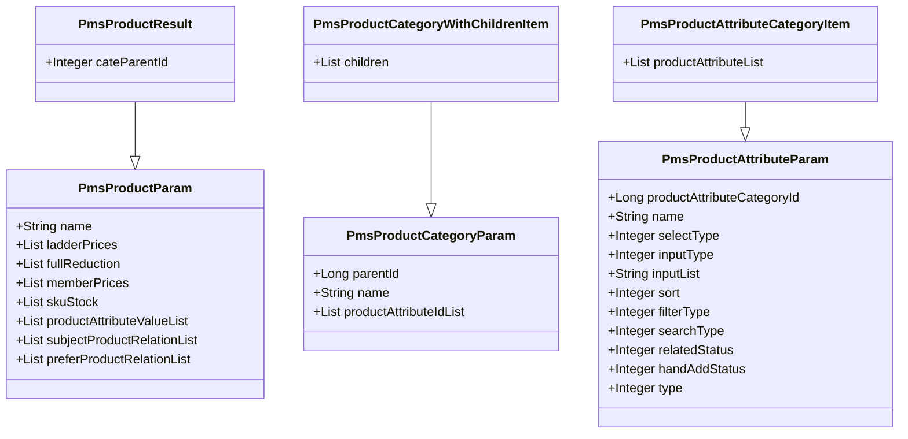
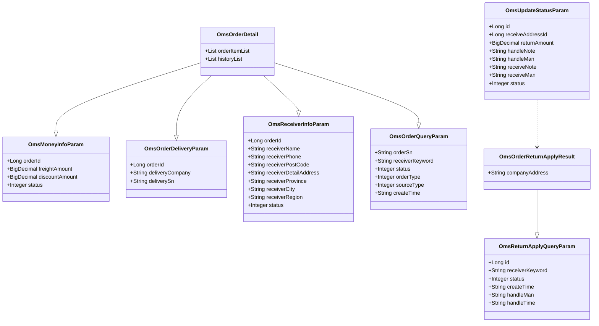
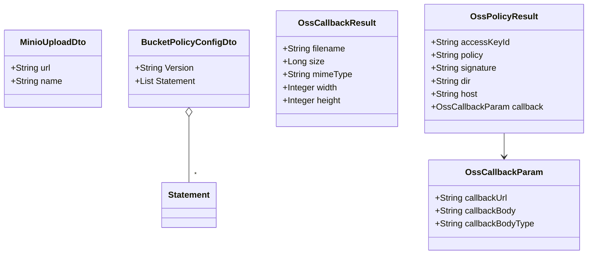
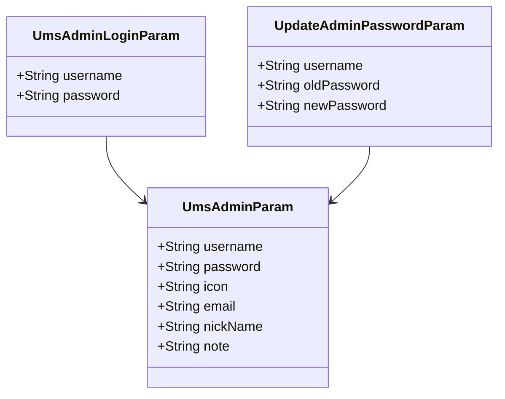
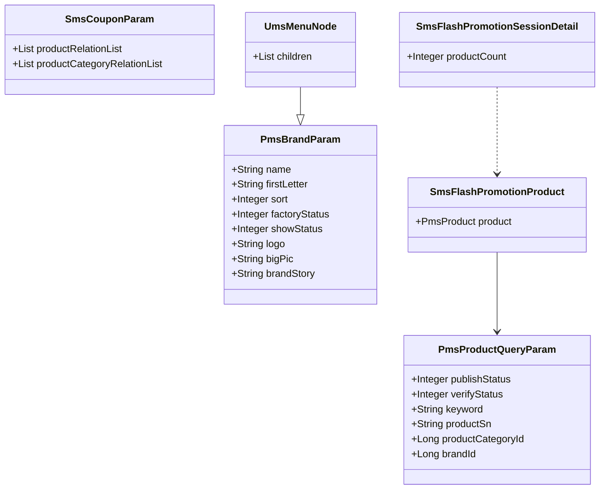

# 数据传输对象（DTO）模块

## 1. 模块所在目录

该模块位于项目的 `mall-admin/src/main/java/com/macro/mall/dto/` 目录下。

## 2. 模块介绍

> 非核心模块

数据传输对象（DTO）模块统一封装商城各业务领域的数据传输对象，规范参数和结果结构，支持前后端及服务间的数据交互，显著提升接口一致性和系统可维护性。该模块涵盖商品、订单、文件存储、管理员账号及核心业务等多维度业务场景，实现数据结构的标准化管理。

模块采用合并封装策略，集中管理各类请求和响应参数对象，简化接口设计与开发流程。通过统一的数据传输规范，增强参数复用和接口规范性，提升系统扩展性和维护效率，促进前后端及服务间的高效协作。

## 3. 职责边界

数据传输对象（DTO）模块专注于统一封装商城各业务领域的数据传输对象，规范接口参数与结果结构，支持前后端及服务间的数据交互，提升接口一致性和系统可维护性。该模块负责管理包括商品、订单、文件存储、管理员账号及核心业务功能等多维度的请求与响应参数对象，实现数据结构的标准化与复用，简化前后端及服务间的交互开发。它不涉及业务逻辑的实现、数据持久化、权限控制或安全认证等功能，这些职责由mall-admin后台管理模块、mall-security安全模块及mall-mbg数据模型模块等承担。DTO模块通过统一的数据结构定义与封装，与各业务功能模块形成清晰的职责划分，确保数据传输的一致性和规范性，同时依赖mall-common基础模块提供的基础设施支持，保证系统整体的高效协作与维护。

## 4. 同级模块关联

数据传输对象（DTO）模块在整个商城系统中承担着**统一封装各业务领域的数据传输结构**的职责，确保前后端及服务间交互的数据格式规范和一致性。与其相关联的同级模块主要涉及基础设施、安全认证、后台管理、门户系统、搜索服务及演示应用，这些模块在不同层面和业务场景中与DTO模块紧密协作，共同支撑系统的高效运行和维护。

### 4.1 mall-common基础模块

**模块介绍**
mall-common基础模块提供了项目通用的基础配置、接口响应规范、异常管理、日志采集及Redis服务等基础设施。该模块为业务模块的统一规范和高复用性提供了坚实保障，是系统整体架构的基础支撑。

### 4.2 mall-mbg代码生成与数据模型模块

**模块介绍**
mall-mbg代码生成与数据模型模块封装了电商系统核心业务的数据模型及其关联关系，提供基于MyBatis的标准Mapper接口和自动代码生成支持。该模块实现了数据访问层的标准化与高效维护，为DTO模块的数据结构提供了底层数据模型支持。

### 4.3 mall-security安全模块

**模块介绍**
mall-security安全模块构建了基于Spring Security的安全认证与权限控制体系，涵盖JWT认证、动态权限管理、安全异常统一处理及缓存异常监控。该模块提升了系统的安全性和灵活性，保障了DTO模块在数据交互过程中的安全认证和权限校验。

### 4.4 mall-admin后台管理模块

**模块介绍**
mall-admin后台管理模块包含后台系统的配置管理、数据访问、业务服务实现、接口控制器及数据传输对象。它支持商品、订单、权限、促销、会员、内容推荐等核心业务功能，实现了高内聚与模块化管理，是DTO模块数据对象的重要应用和维护场景。

### 4.5 mall-portal门户系统模块

**模块介绍**
mall-portal门户系统模块构建了商城门户系统的全栈体系，包括领域模型、配置管理、业务服务、数据访问、REST接口及异步组件。该模块支持会员、订单、支付、促销、内容展示等前端核心业务需求，与DTO模块的数据传输对象紧密配合，实现前端业务功能的数据交互。

### 4.6 mall-search搜索模块

**模块介绍**
mall-search搜索模块实现了基于Elasticsearch的商品搜索服务，涵盖数据结构定义、数据访问层、业务逻辑及系统配置。该模块为商品查询和索引管理提供高效灵活的搜索能力，并依赖DTO模块定义的统一数据传输结构进行数据交互。

### 4.7 mall-demo演示模块

**模块介绍**
mall-demo演示模块基于Spring Boot构建，包含配置管理、业务服务、验证注解及REST控制器。该模块用于展示和验证商城系统主要功能的使用和实现方式，利用DTO模块提供的数据传输对象完成业务流程的模拟和演示。

## 5. 模块内部架构

数据传输对象（DTO）模块**统一封装商城各业务领域的数据传输对象**，规范参数和结果结构，支持前后端及服务间的数据交互，提升接口一致性和系统可维护性。该模块通过丰富的DTO类定义，实现对商品、订单、文件存储、管理员账号及核心业务功能等多个业务领域的参数和结果结构的规范管理，确保数据传输的统一性和复用性。

该模块**无子模块划分**，所有DTO类均集中管理，涵盖商品创建与修改参数、订单管理相关参数、文件上传交互数据、管理员账号安全参数以及促销、优惠券等核心业务功能的参数和结果对象。

以下Mermaid示意图展示了数据传输对象模块的内部架构，描述了模块的组织结构和关键组件类别：

```mermaid
graph TD
    DTO模块 --> 商品相关DTO
    DTO模块 --> 订单相关DTO
    DTO模块 --> 文件存储DTO
    DTO模块 --> 管理员账号DTO
    DTO模块 --> 核心业务功能DTO

    商品相关DTO --> PmsProductParam["PmsProductParam\n(商品创建/修改请求) "]
    商品相关DTO --> PmsProductResult["PmsProductResult\n(商品修改结果) "]
    商品相关DTO --> PmsProductCategoryParam["PmsProductCategoryParam\n(商品分类参数) "]
    商品相关DTO --> PmsProductCategoryWithChildrenItem["PmsProductCategoryWithChildrenItem\n(分类树结构) "]
    商品相关DTO --> PmsProductAttributeParam["PmsProductAttributeParam\n(商品属性参数) "]
    商品相关DTO --> PmsProductAttributeCategoryItem["PmsProductAttributeCategoryItem\n(属性分类及属性列表) "]

    订单相关DTO --> OmsOrderDetail["OmsOrderDetail\n(订单详情) "]
    订单相关DTO --> OmsMoneyInfoParam["OmsMoneyInfoParam\n(订单费用参数) "]
    订单相关DTO --> OmsOrderDeliveryParam["OmsOrderDeliveryParam\n(订单发货参数) "]
    订单相关DTO --> OmsReceiverInfoParam["OmsReceiverInfoParam\n(收货人及状态参数) "]
    订单相关DTO --> OmsOrderReturnApplyResult["OmsOrderReturnApplyResult\n(退货申请结果) "]
    订单相关DTO --> OmsReturnApplyQueryParam["OmsReturnApplyQueryParam\n(退货申请查询参数) "]
    订单相关DTO --> OmsUpdateStatusParam["OmsUpdateStatusParam\n(售后状态更新) "]
    订单相关DTO --> OmsOrderQueryParam["OmsOrderQueryParam\n(订单查询参数) "]

    文件存储DTO --> MinioUploadDto["MinioUploadDto\n(文件上传返回结果) "]
    文件存储DTO --> BucketPolicyConfigDto["BucketPolicyConfigDto\n(存储桶访问策略配置) "]
    文件存储DTO --> OssCallbackParam["OssCallbackParam\n(OSS上传回调参数) "]
    文件存储DTO --> OssCallbackResult["OssCallbackResult\n(OSS上传回调结果) "]
    文件存储DTO --> OssPolicyResult["OssPolicyResult\n(OSS上传授权结果) "]

    管理员账号DTO --> UmsAdminLoginParam["UmsAdminLoginParam\n(管理员登录参数) "]
    管理员账号DTO --> UmsAdminParam["UmsAdminParam\n(管理员注册参数) "]
    管理员账号DTO --> UpdateAdminPasswordParam["UpdateAdminPasswordParam\n(修改密码参数) "]

    核心业务功能DTO --> SmsCouponParam["SmsCouponParam\n(优惠券及绑定信息) "]
    核心业务功能DTO --> SmsFlashPromotionProduct["SmsFlashPromotionProduct\n(限时购促销商品) "]
    核心业务功能DTO --> SmsFlashPromotionSessionDetail["SmsFlashPromotionSessionDetail\n(秒杀促销场次详情) "]
    核心业务功能DTO --> UmsMenuNode["UmsMenuNode\n(后台菜单节点) "]
    核心业务功能DTO --> ProductAttrInfo["ProductAttrInfo\n(商品属性核心信息) "]

    style DTO模块 fill:#f9f,stroke:#333,stroke-width:2px
    style 商品相关DTO fill:#bbf,stroke:#333,stroke-width:1px
    style 订单相关DTO fill:#bfb,stroke:#333,stroke-width:1px
    style 文件存储DTO fill:#fbf,stroke:#333,stroke-width:1px
    style 管理员账号DTO fill:#ffb,stroke:#333,stroke-width:1px
    style 核心业务功能DTO fill:#fbb,stroke:#333,stroke-width:1px
```

此架构体现了DTO模块**以领域业务为导向的组织结构**，通过丰富细分的DTO类实现对各类业务数据的完整封装，确保前后端及服务间高效且一致的数据交互。

## 6. 核心功能组件

数据传输对象（DTO）模块主要包含**多个核心功能组件**，分别针对商城系统中的关键业务领域进行数据结构的统一封装和规范管理。核心组件涵盖了商品管理、订单处理、文件存储、安全认证及核心业务功能参数传递等方面，有效提升接口一致性和系统的可维护性。

### 6.1 商品管理组件

商品管理组件统一封装了商品创建、修改及查询相关的数据传输对象，支持多维度参数的集成管理。该组件涵盖了商品的基本信息、多规格参数、价格策略及分类层级结构，确保前后端对商品维护接口的数据结构保持一致且完整。

**Sources Files**

`mall-admin/src/main/java/com/macro/mall/dto/PmsProductParam.java`

`mall-admin/src/main/java/com/macro/mall/dto/PmsProductResult.java`

`mall-admin/src/main/java/com/macro/mall/dto/PmsProductCategoryParam.java`

`mall-admin/src/main/java/com/macro/mall/dto/PmsProductCategoryWithChildrenItem.java`

`mall-admin/src/main/java/com/macro/mall/dto/PmsProductAttributeParam.java`

`mall-admin/src/main/java/com/macro/mall/dto/PmsProductAttributeCategoryItem.java`

### 6.2 订单管理组件

订单管理组件统一封装了订单操作相关的请求参数和结果对象，涵盖订单详情、费用调整、发货流程、收货人信息、订单状态变更及退货申请等多方面业务场景。该组件设计确保订单模块的数据传输结构规范，简化前后端交互并提升系统维护效率。

**Sources Files**

`mall-admin/src/main/java/com/macro/mall/dto/OmsOrderDetail.java`

`mall-admin/src/main/java/com/macro/mall/dto/OmsMoneyInfoParam.java`

`mall-admin/src/main/java/com/macro/mall/dto/OmsOrderDeliveryParam.java`

`mall-admin/src/main/java/com/macro/mall/dto/OmsReceiverInfoParam.java`

`mall-admin/src/main/java/com/macro/mall/dto/OmsOrderQueryParam.java`

`mall-admin/src/main/java/com/macro/mall/dto/OmsOrderReturnApplyResult.java`

`mall-admin/src/main/java/com/macro/mall/dto/OmsReturnApplyQueryParam.java`

`mall-admin/src/main/java/com/macro/mall/dto/OmsUpdateStatusParam.java`

### 6.3 文件存储组件

文件存储组件专注于统一封装对象存储相关的上传请求及回调参数，涵盖Minio和OSS文件上传结果、上传授权信息及上传完成后的回调数据。该组件通过标准化数据传输对象，便于前后端及服务间的上传流程管理与接口规范化。

**Sources Files**

`mall-admin/src/main/java/com/macro/mall/dto/MinioUploadDto.java`

`mall-admin/src/main/java/com/macro/mall/dto/BucketPolicyConfigDto.java`

`mall-admin/src/main/java/com/macro/mall/dto/OssCallbackParam.java`

`mall-admin/src/main/java/com/macro/mall/dto/OssCallbackResult.java`

`mall-admin/src/main/java/com/macro/mall/dto/OssPolicyResult.java`

### 6.4 管理员账号安全组件

该组件统一封装管理员账号的登录及密码修改请求参数，确保账号认证和安全模块的数据结构统一管理。通过规范化的DTO设计，提升接口一致性和安全校验代码的复用程度。

**Sources Files**

`mall-admin/src/main/java/com/macro/mall/dto/UmsAdminLoginParam.java`

`mall-admin/src/main/java/com/macro/mall/dto/UpdateAdminPasswordParam.java`

`mall-admin/src/main/java/com/macro/mall/dto/UmsAdminParam.java`

### 6.5 核心业务功能组件

核心业务功能组件集中封装了商城各类核心业务功能的数据传输对象，包括促销、优惠券、品牌管理、商品查询、菜单管理及管理员注册等，规范数据传递结构，提升接口的复用性和系统可维护性。

**Sources Files**

`mall-admin/src/main/java/com/macro/mall/dto/PmsBrandParam.java`

`mall-admin/src/main/java/com/macro/mall/dto/SmsCouponParam.java`

`mall-admin/src/main/java/com/macro/mall/dto/PmsProductQueryParam.java`

`mall-admin/src/main/java/com/macro/mall/dto/UmsMenuNode.java`

`mall-admin/src/main/java/com/macro/mall/dto/SmsFlashPromotionProduct.java`

`mall-admin/src/main/java/com/macro/mall/dto/SmsFlashPromotionSessionDetail.java`
