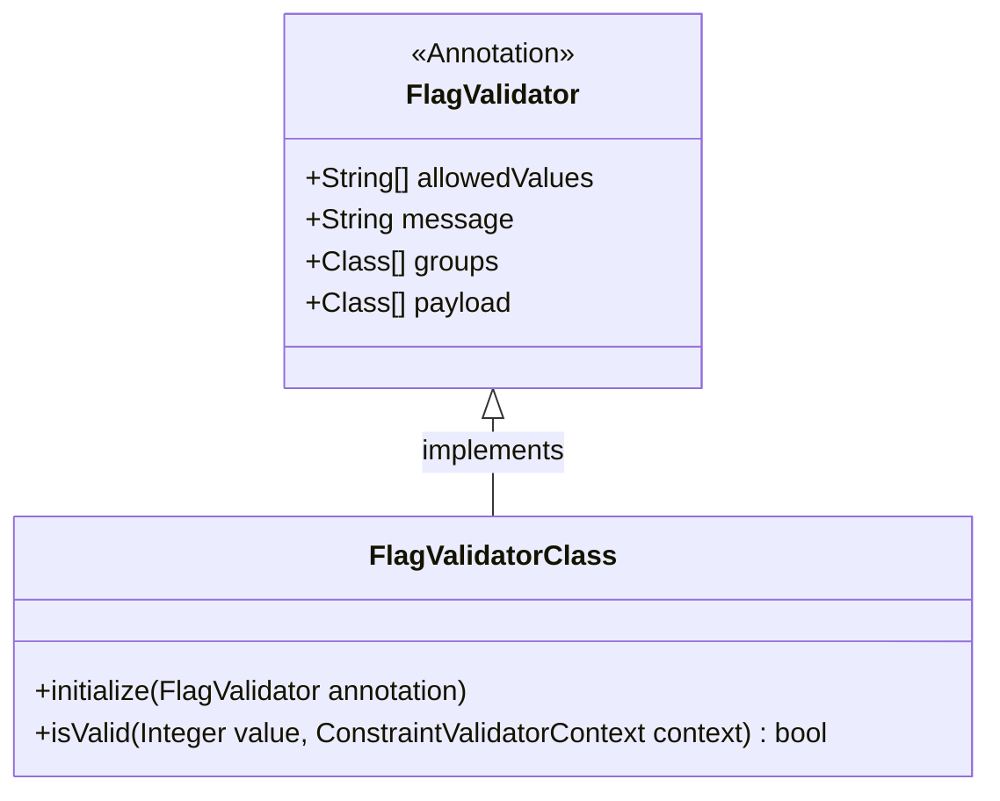
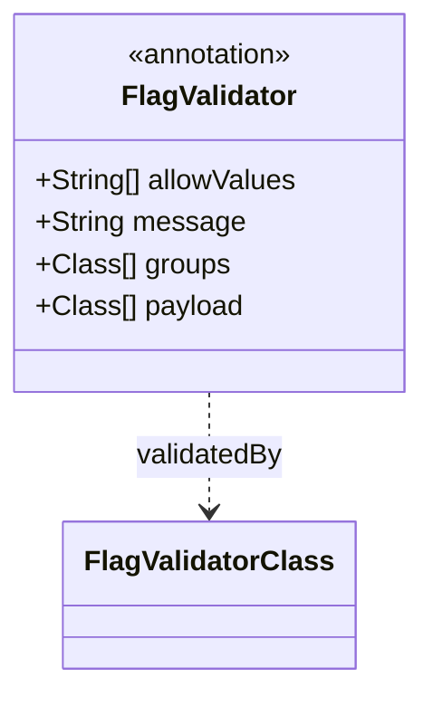
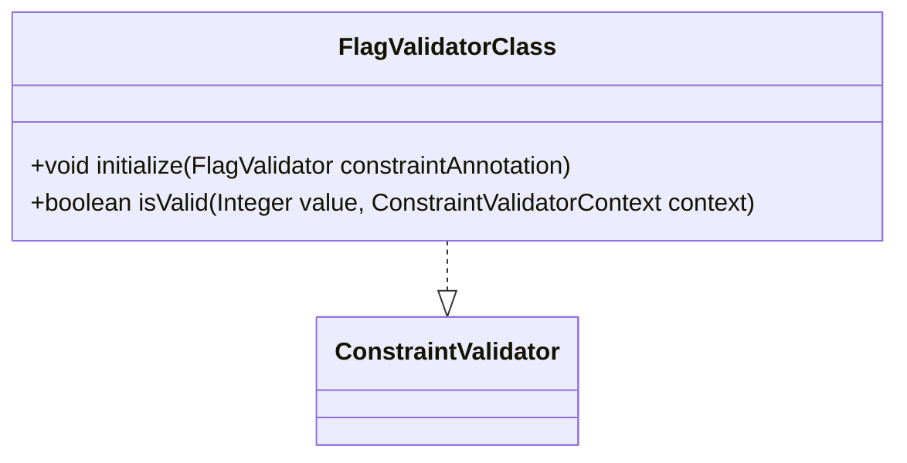

# 数据校验模块

## 1. 模块所在目录

该模块位于项目的 `mall-admin/src/main/java/com/macro/mall/validator/` 目录下。

## 2. 模块介绍

> 非核心模块

数据校验模块基于javax.validation框架，提供了一系列自定义校验注解及其实现，用于对业务字段或参数进行声明式的有效性验证，保障数据的安全性和一致性。

该模块通过组合自定义状态标志校验注解与实现类，实现对业务数据取值范围的精准校验，提升了代码的复用性与维护性，符合现代软件开发中注解驱动验证的设计理念。

## 3. 职责边界

数据校验模块专注于基于javax.validation框架提供自定义校验注解及其实现，承担业务字段或参数的声明式有效性验证职责，以确保数据的安全性和一致性。该模块不涉及业务逻辑处理、数据存储或安全认证功能，这些由相应的业务服务模块、数据访问模块和安全模块负责。与mall-mbg模块明确划分数据模型定义与访问职责，mall-security模块承担认证和权限控制，mall-admin及mall-portal模块负责具体业务流程的实现。数据校验模块通过提供统一的校验工具，提升整个系统的数据质量保障能力，确保各业务模块能在高质量数据基础上稳定运行，同时保持职责清晰、边界明确。

## 4. 同级模块关联

数据校验模块作为非核心模块，专注于基于javax.validation框架的**自定义校验注解及实现**，确保业务字段或参数的有效性与一致性。与其相关联的同级模块主要涉及基础设施、安全体系、代码生成及后台管理等方面，这些模块共同支撑系统的稳定运行和业务逻辑实现。

### 4.1 mall-common基础模块

**模块介绍**  
mall-common基础模块提供项目通用的基础配置、接口响应规范、异常管理、日志采集及Redis服务等基础设施。该模块确保了业务模块的统一规范和高复用性，为数据校验模块提供了统一的底层支持和服务保障。

### 4.2 mall-mbg代码生成与数据模型模块

**模块介绍**  
mall-mbg代码生成与数据模型模块封装了电商系统核心业务数据模型及其关联关系，提供基于MyBatis的标准Mapper接口和自动代码生成支持。该模块实现了数据访问层的标准化与高效维护，对数据校验模块的数据结构和验证逻辑具有直接支撑作用。

### 4.3 mall-security安全模块

**模块介绍**  
mall-security安全模块构建基于Spring Security的安全认证与权限控制体系，包含JWT认证、动态权限管理、安全异常统一处理及缓存异常监控。其安全机制为数据校验模块提供了系统级的安全保障，确保数据验证过程的安全性和可靠性。

### 4.4 mall-admin后台管理模块

**模块介绍**  
mall-admin后台管理模块涵盖后台管理系统的配置管理、数据访问、业务服务实现、接口控制器及数据传输对象。通过支持商品、订单、权限、促销、会员、内容推荐等核心业务功能，该模块与数据校验模块紧密配合，保障业务数据的有效性与一致性，提升系统整体的高内聚与模块化管理水平。

## 5. 模块内部架构

数据校验模块主要由基于javax.validation框架的自定义校验注解及其实现组成，**实现业务字段或参数的声明式有效性验证**，确保数据的安全性和一致性。该模块通过自定义注解和校验器紧密协作，提升数据校验的复用性与维护性。

该模块未包含子模块，核心组成部分包括自定义校验注解@FlagValidator及其对应的实现类FlagValidatorClass。@FlagValidator注解用于定义允许的字符串集合及相关校验参数，而FlagValidatorClass则实现具体的校验逻辑，确保字段值符合预定义的业务状态要求。

以下Mermaid示意图展示了数据校验模块的内部架构及关键组件间的关系。

此架构体现了**数据校验模块的高度内聚性**，通过注解与校验器的结合，灵活支持业务字段的有效性检验，保障系统整体数据质量。

## 6. 核心功能组件

数据校验模块包含两个**核心功能组件**，分别是基于javax.validation框架的自定义校验注解和其对应的校验逻辑实现。这些组件协同工作，实现了对业务字段或参数的声明式有效性验证，确保数据的安全性和一致性，提升系统的代码复用性和维护效率。

### 6.1 FlagValidator

**FlagValidator** 是一个基于javax.validation框架定义的**自定义Java注解**，用于对类的字段或方法参数进行校验。该注解通过配置允许的字符串集合，限定字段值必须属于预定义的有效取值范围，从而保证业务数据的正确性和一致性。它支持自定义错误提示信息以及验证分组，便于在不同场景下灵活应用。

**Sources Files**

`mall-admin/src/main/java/com/macro/mall/validator/FlagValidator.java`

### 6.2 FlagValidatorClass

**FlagValidatorClass** 实现了javax.validation.ConstraintValidator接口，是自定义注解FlagValidator的具体校验器。该类负责验证传入的Integer类型字段值是否包含在注解中指定的允许字符串集合内，确保业务状态字段的合法性。校验器设计中，当传入值为null时默认返回通过，避免不必要的验证失败。

**Sources Files**

`mall-admin/src/main/java/com/macro/mall/validator/FlagValidatorClass.java`
