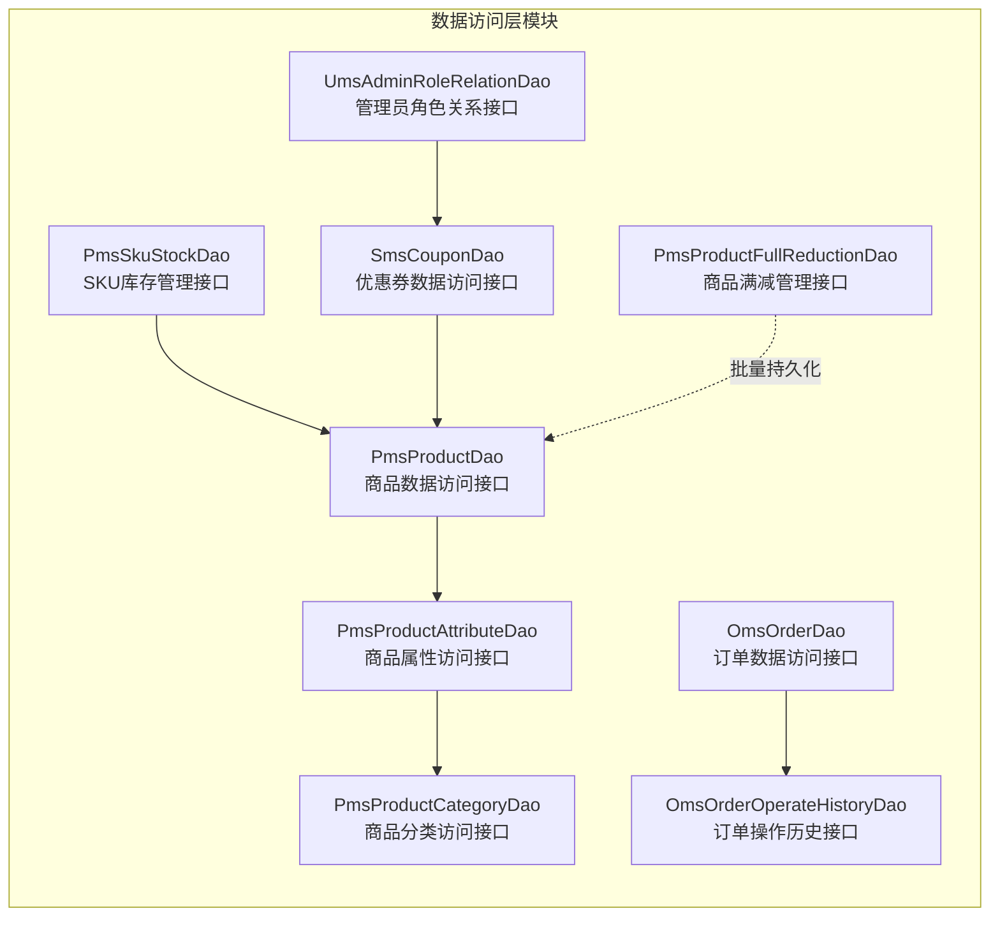
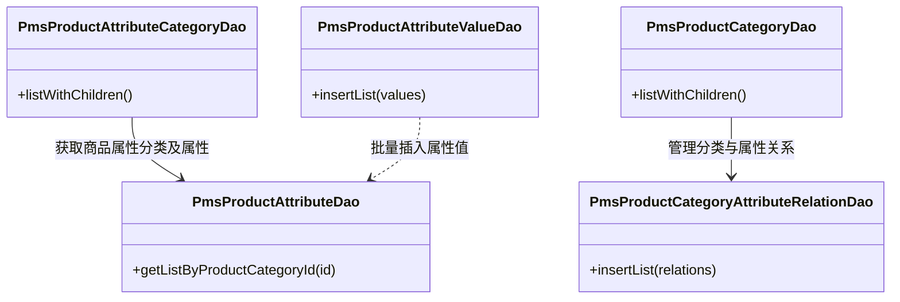
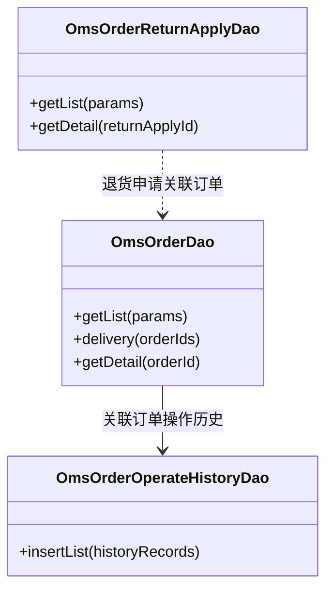
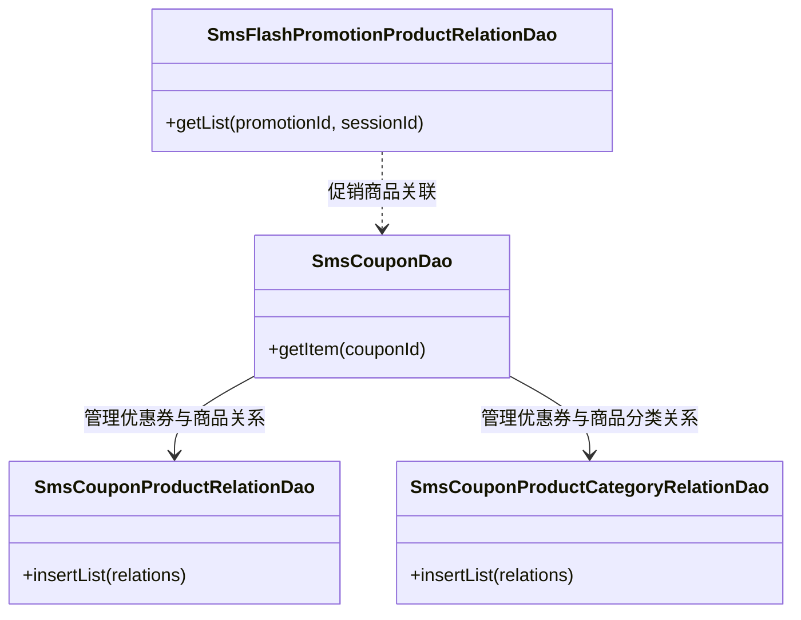
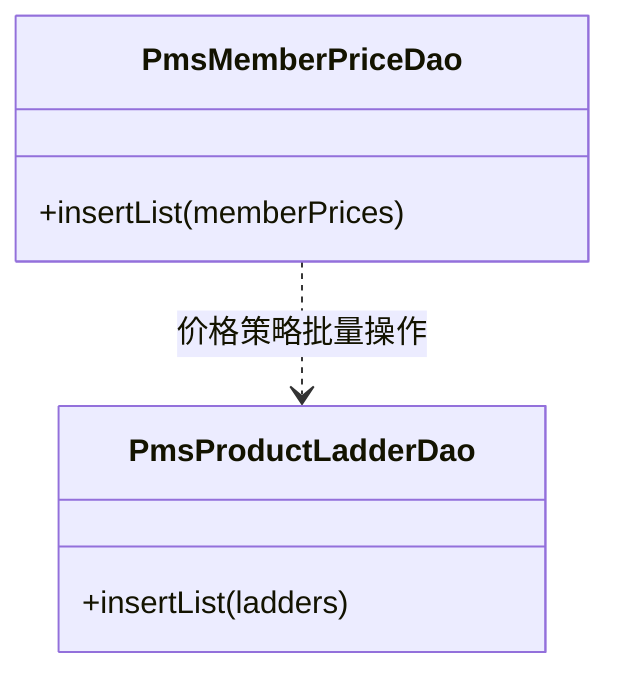
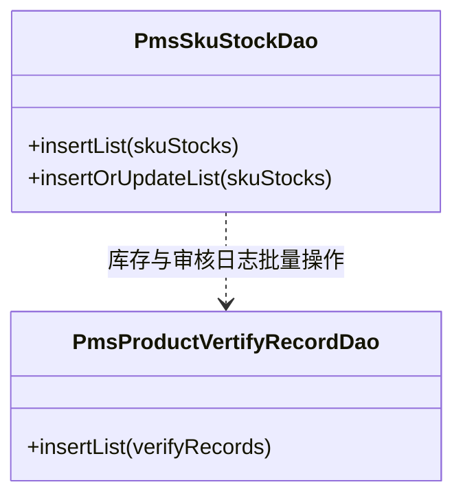
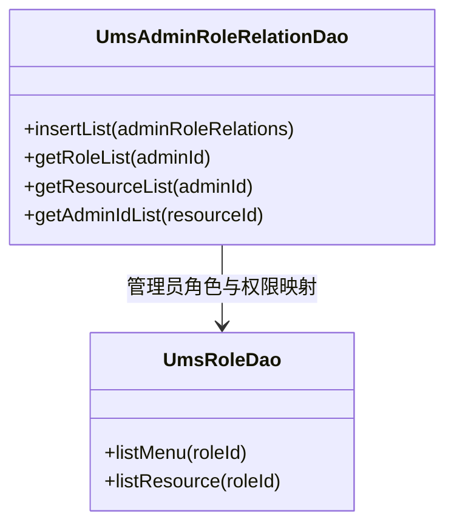

# 数据访问层模块

## 1. 模块所在目录

该模块位于项目的 `mall-admin/src/main/java/com/macro/mall/dao/` 目录下。

## 2. 模块介绍

> 非核心模块

数据访问层模块负责商城后台各类业务实体的数据库访问操作，涵盖商品及其属性、分类等多维度数据的管理。该模块通过统一处理复杂查询和数据结构的获取逻辑，实现数据访问层的聚合与优化，保障业务数据的高效持久化和一致性。

在技术设计上，模块聚焦于批量持久化和关系管理，提升DAO层的聚合性与维护效率。通过整合商品SKU库存、优惠券、订单操作记录等多种业务实体的自定义数据访问操作，优化查询性能并简化数据结构管理流程，推动商城后台数据访问的结构化和高效化。

## 3. 职责边界

数据访问层模块专注于商城后台各类业务实体的数据库访问操作，涵盖商品及其属性、分类、属性分类、属性与分类关系等复杂查询与批量持久化管理，致力于提升DAO层的聚合性、性能和维护效率。该模块不负责业务逻辑实现、安全认证、前端展示及搜索功能，这些分别由mall-admin后台管理模块、mall-security安全模块、mall-portal门户系统模块和mall-search搜索模块承担。数据访问层模块依托mall-mbg代码生成与数据模型模块提供的标准数据模型和映射接口，配合mall-common基础模块提供的通用基础设施，形成规范高效的数据访问体系。通过明确职责边界，该模块确保数据操作的集中管理和优化，同时与其他功能模块保持清晰的接口分工，支持系统整体的高内聚与模块化协同。

## 4. 同级模块关联

数据访问层模块与项目中的多个基础及业务模块密切相关，共同构建了商城后台数据操作的核心支撑。通过与基础模块、代码生成模块、安全模块及多个业务系统的协作，数据访问层模块实现了对复杂数据结构的统一管理和高效访问，促进了系统的模块化和高扩展性。

### 4.1 mall-common基础模块

**模块介绍**
mall-common基础模块提供了项目通用的基础配置、接口响应规范、异常管理、日志采集及Redis服务等基础设施，**确保业务模块的统一规范和高复用性**。该模块为数据访问层模块提供了坚实的基础支持，保证了数据处理的一致性和稳定性。

### 4.2 mall-mbg代码生成与数据模型模块

**模块介绍**
mall-mbg代码生成与数据模型模块封装了电商系统核心业务数据模型及其关联关系，**提供基于MyBatis的标准Mapper接口和自动代码生成支持**，实现了数据访问层的标准化与高效维护。该模块与数据访问层模块紧密配合，提升了数据操作的规范性和开发效率。

### 4.3 mall-security安全模块

**模块介绍**
mall-security安全模块构建了基于Spring Security的安全认证与权限控制体系，包含JWT认证、动态权限管理、安全异常统一处理及缓存异常监控，**显著提升了系统的安全性和灵活性**。数据访问层模块依赖该安全模块以保障数据访问的权限控制和安全合规。

### 4.4 mall-admin后台管理模块

**模块介绍**
mall-admin后台管理模块涵盖了后台管理系统的配置管理、数据访问、业务服务实现、接口控制器及数据传输对象，支持商品、订单、权限、促销、会员、内容推荐等核心业务功能，**实现了高内聚与模块化管理**。数据访问层模块作为该后台模块的重要组成部分，承担了各类业务实体的数据库访问操作，支撑后台业务的稳定运行。

### 4.5 mall-portal门户系统模块

**模块介绍**
mall-portal门户系统模块构建了商城门户系统的全栈体系，包括领域模型、配置管理、业务服务、数据访问、REST接口及异步组件，支持会员、订单、支付、促销、内容展示等前端核心业务需求。数据访问层模块为门户系统提供了底层数据支持，保障前端业务数据的准确和高效获取。

### 4.6 mall-search搜索模块

**模块介绍**
mall-search搜索模块实现了基于Elasticsearch的商品搜索服务，涵盖数据结构定义、数据访问层、业务逻辑及系统配置，**提供了高效、灵活的搜索及索引管理能力**。数据访问层模块通过与搜索模块的协作，丰富了商品数据的查询及展示能力。

### 4.7 mall-demo演示模块

**模块介绍**
mall-demo演示模块基于Spring Boot，包含配置管理、业务服务、验证注解及REST控制器，主要用于展示和验证商城系统主要功能的使用和实现方式。数据访问层模块提供了演示模块所需的数据访问支持，辅助演示系统功能的完整实现。

## 5. 模块内部架构

数据访问层模块主要负责商城后台各类业务实体的数据库访问操作，涵盖商品及其属性、分类、批量持久化和复杂查询等功能。该模块通过统一管理复杂查询、批量持久化和实体关系处理，实现了数据访问层的聚合与优化，提升了DAO层的维护效率和性能表现。

该模块未划分具体的子模块，而是通过众多接口（DAO）实现对不同业务实体的高效数据访问与管理。各DAO接口针对特定的业务实体或业务场景，提供了批量插入、复杂查询、关联关系维护等多样化的数据操作方法。例如，商品属性相关的DAO接口负责商品属性及其分类的查询和批量管理；订单相关DAO接口支持订单列表查询、发货状态更新和操作历史记录的插入；优惠券及促销相关DAO接口则负责优惠券与商品及分类的关联关系维护。通过这些接口的协同工作，模块实现了对商城后台各类业务实体的全面数据访问和管理。

以下Mermaid图展示了数据访问层模块的内部架构及关键组件的组织结构：

## 6. 核心功能组件

数据访问层模块主要聚焦于商城后台的数据库访问操作，涵盖**商品及其属性管理、订单及退货申请处理、优惠券及促销关系管理**等核心功能组件。通过统一管理复杂的查询、批量持久化及实体关系维护，实现DAO层的高聚合性和性能优化，提升整体维护效率。

### 6.1 商品属性与分类管理组件

该组件负责对商品属性、属性分类、商品分类以及属性与分类关系的管理，支持批量插入属性值和属性分类关联关系，提供商品属性信息的获取和分类树形结构的查询功能。通过该组件，能够高效地维护商品的多层次属性结构及其分类体系，为商品模块的细粒度管理提供数据支持。

**Sources Files**
`mall-admin/src/main/java/com/macro/mall/dao/PmsProductAttributeCategoryDao.java`
`mall-admin/src/main/java/com/macro/mall/dao/PmsProductAttributeDao.java`
`mall-admin/src/main/java/com/macro/mall/dao/PmsProductAttributeValueDao.java`
`mall-admin/src/main/java/com/macro/mall/dao/PmsProductCategoryDao.java`
`mall-admin/src/main/java/com/macro/mall/dao/PmsProductCategoryAttributeRelationDao.java`

### 6.2 订单与退货申请管理组件

该组件专注于订单及退货申请相关数据的访问和维护，包含订单列表查询、发货状态批量更新、订单详细信息获取，以及退货申请列表与详细信息查询等功能。支持订单操作历史的批量插入，保证订单全生命周期的操作记录持久化，为订单管理业务提供强大的数据访问支持。

**Sources Files**
`mall-admin/src/main/java/com/macro/mall/dao/OmsOrderDao.java`
`mall-admin/src/main/java/com/macro/mall/dao/OmsOrderReturnApplyDao.java`
`mall-admin/src/main/java/com/macro/mall/dao/OmsOrderOperateHistoryDao.java`

### 6.3 优惠券与促销关联管理组件

该组件管理优惠券与商品、商品分类及促销活动的关联关系，支持批量插入优惠券与商品或分类的关联数据，方便高效地维护优惠券绑定。还包括限时购活动中商品与活动的关联查询，确保促销活动数据的完整性和快速访问，支撑促销业务的灵活配置与执行。

**Sources Files**
`mall-admin/src/main/java/com/macro/mall/dao/SmsCouponDao.java`
`mall-admin/src/main/java/com/macro/mall/dao/SmsCouponProductRelationDao.java`
`mall-admin/src/main/java/com/macro/mall/dao/SmsCouponProductCategoryRelationDao.java`
`mall-admin/src/main/java/com/macro/mall/dao/SmsFlashPromotionProductRelationDao.java`

### 6.4 会员价格及阶梯价格管理组件

此组件集中处理会员价格与阶梯价格的批量插入，支持高效批量持久化会员价格和阶梯价格实体，保障价格策略的灵活应用和数据一致性。该组件通过批量操作提升数据库写入效率，优化价格相关业务的数据访问性能。

**Sources Files**
`mall-admin/src/main/java/com/macro/mall/dao/PmsMemberPriceDao.java`
`mall-admin/src/main/java/com/macro/mall/dao/PmsProductLadderDao.java`

### 6.5 商品库存与审核记录管理组件

该组件负责商品SKU库存的批量插入及更新，以及商品审核日志的批量持久化。通过批量操作实现库存数据的快速更新，保证库存信息的实时性和准确性。同时，商品审核记录的管理支持商品审核流程的完整追踪和数据存档。

**Sources Files**
`mall-admin/src/main/java/com/macro/mall/dao/PmsSkuStockDao.java`
`mall-admin/src/main/java/com/macro/mall/dao/PmsProductVertifyRecordDao.java`

### 6.6 后台用户角色与权限管理组件

该组件聚焦于后台管理员用户与角色以及权限资源的关系管理，支持批量插入用户角色关联关系，查询管理员角色及其对应权限资源。通过该组件，系统能够实现灵活的权限控制和后台用户访问管理，保障后台管理系统的安全性和权限的精细化配置。

**Sources Files**
`mall-admin/src/main/java/com/macro/mall/dao/UmsAdminRoleRelationDao.java`
`mall-admin/src/main/java/com/macro/mall/dao/UmsRoleDao.java`