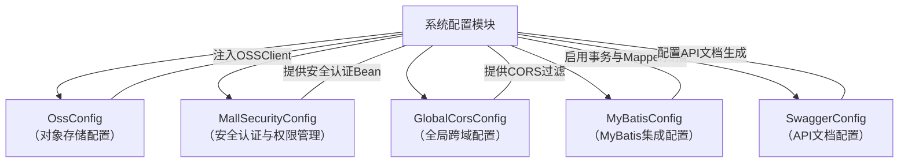
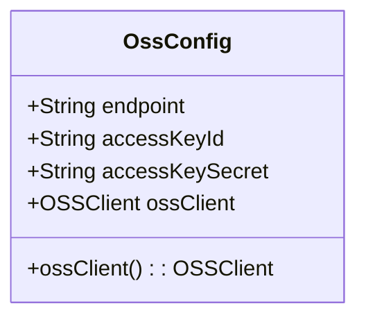
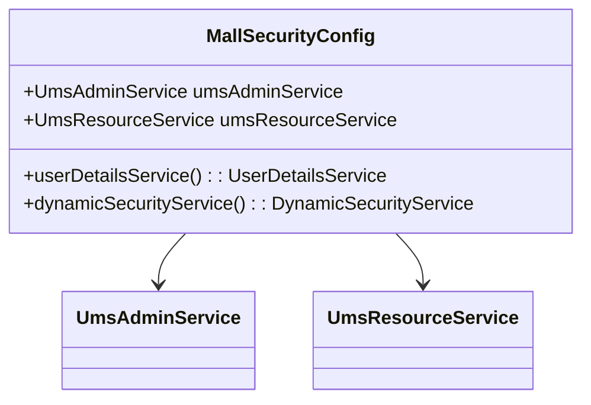
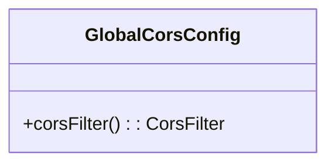
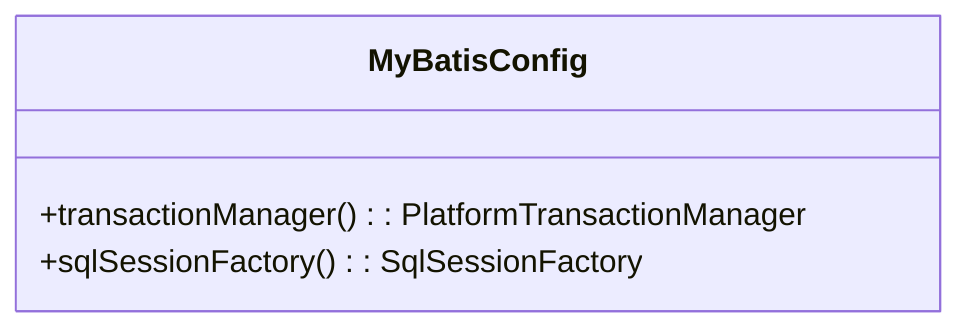
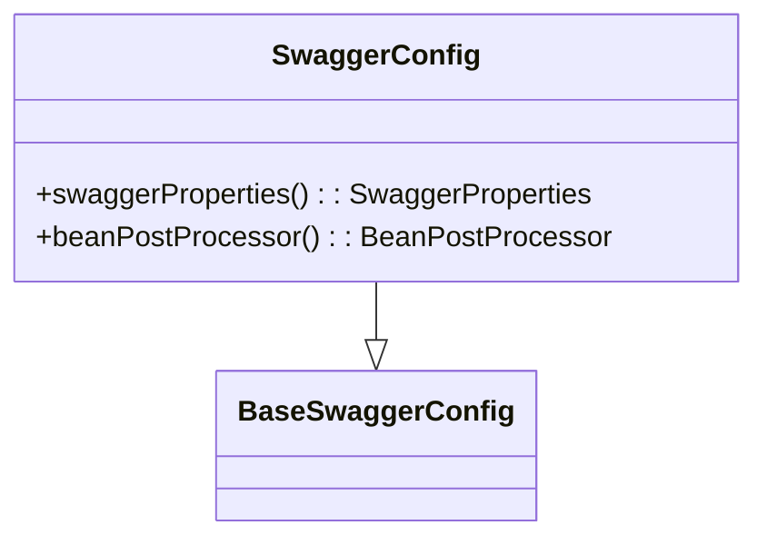

# 系统配置模块

## 1. 模块所在目录

该模块位于项目的 `mall-admin/src/main/java/com/macro/mall/config/` 目录下。

## 2. 模块介绍

> 非核心模块

系统配置模块负责集中管理商城后台系统中所有与Spring框架相关的配置，涵盖对象存储、安全认证、跨域策略、MyBatis集成及API文档配置等关键环节。通过统一配置管理，该模块有效提升了系统配置的统一性和可维护性，保障了mall-admin模块的稳定运行。

该模块采用集中式配置设计理念，将阿里云OSS客户端、安全认证与权限控制、全局CORS跨域策略、MyBatis集成及Swagger API文档等配置整合于一处，简化了配置文件结构，便于后续扩展和统一管理，显著提高了系统配置管理的效率和一致性。

## 3. 职责边界

系统配置模块专注于集中管理商城后台系统的Spring相关配置，涵盖对象存储、安全认证、跨域策略、MyBatis集成及API文档配置，旨在提升配置的一致性和可维护性。该模块不涉及具体业务逻辑的实现，也不承担数据模型设计、安全认证的具体业务规则或后台业务功能的开发。与mall-security模块明确划分安全认证与权限控制的业务职责，mall-mbg模块负责数据模型及MyBatis的业务层面设计，mall-admin模块承担后台管理的具体业务实现。系统配置模块通过统一配置支持其他业务模块的稳定运行，确保配置管理集中且清晰，保持了职责的单一性和模块间的清晰边界。

## 4. 同级模块关联

系统配置模块作为商城后台系统中负责Spring相关配置的非核心模块，与多个同级模块存在功能上的协作和依赖关系。通过统一管理对象存储、安全认证、跨域策略、MyBatis集成及API文档配置，它为其他模块提供了基础配置支持和安全保障，促进了系统整体的稳定性和可维护性。以下介绍与系统配置模块密切关联的同级模块。

### 4.1 mall-security安全模块

**模块介绍**

mall-security安全模块构建了基于Spring Security的安全认证与权限控制体系，涵盖JWT认证、动态权限管理、安全异常统一处理及缓存异常监控等功能。该模块为系统配置模块中的安全认证配置提供了业务支撑，通过注入后台管理员用户服务和资源服务，实现了用户认证和动态权限管理的核心功能，提升了系统的安全性和灵活性。

### 4.2 mall-admin后台管理模块

**模块介绍**

mall-admin后台管理模块包含后台管理系统的配置管理、数据访问、业务服务、接口控制器及数据传输对象，支持商品、订单、权限、促销、会员、内容推荐等核心业务功能。系统配置模块通过集中管理mall-admin模块下的Spring相关配置，提升了该模块的配置统一性和维护效率，保障了后台管理系统的稳定运行。

### 4.3 mall-common基础模块

**模块介绍**

mall-common基础模块提供项目通用的基础配置、接口响应规范、异常管理、日志采集及Redis服务等基础设施。系统配置模块依赖于mall-common模块所提供的基础设施，确保业务模块之间的统一规范和高复用性，促进了整体系统的架构规范和功能协同。

### 4.4 mall-mbg代码生成与数据模型模块

**模块介绍**

mall-mbg代码生成与数据模型模块封装了电商系统核心业务数据模型及其关联关系，并提供基于MyBatis的标准Mapper接口和自动代码生成支持。系统配置模块中的MyBatis集成配置为该模块的数据访问层提供了必要的框架支持，实现了数据访问层的标准化与高效维护。

## 5. 模块内部架构

系统配置模块**集中管理商城后台系统的Spring相关配置**，涵盖对象存储、安全认证、跨域策略、MyBatis集成及API文档配置等关键方面。通过统一配置，模块实现了配置的高一致性和良好维护性，简化了系统配置结构，方便后续的扩展和管理。

该模块不包含子模块，所有功能均以配置类形式直接集成，具体职责涵盖以下几个核心组件：

- **OssConfig**：负责阿里云对象存储服务（OSS）的客户端配置，基于外部配置文件注入OSS访问参数，提供OSSClient Bean供全局使用。

- **MallSecurityConfig**：定义Spring Security的用户认证和动态权限管理，集成后台管理员用户服务和资源服务，提供安全认证与权限控制的核心配置。

- **GlobalCorsConfig**：提供全局跨域资源共享（CORS）策略，允许任意来源跨域请求，支持跨域Cookie及所有HTTP方法和请求头，统一处理跨域问题。

- **MyBatisConfig**：配置MyBatis框架，启用事务管理，自动扫描Mapper接口，实现数据访问层的标准化配置。

- **SwaggerConfig**：继承基础Swagger配置，提供API文档生成和管理，包含基本信息设置和兼容性处理，确保API文档的完整性和正确展示。

以下Mermaid架构图展示了系统配置模块的内部组织结构及关键组件之间的关系：

## 6. 核心功能组件

系统配置模块包含多个**核心功能组件**，这些组件集中管理商城后台系统的Spring相关配置，涵盖对象存储、安全认证、跨域资源共享、MyBatis集成以及API文档配置。通过这些组件，模块实现了配置的统一性和可维护性，简化了系统配置结构，为后续扩展提供了坚实基础。

### 6.1 OssConfig

OssConfig是负责阿里云对象存储服务（OSS）配置的Spring配置类。它从外部配置文件中读取必要的参数，如endpoint、accessKeyId和accessKeySecret，并基于这些参数创建了一个OSSClient实例。该实例作为Spring Bean注入到应用上下文中，供其他组件调用，实现对OSS服务的访问与操作。

**Sources Files**

`mall-admin/src/main/java/com/macro/mall/config/OssConfig.java`

### 6.2 MallSecurityConfig

MallSecurityConfig是针对mall-security模块的安全配置核心类。它定义了用户认证和动态权限管理的核心逻辑，通过注入后台管理员用户服务UmsAdminService和资源服务UmsResourceService，分别实现用户详细信息加载和基于资源的动态权限映射。该组件提供了UserDetailsService和DynamicSecurityService的Spring Bean，支撑后台系统的安全认证和权限控制。

**Sources Files**

`mall-admin/src/main/java/com/macro/mall/config/MallSecurityConfig.java`

### 6.3 GlobalCorsConfig

GlobalCorsConfig是全局跨域资源共享（CORS）配置类，提供统一的跨域请求支持。该配置允许所有来源的跨域请求，支持携带cookie，放行所有请求头和HTTP方法，确保整个项目中的接口统一处理跨域请求，有效解决浏览器同源策略限制问题。

**Sources Files**

`mall-admin/src/main/java/com/macro/mall/config/GlobalCorsConfig.java`

### 6.4 MyBatisConfig

MyBatisConfig是MyBatis框架的Spring配置类。通过注解声明配置类身份，启用事务管理，并指定MyBatis Mapper接口的位置，实现了Mapper接口的自动扫描与注册，简化了数据访问层的配置。

**Sources Files**

`mall-admin/src/main/java/com/macro/mall/config/MyBatisConfig.java`

### 6.5 SwaggerConfig

SwaggerConfig继承自BaseSwaggerConfig，用于配置Swagger 2框架，生成和管理项目API文档。它通过重写swaggerProperties方法，提供基础信息配置，如控制器扫描包路径、文档标题、描述、联系人、版本及安全认证启用状态。该组件还定义了BeanPostProcessor，解决Springfox和Spring版本兼容性，保证Swagger文档正常展示。

**Sources Files**

`mall-admin/src/main/java/com/macro/mall/config/SwaggerConfig.java`
