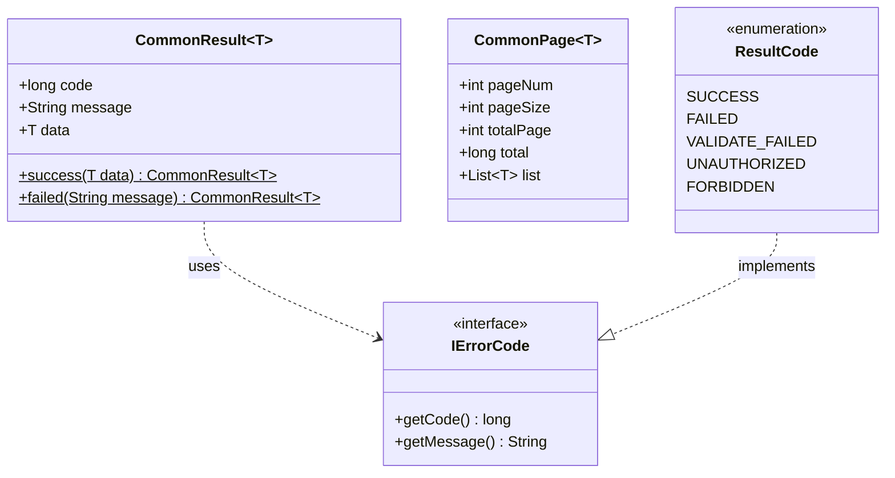
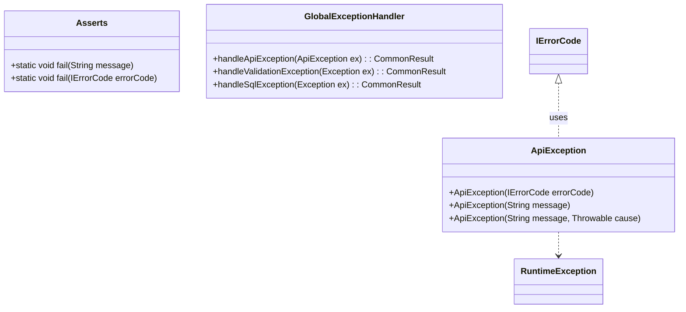
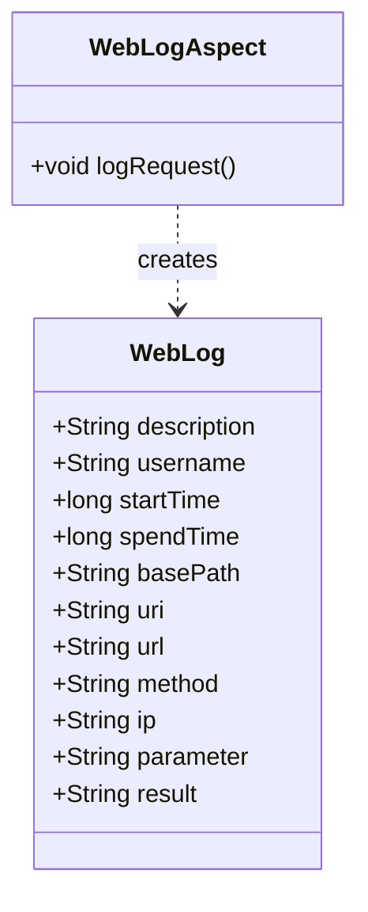
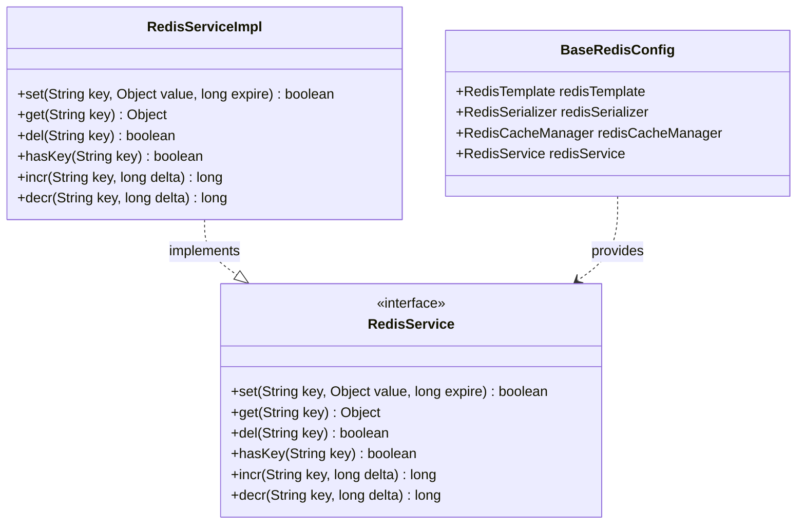
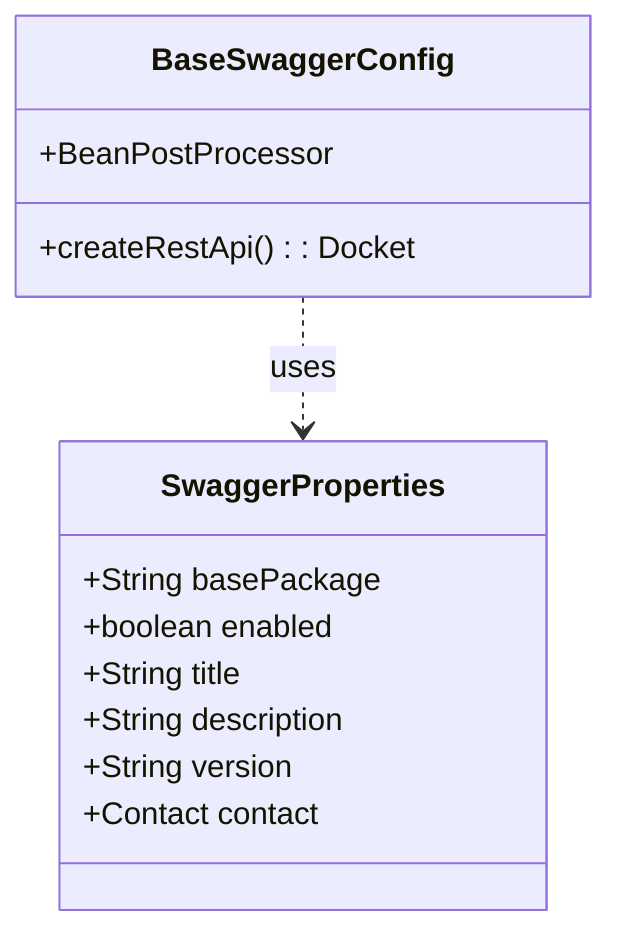

# mall-common基础模块

## 1. 模块所在目录

该模块包含以下目录：

- `mall-common/src/main/java/com/macro/mall/common/`
- `mall-common/src/main/java/com/macro/mall/common/api/`
- `mall-common/src/main/java/com/macro/mall/common/exception/`
- `mall-common/src/main/java/com/macro/mall/common/service/`
- `mall-common/src/main/java/com/macro/mall/common/config/`
- `mall-common/src/main/java/com/macro/mall/common/domain/`
- `mall-common/src/main/java/com/macro/mall/common/log/`

## 2. 模块介绍

> 非核心模块

mall-common基础模块提供项目通用的基础配置、接口响应规范、异常管理、日志采集及Redis服务等基础设施，保障业务模块在接口规范、异常处理和日志管理上的统一性与高复用性，提升系统整体的健壮性和维护效率。

该模块集成了标准化接口响应结构、统一异常处理机制和集中日志管理，同时封装了Redis访问接口，支持多种数据结构操作，注重降低业务模块的开发复杂度和耦合度。通过自动化的接口文档生成与安全管理，实现系统配置和运维的规范化，增强系统的可扩展性和代码复用性。

## 3. 职责边界

mall-common基础模块主要负责为整个项目提供统一且标准化的基础配置，包括接口响应规范、异常管理、日志采集以及Redis服务的封装与管理，确保业务模块在开发过程中能够共享通用的基础设施并保持高度复用性与一致性。该模块不涉及具体业务逻辑的实现，也不承担安全认证、权限控制（由mall-security模块负责）、数据模型定义与访问（由mall-mbg模块负责）、后台管理功能（由mall-admin模块负责）、门户系统业务以及搜索功能等上层业务服务。mall-common通过标准化的API响应结构、统一的错误码管理和全局异常处理，为上层业务模块如mall-admin、mall-portal和mall-search等提供稳定的基础支撑，同时通过Redis服务接口降低业务模块对底层缓存实现的依赖，促进系统的可维护性和扩展性。此职责划分确保mall-common专注于基础设施建设，而具体业务功能则由相应的业务模块独立开发，实现了职责清晰、边界明确和模块间的合理协作。

## 4. 同级模块关联

在mall-common基础模块的体系中，存在多个与之密切相关的同级模块，它们共同构建了完整的电商系统架构。这些模块涵盖了从核心业务数据模型、安全认证、后台管理、门户系统、搜索功能到演示应用等多个方面，彼此间通过规范的接口和统一的基础设施实现高效协同和模块化管理。

### 4.1 mall-mbg代码生成与数据模型模块

**模块介绍**

mall-mbg模块封装了电商系统的核心业务数据模型及其关联关系，提供基于MyBatis的标准Mapper接口和自动代码生成支持。该模块实现了数据访问层的标准化与高效维护，为业务模块的数据操作提供了坚实基础，促进了代码的规范化和开发效率的提升。

### 4.2 mall-security安全模块

**模块介绍**

mall-security模块构建了基于Spring Security的安全认证与权限控制体系，包含了JWT认证、动态权限管理、安全异常统一处理及缓存异常监控等功能。该模块有效提升了系统的安全性与灵活性，是保障整个系统安全运行的重要组成部分。

### 4.3 mall-admin后台管理模块

**模块介绍**

mall-admin模块涵盖后台管理系统必要的配置管理、数据访问、业务服务实现、接口控制器及数据传输对象。它支持商品、订单、权限、促销、会员、内容推荐等核心业务功能，实现了高内聚与模块化管理，确保后台管理系统的稳定性和可扩展性。

### 4.4 mall-portal门户系统模块

**模块介绍**

mall-portal模块构建了商城门户系统的全栈体系，包括领域模型、配置管理、业务服务、数据访问、REST接口及异步组件。该模块支持会员、订单、支付、促销、内容展示等前端核心业务需求，是用户交互和前端展示的关键模块。

### 4.5 mall-search搜索模块

**模块介绍**

mall-search模块基于Elasticsearch实现了商品搜索服务，涵盖数据结构定义、数据访问层、业务逻辑及系统配置。它为系统提供了高效、灵活的搜索及索引管理能力，提升了用户的搜索体验和系统的响应速度。

### 4.6 mall-demo演示模块

**模块介绍**

mall-demo模块是基于Spring Boot的电商演示应用，包含配置管理、业务服务、验证注解及REST控制器。该模块用于展示和验证商城系统主要功能的使用和实现方式，便于开发人员快速理解和上手系统功能。

## 5. 模块内部架构

mall-common基础模块作为项目的通用基础设施，**提供统一的基础配置、接口响应规范、异常管理、日志采集及Redis服务支持**，以确保各业务模块的开发规范性和高复用性。该模块通过多个包结构组织功能组件，涵盖API响应封装、异常处理机制、日志记录、基础配置管理及Redis操作接口等关键内容，形成了一个高度内聚、职责清晰的基础服务层。

该模块**不包含子模块（submodules）**，其内部结构以功能包为划分依据，分别承担如下职责：

- **api包**：封装统一的接口响应结构（如CommonResult和CommonPage）、错误码接口和枚举，规范接口返回格式和错误管理。
- **exception包**：实现业务异常的自定义定义、断言处理及全局异常统一捕获，保障系统异常处理的标准化。
- **config包**：集中管理基础配置，包括Redis及Swagger相关配置，确保中间件和工具的统一配置。
- **service包及其实现类**：定义和实现Redis访问服务接口，提供多数据结构的Redis操作封装。
- **log包**：基于Spring AOP实现日志切面，统一拦截控制器层请求，输出结构化日志，便于运维分析。
- **domain包**：封装Swagger配置属性和Web请求日志数据结构，支持配置管理和日志信息的标准化。

以下Mermaid图示展示了mall-common模块的**内部架构组织及关键组件间的关系**：

```mermaid
graph TD
    A[mall-common模块]
    A --> B[api包]
    B --> B1[CommonResult]
    B --> B2[CommonPage]
    B --> B3[IErrorCode接口]
    B --> B4[ResultCode枚举]

    A --> C[exception包]
    C --> C1[ApiException]
    C --> C2[Asserts]
    C --> C3[GlobalExceptionHandler]

    A --> D[config包]
    D --> D1[BaseRedisConfig]
    D --> D2[BaseSwaggerConfig]

    A --> E[service包]
    E --> E1[RedisService接口]
    E --> E2[RedisServiceImpl实现类]

    A --> F[log包]
    F --> F1[WebLogAspect]

    A --> G[domain包]
    G --> G1[SwaggerProperties]
    G --> G2[WebLog]

    style A fill:#f9f,stroke:#333,stroke-width:2px
    style B fill:#bbf,stroke:#333,stroke-width:1px
    style C fill:#bbf,stroke:#333,stroke-width:1px
    style D fill:#bbf,stroke:#333,stroke-width:1px
    style E fill:#bbf,stroke:#333,stroke-width:1px
    style F fill:#bbf,stroke:#333,stroke-width:1px
    style G fill:#bbf,stroke:#333,stroke-width:1px
```

该架构确保mall-common模块能够**高效支撑项目基础服务需求，促成业务模块的统一规范和可维护性**。

## 6. 核心功能组件

mall-common基础模块提供了多个**核心功能组件**，涵盖了项目通用的基础配置、接口响应规范、异常管理、日志采集以及Redis服务等基础设施。这些组件通过统一规范和高复用性设计，确保了业务模块的开发效率和系统的可维护性。主要核心功能组件包括：

### 6.1 接口响应规范组件

接口响应规范组件负责统一封装API接口的返回结构，包含通用数据返回格式和状态码管理。通过该组件，系统实现了接口返回的规范化，错误码的集中管理以及代码的高可维护性，极大简化了业务逻辑的处理和接口调用的统一性。

**Sources Files**

`mall-common/src/main/java/com/macro/mall/common/api/CommonResult.java`  
`mall-common/src/main/java/com/macro/mall/common/api/CommonPage.java`  
`mall-common/src/main/java/com/macro/mall/common/api/IErrorCode.java`  
`mall-common/src/main/java/com/macro/mall/common/api/ResultCode.java`

### 6.2 异常管理组件

异常管理组件提供了完整的业务异常处理体系，包含自定义异常类、断言工具以及全局异常处理机制。该组件实现了从异常的产生、断言抛出到全局捕获和格式化返回的**统一流程管理**，有助于提升系统的健壮性和开发维护效率。

**Sources Files**

`mall-common/src/main/java/com/macro/mall/common/exception/ApiException.java`  
`mall-common/src/main/java/com/macro/mall/common/exception/Asserts.java`  
`mall-common/src/main/java/com/macro/mall/common/exception/GlobalExceptionHandler.java`

### 6.3 日志采集组件

日志采集组件基于Spring AOP实现，统一拦截控制器层的HTTP请求，记录请求及响应的详细日志信息。该组件结构化地封装日志内容，有助于日志的集中管理、分析和追踪，提升运维和故障排查的效率。

**Sources Files**

`mall-common/src/main/java/com/macro/mall/common/domain/WebLog.java`  
`mall-common/src/main/java/com/macro/mall/common/log/WebLogAspect.java`

### 6.4 Redis服务组件

Redis服务组件提供了统一且通用的Redis访问接口及其基于Spring Data Redis的实现。通过该组件，业务系统可以便捷地操作不同类型的Redis数据结构，且降低了对底层Redis实现的耦合度，提升系统的扩展性和维护性。

**Sources Files**

`mall-common/src/main/java/com/macro/mall/common/service/RedisService.java`  
`mall-common/src/main/java/com/macro/mall/common/service/impl/RedisServiceImpl.java`  
`mall-common/src/main/java/com/macro/mall/common/config/BaseRedisConfig.java`

### 6.5 Swagger接口文档配置组件

该组件提供了统一的Swagger API文档配置，支持自动生成接口文档及安全认证管理。通过抽象基础配置类和属性封装，实现了对Swagger文档的标准化管理，提升接口文档的可维护性和安全性。

**Sources Files**

`mall-common/src/main/java/com/macro/mall/common/config/BaseSwaggerConfig.java`  
`mall-common/src/main/java/com/macro/mall/common/domain/SwaggerProperties.java`
