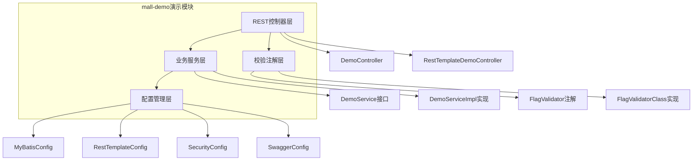
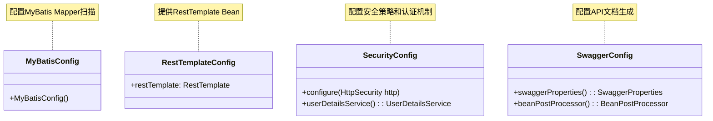
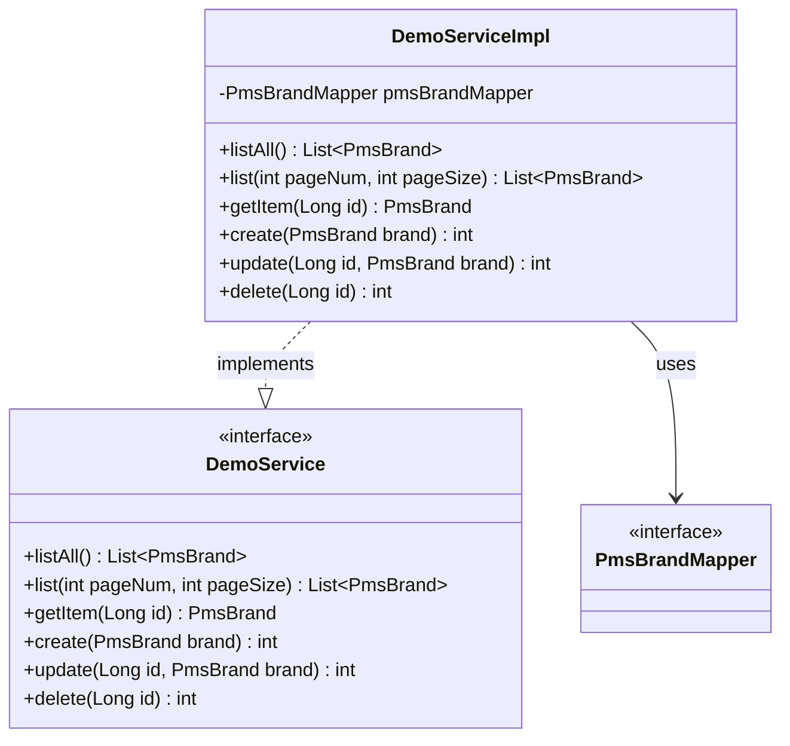
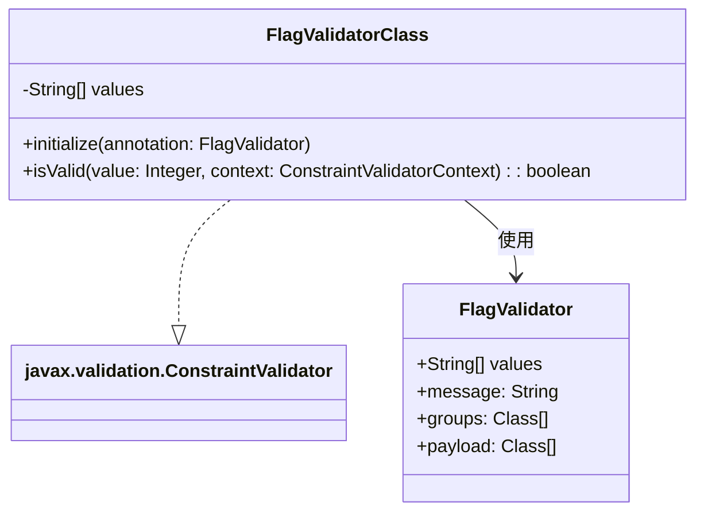
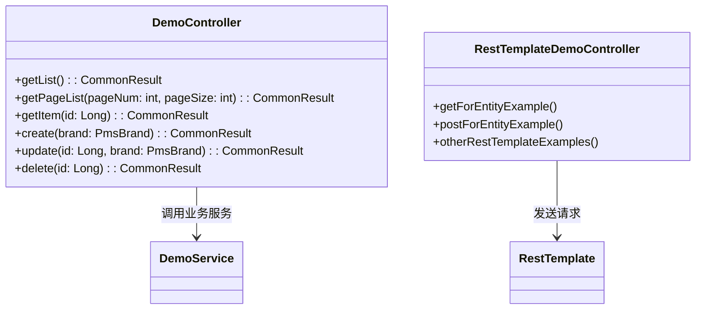

# mall-demo演示模块

## 1. 模块所在目录

该模块包含以下目录：

- `mall-demo/src/main/java/com/macro/mall/demo/config/`
- `mall-demo/src/main/java/com/macro/mall/demo/validator/`
- `mall-demo/src/main/java/com/macro/mall/demo/controller/`
- `mall-demo/src/main/java/com/macro/mall/demo/service/`
- `mall-demo/src/main/java/com/macro/mall/demo/service/impl/`

## 2. 模块介绍

> 非核心模块

mall-demo演示模块是基于Spring Boot构建的电商演示应用，集成了配置管理、业务服务、验证注解及REST控制器等关键组成部分，旨在展示和验证商城系统主要功能的实现方式和使用场景。该模块通过统一管理品牌业务逻辑、核心配置及接口实现，为应用提供了清晰的功能划分和高效的业务支撑。

模块设计强调结构清晰与分层合理，通过集中配置MyBatis、Spring Security、RestTemplate和Swagger等框架，简化了集成过程并提升系统的可维护性和扩展性。自定义状态校验注解确保数据一致性，REST控制器示例展示了标准的接口开发模式，整体实现了高内聚、低耦合的架构风格，支持快速启动和灵活扩展，满足电商演示应用的多样化需求。

## 3. 职责边界

mall-demo演示模块主要负责构建基于Spring Boot的电商演示应用框架，涵盖核心配置管理（如MyBatis、Spring Security、RestTemplate及Swagger的统一配置）、品牌业务服务的实现、状态标记校验注解及其校验器的集成，以及多样化REST控制器的演示和实现。该模块聚焦于展示和验证商城系统核心功能的使用方式及实现逻辑，确保应用快速启动、模块化清晰和高效维护。它不承担基础设施服务、核心数据模型定义、安全认证体系建设以及后台业务管理与门户系统的具体业务实现，这些职责由mall-common、mall-mbg、mall-security、mall-admin及mall-portal等模块分别承担。通过明确与这些模块的职责划分，mall-demo模块作为演示和示范层，依托于基础模块提供的标准规范和数据支持，专注于业务逻辑的整合与接口示范，保持了职责单一且与其他模块高内聚低耦合的良好关系。

## 4. 同级模块关联

在mall-demo演示模块的开发与应用过程中，多个同级模块提供了基础设施、核心业务模型、安全保障及后台管理等重要支持。通过与这些模块的协同工作，mall-demo模块能够实现电商系统的完整功能演示与验证，提升系统的整体可维护性和扩展性。以下内容详细介绍与mall-demo模块具有实际关联的同级模块。

### 4.1 mall-common基础模块

**模块介绍**
mall-common基础模块承担了项目的通用基础配置职责，涵盖接口响应规范、异常管理、日志采集以及Redis服务等关键基础设施。该模块为业务模块提供了统一的规范和高复用性支持，确保了系统在开发和运行过程中的一致性与稳定性，是构建高质量业务应用的底层保障。

### 4.2 mall-mbg代码生成与数据模型模块

**模块介绍**
mall-mbg代码生成与数据模型模块封装了电商系统中的核心业务数据模型及其关联关系，提供基于MyBatis的标准Mapper接口与自动代码生成功能。该模块通过标准化数据访问层设计，提升了代码的维护效率和数据操作的规范性，对于mall-demo模块中业务逻辑的实现提供了坚实的数据支持。

### 4.3 mall-security安全模块

**模块介绍**
mall-security安全模块构建了基于Spring Security的认证与权限控制体系，包含JWT认证机制、动态权限管理、安全异常统一处理及缓存异常监控功能。该模块提升了系统的安全性和灵活性，为mall-demo模块中的用户身份认证和权限控制提供了核心保障，确保演示应用的安全运行。

### 4.4 mall-admin后台管理模块

**模块介绍**
mall-admin后台管理模块涵盖了后台系统的配置管理、数据访问、业务服务实现、接口控制器及数据传输对象等内容，支持商品、订单、权限、促销、会员与内容推荐等核心业务功能。该模块实现了高内聚与模块化管理，为mall-demo演示模块提供了丰富的业务场景和功能支持，便于展示和验证商城系统的实际应用效果。

### 4.5 mall-portal门户系统模块

**模块介绍**
mall-portal门户系统模块构建了商城门户的全栈体系，包含领域模型、配置管理、业务服务、数据访问、REST接口及异步组件。它支持会员、订单、支付、促销及内容展示等前端核心业务需求，为mall-demo模块演示的前端业务流程和接口交互提供了基础和示范，促进了系统整体功能的连贯性。

### 4.6 mall-search搜索模块

**模块介绍**
mall-search搜索模块基于Elasticsearch实现了商品搜索服务，涵盖数据结构定义、数据访问层、业务逻辑及系统配置。该模块提供了高效且灵活的搜索与索引管理能力，支持mall-demo模块中商品搜索功能的演示，有效提升了用户检索体验和系统性能表现。

## 5. 模块内部架构

mall-demo演示模块作为一个基于Spring Boot的**电商演示应用**，其内部结构清晰且分层合理，主要涵盖核心配置管理、业务服务、验证注解和REST控制器四大部分。该模块通过集中管理配置和业务逻辑，结合统一的接口展示，实现了商城系统主要功能的演示与验证。

本模块不包含子模块，其内部组织结构以功能包划分，分别负责应用的配置集成、业务逻辑实现、参数校验及接口控制，确保了模块的高内聚和职责分明。

以下Mermaid图展示了mall-demo演示模块的内部组织结构及其关键组件：

该架构体现了模块中**配置集中管理Spring Boot项目中的核心框架集成**（如MyBatis、Spring Security、RestTemplate及Swagger），**业务服务层实现品牌管理相关业务逻辑**，**校验层提供自定义状态标记注解及实现**，以及**控制器层统一展示REST接口的调用演示**。通过分层设计和组件协作，mall-demo模块实现了功能的灵活扩展与高效维护。

## 6. 核心功能组件

mall-demo演示模块包含多个核心功能组件，涵盖了配置管理、业务服务、验证注解以及REST控制器等关键领域，充分展示了商城系统主要功能的实现方式。这些组件分别负责系统的配置集成、品牌管理业务逻辑、状态标记数据校验，以及REST接口的实现与远程调用，协同构建了一个层次分明、功能完备的电商演示应用。

### 6.1 配置管理组件

配置管理组件统一管理Spring Boot项目中与MyBatis、Spring Security、RestTemplate和Swagger相关的核心配置。通过集中配置的方式，该组件简化了各大框架与Spring的集成过程，提升了项目的可维护性和扩展性，确保应用框架统一且高效地运行。

**Sources Files**

`mall-demo/src/main/java/com/macro/mall/demo/config/MyBatisConfig.java`

`mall-demo/src/main/java/com/macro/mall/demo/config/RestTemplateConfig.java`

`mall-demo/src/main/java/com/macro/mall/demo/config/SecurityConfig.java`

`mall-demo/src/main/java/com/macro/mall/demo/config/SwaggerConfig.java`

### 6.2 品牌业务服务组件

品牌业务服务组件整合了品牌（PmsBrand）相关的业务服务接口及其实现逻辑，统一管理品牌的增删改查操作。该服务层实现了业务逻辑的抽象与具体执行，支持品牌信息的创建、查询、更新和删除，提升了系统的模块化和解耦性。

**Sources Files**

`mall-demo/src/main/java/com/macro/mall/demo/service/DemoService.java`

`mall-demo/src/main/java/com/macro/mall/demo/service/impl/DemoServiceImpl.java`

### 6.3 状态标记验证组件

状态标记验证组件集成了自定义状态标记校验注解及对应的校验器实现，用于校验业务模型中状态标记字段的合规性。该组件确保数据的有效性与一致性，方便在Spring等框架中复用和维护自定义的校验规则。

**Sources Files**

`mall-demo/src/main/java/com/macro/mall/demo/validator/FlagValidator.java`

`mall-demo/src/main/java/com/macro/mall/demo/validator/FlagValidatorClass.java`

### 6.4 REST控制器组件

REST控制器组件合并了所有Spring MVC控制器的演示代码，集中展示了多种RESTful接口的实现与调用方式。包括品牌管理相关的CRUD接口及基于RestTemplate的远程服务调用示例，统一封装请求处理、响应结果及接口文档注解，便于开发者学习和复用典型REST接口开发模式，提升系统模块化和维护效率。

**Sources Files**

`mall-demo/src/main/java/com/macro/mall/demo/controller/DemoController.java`

`mall-demo/src/main/java/com/macro/mall/demo/controller/RestTemplateDemoController.java`
