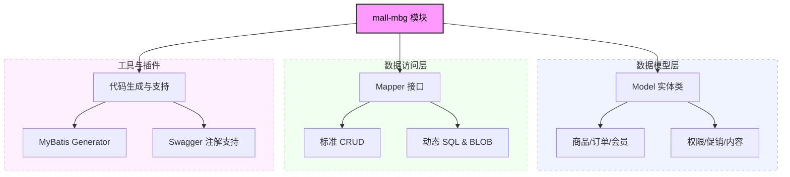
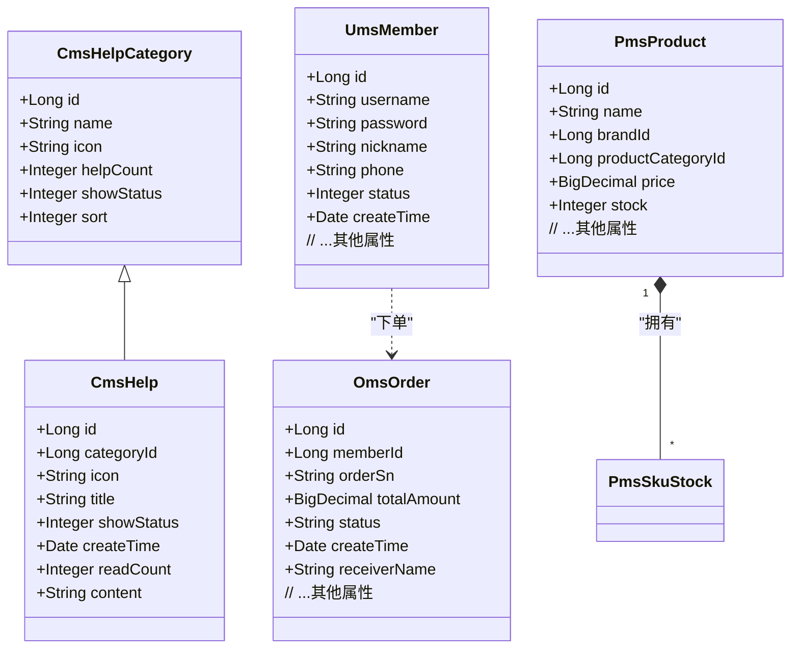
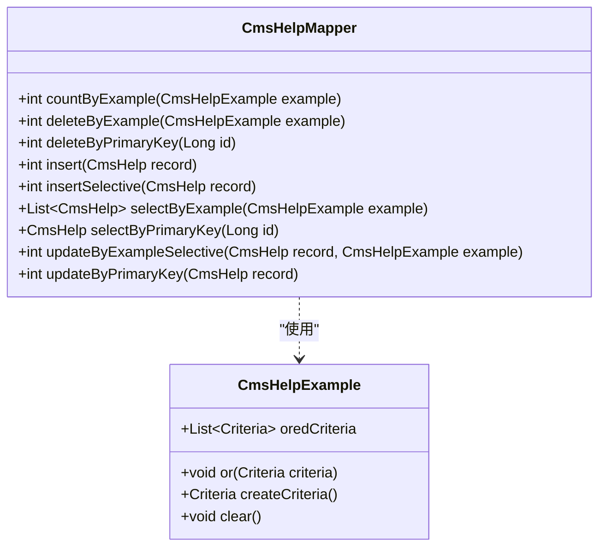
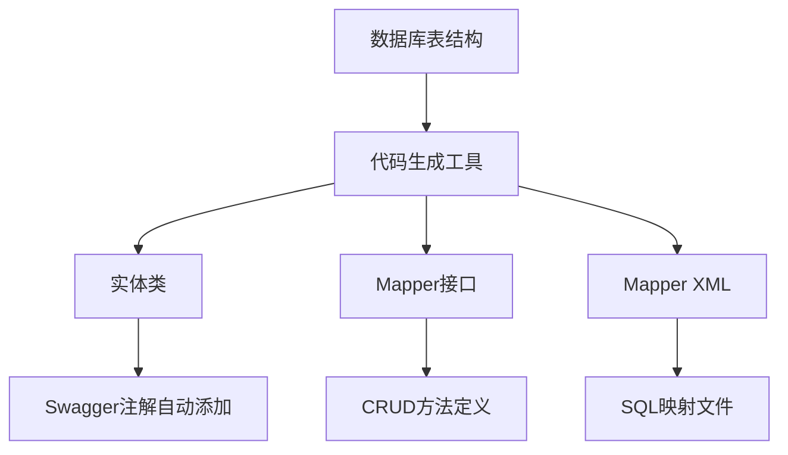
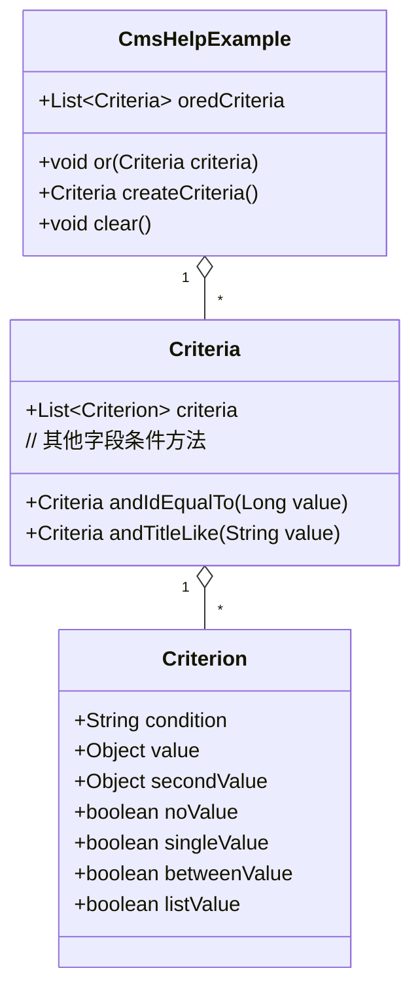
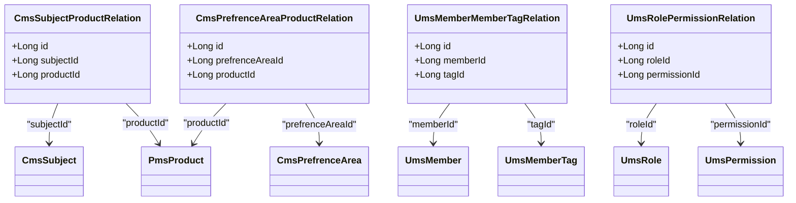

# mall-mbg代码生成与数据模型模块

## 1. 模块所在目录

该模块包含以下目录：

- `mall-mbg/src/main/java/com/macro/mall/model/`
- `mall-mbg/src/main/java/com/macro/mall/mapper/`

## 2. 模块介绍

> 核心模块

mall-mbg代码生成与数据模型模块封装了电商系统的核心业务数据模型及其关联关系，提供基于MyBatis的标准Mapper接口和自动代码生成支持，实现数据访问层的标准化和高效维护。该模块通过统一管理商品、订单、会员、权限、促销及内容等关键业务领域的数据结构，保障业务逻辑的集中处理和系统的良好扩展性。

技术上，本模块融合了MyBatis的实体CRUD操作接口，支持多样化的数据库操作方式，包括批量处理、BLOB字段管理和动态SQL，确保持久层与业务逻辑层的解耦与规范。此外，集成了自动代码生成工具和自定义注释功能，自动生成符合数据库字段备注的Swagger注解，实现代码与接口文档的无缝衔接，极大提升开发效率和文档质量。

## 3. 职责边界

mall-mbg代码生成与数据模型模块专注于封装电商系统核心业务数据模型及其关联关系，提供基于MyBatis的标准Mapper接口和自动代码生成支持，确保数据访问层的标准化与高效维护。该模块负责实现实体对象与数据库表之间的增删改查操作、动态SQL及注释增强，提升开发效率和代码维护性。它不涉及具体业务逻辑的实现、用户界面展示或安全认证管理，这些职责分别由mall-admin后台管理模块、mall-portal门户系统模块和mall-security安全模块承担。与mall-common基础模块协作，依赖其基础设施保障规范统一，与mall-search搜索模块、mall-demo演示模块等保持清晰的职责分工。通过专注于数据模型管理与自动代码生成，该模块为整个电商系统的数据访问和开发流程提供坚实支持，确保系统的可维护性和灵活应对复杂业务变化的能力。

## 4. 同级模块关联

在电商系统中，`mall-mbg代码生成与数据模型模块`作为核心模块，承担着封装和管理系统核心业务数据模型及其关联关系的职责。它为数据访问层提供标准化的接口和自动代码生成支持，确保业务数据结构的统一与高效维护。与之紧密相关的同级模块共同构成了电商系统的完整功能体系，涵盖基础设施、安全认证、后台管理、门户服务、搜索功能及演示应用等多个方面，确保系统的稳定运行与功能拓展。

### 4.1 mall-common基础模块

**模块介绍**

该模块提供了项目中通用的基础配置和公共服务，涵盖接口响应规范、异常管理、日志采集以及Redis服务等关键基础设施。作为系统的基础支撑层，**mall-common基础模块确保业务模块的统一规范和高复用性**，为整个电商系统提供稳定且高效的基础环境。

### 4.2 mall-security安全模块

**模块介绍**

本模块构建了基于Spring Security的安全认证与权限控制体系。它包含JWT认证机制、动态权限管理、安全异常统一处理以及缓存异常监控功能。通过这些安全策略，**mall-security安全模块显著提升了系统的安全性和灵活性**，保障业务数据和用户信息的安全访问。

### 4.3 mall-admin后台管理模块

**模块介绍**

该模块涵盖了后台管理系统的配置管理、数据访问、业务服务实现、接口控制器及数据传输对象。它支持商品、订单、权限、促销、会员和内容推荐等核心业务功能。通过高内聚和模块化的设计，**mall-admin后台管理模块实现了对商城关键业务的高效管理和控制**，为系统运营提供强有力的支持。

### 4.4 mall-portal门户系统模块

**模块介绍**

作为商城的前端展示和交互平台，该模块构建了完整的全栈体系，包括领域模型、配置管理、业务服务、数据访问、REST接口及异步组件。它支持会员、订单、支付、促销和内容展示等前端核心业务需求，**mall-portal门户系统模块保障了用户体验的流畅性和业务功能的完整性**。

### 4.5 mall-search搜索模块

**模块介绍**

该模块实现了基于Elasticsearch的商品搜索服务，涵盖数据结构定义、数据访问层、业务逻辑及系统配置。通过提供高效且灵活的搜索和索引管理能力，**mall-search搜索模块提升了商品检索速度和搜索结果的相关性**，优化了用户的购物体验。

### 4.6 mall-demo演示模块

**模块介绍**

作为基于Spring Boot的电商演示应用，该模块包含配置管理、业务服务、验证注解及REST控制器。它用于展示和验证商城系统主要功能的实现方式和使用流程，**mall-demo演示模块为开发者和用户提供了直观的功能演示和技术参考**，促进系统的推广和使用。

## 5. 模块内部架构

**mall-mbg代码生成与数据模型模块**是电商系统的**核心模块**，主要负责封装核心业务数据模型及其复杂关联关系，提供基于MyBatis的标准Mapper接口支持，以及自动代码生成工具。该模块通过定义丰富且标准的数据实体类，结合自动生成的Mapper接口，实现了数据访问层的统一规范和高效维护，极大提升了系统的开发效率和代码质量。

本模块不包含子模块。其内部结构主要包括以下几个关键组成：

- **数据模型（Model）层**：封装了系统中各业务领域的实体类，涵盖商品、订单、会员、权限、促销、内容等多个核心业务线，支持序列化和Swagger注解，确保数据模型的完整性与接口文档的自动生成。

- **数据访问（Mapper）层**：基于MyBatis框架，提供针对各实体的标准CRUD接口，支持动态条件查询、批量操作、BLOB字段处理及选择性更新，保证持久层操作的灵活性和一致性。

- **代码生成支持**：集成MyBatis代码生成器，支持自动生成实体类、Mapper接口及XML映射文件，并增强注释生成，提升代码文档化水平和维护效率。

以下Mermaid图示展示了该模块的组织结构及关键组件关系：

## 6. 核心功能组件

mall-mbg代码生成与数据模型模块是商城系统的**核心模块**，主要负责封装电商核心业务的数据模型及其关联关系，提供基于MyBatis的标准Mapper接口，并集成自动代码生成工具。该模块涵盖了**数据模型管理**、**数据访问层标准化**、**自动代码生成**、**业务实体关联管理**以及**动态查询条件构造**等核心功能，保障系统的数据访问效率和维护便捷性。

### 6.1 数据模型管理

数据模型管理组件负责封装商城系统中各业务领域的实体模型，包括商品、订单、会员、权限、促销和内容等。每个实体类均实现了Serializable接口，支持对象序列化，方便数据持久化和网络传输。实体类中包含了详细的属性定义和完整的getter/setter方法，部分字段配合Swagger注解以支持接口文档生成。该组件通过统一管理核心业务模型，提升了数据结构的标准化和业务逻辑的集中处理能力。

**Sources Files**

`mall-mbg/src/main/java/com/macro/mall/model/CmsHelp.java`

`mall-mbg/src/main/java/com/macro/mall/model/CmsHelpCategory.java`

`mall-mbg/src/main/java/com/macro/mall/model/OmsOrder.java`

`mall-mbg/src/main/java/com/macro/mall/model/UmsMember.java`

`mall-mbg/src/main/java/com/macro/mall/model/PmsProduct.java`

`mall-mbg/src/main/java/com/macro/mall/model/PmsSkuStock.java`

### 6.2 数据访问层标准化

数据访问层标准化组件基于MyBatis框架，定义了针对每个实体的Mapper接口，提供标准的增删改查（CRUD）方法。接口设计遵循MyBatis的规范，支持通过主键和Example条件对象执行灵活的查询、插入、更新和删除操作。此组件实现了持久层与业务逻辑层的解耦，规范了数据访问流程，并提升了开发效率和代码维护性。

**Sources Files**

`mall-mbg/src/main/java/com/macro/mall/mapper/CmsHelpMapper.java`

`mall-mbg/src/main/java/com/macro/mall/mapper/OmsOrderMapper.java`

`mall-mbg/src/main/java/com/macro/mall/mapper/UmsMemberMapper.java`

`mall-mbg/src/main/java/com/macro/mall/mapper/PmsProductMapper.java`

`mall-mbg/src/main/java/com/macro/mall/mapper/PmsSkuStockMapper.java`

### 6.3 自动代码生成

自动代码生成组件整合了基于数据库表结构的实体类、Mapper接口及XML映射文件的自动生成工具。该组件支持**自定义注释生成**，能够根据数据库字段备注自动添加Swagger注解，提升接口文档的完整性和准确性。通过该工具，开发者能够快速生成标准化代码，减少重复劳动，提升开发效率和文档质量。

**Sources Files**

`mall-mbg/src/main/java/com/macro/mall/mapper/`  (包含自动生成的Mapper接口)

`mall-mbg/src/main/java/com/macro/mall/model/`  (包含自动生成的实体类及Example)

### 6.4 动态查询条件构造

该组件提供了针对各个实体的Example及Criteria辅助类，支持动态构建复杂的SQL查询条件。通过封装多组Criteria及Criterion对象，支持条件的AND和OR组合，能够灵活表达等值、不等、范围、模糊匹配等多种查询条件，大大简化了复杂SQL的生成过程，提升了代码的灵活性和可维护性。

**Sources Files**

`mall-mbg/src/main/java/com/macro/mall/model/CmsHelpExample.java`

`mall-mbg/src/main/java/com/macro/mall/model/OmsOrderExample.java`

`mall-mbg/src/main/java/com/macro/mall/model/UmsMemberExample.java`

`mall-mbg/src/main/java/com/macro/mall/model/PmsProductExample.java`

### 6.5 业务实体关联管理

该组件管理电商系统中的业务实体间的多对多及一对多关联关系，如专题与产品、偏好区域与产品、会员与标签、角色与权限等。通过定义关联实体类及对应Mapper接口，实现关联关系的持久化管理和查询，支持复杂业务场景下的关系维护和数据访问，提升系统的业务灵活性和扩展能力。

**Sources Files**

`mall-mbg/src/main/java/com/macro/mall/model/CmsSubjectProductRelation.java`

`mall-mbg/src/main/java/com/macro/mall/model/CmsPrefrenceAreaProductRelation.java`

`mall-mbg/src/main/java/com/macro/mall/model/UmsMemberMemberTagRelation.java`

`mall-mbg/src/main/java/com/macro/mall/model/UmsRolePermissionRelation.java`

`mall-mbg/src/main/java/com/macro/mall/mapper/CmsSubjectProductRelationMapper.java`

`mall-mbg/src/main/java/com/macro/mall/mapper/CmsPrefrenceAreaProductRelationMapper.java`

`mall-mbg/src/main/java/com/macro/mall/mapper/UmsMemberMemberTagRelationMapper.java`

`mall-mbg/src/main/java/com/macro/mall/mapper/UmsRolePermissionRelationMapper.java`
