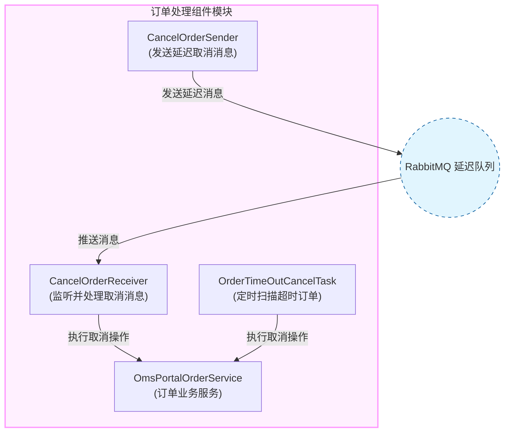
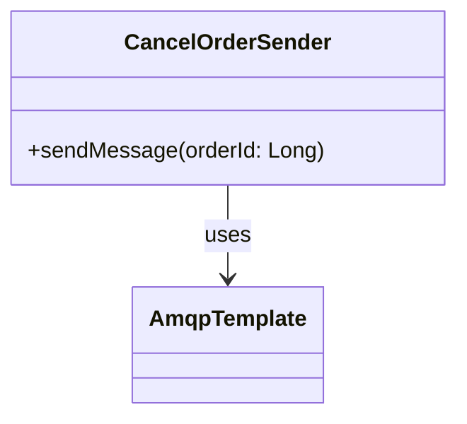
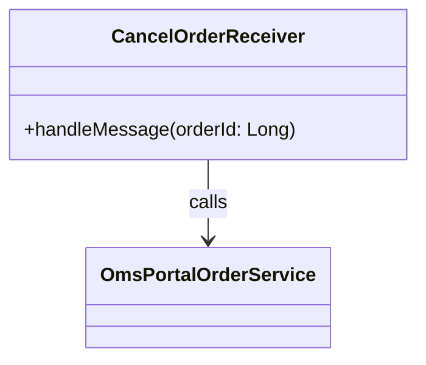
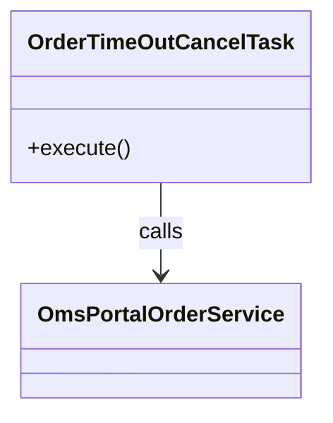

# Component Module

## 1. 模块所在目录

该模块位于项目的 `mall-portal/src/main/java/com/macro/mall/portal/component/` 目录下。

## 2. 模块介绍

> 非核心模块

Component Module 主要负责订单自动取消相关的异步处理逻辑，涵盖消息发送、队列监听及超时订单扫描等功能，旨在实现业务流程的自动化和提升库存管理效率。

该模块整合订单取消的延迟消息发送、RabbitMQ异步监听与处理，以及定时扫描超时未支付订单自动取消机制，通过统一管理订单取消的发送、接收及超时处理，增强系统异步处理能力和业务流程的自动化水平。

## 3. 职责边界

Component Module专注于订单自动取消相关的异步处理逻辑，负责订单取消消息的延迟发送、RabbitMQ队列的异步监听与处理，以及定时扫描超时未支付订单并自动取消，从而实现业务流程的自动化和库存管理效率的提升。该模块不涉及订单的创建、支付处理或安全认证等功能，这些由mall-portal模块负责订单的前端业务流程，mall-security模块负责安全控制，mall-admin模块负责后台订单管理。Component Module通过异步消息和定时任务与其他模块协作，确保订单取消流程的独立性和高效执行，明确划分职责边界，保障系统整体的模块化与高内聚。

## 4. 同级模块关联

当前的Component Module作为mall-portal门户系统模块中的非核心模块，专注于订单自动取消的异步处理逻辑。与此紧密关联的同级模块主要包括提供通用基础设施支持的mall-common基础模块和封装核心业务数据模型的mall-mbg代码生成与数据模型模块，这些模块为Component Module的功能实现提供了重要支撑。

### 4.1 mall-common基础模块

**模块介绍**
mall-common基础模块提供项目通用的基础配置、接口响应规范、异常管理、日志采集及Redis服务等基础设施。该模块确保了业务模块的统一规范和高复用性，是系统稳定运行和高效开发的基础保障。

### 4.2 mall-mbg代码生成与数据模型模块

**模块介绍**
mall-mbg代码生成与数据模型模块封装了电商系统核心业务数据模型及其关联关系，提供基于MyBatis的标准Mapper接口和自动代码生成支持。通过该模块，数据访问层得以标准化和高效维护，有效支撑了Component Module中订单及库存数据的管理与操作。

## 5. 模块内部架构

Component Module 负责订单自动取消相关的异步处理逻辑，涵盖消息发送、队列监听以及超时订单扫描，实现业务流程的自动化和库存管理的效率提升。该模块内部结构紧密结合异步消息机制和定时任务，确保订单取消操作的及时性和准确性。

该模块**无子模块**，其内部组织主要由三个核心组件组成，分别承担不同的职责：

- **CancelOrderSender**：负责向RabbitMQ延迟队列发送取消订单消息，实现订单取消的延迟处理功能。
- **CancelOrderReceiver**：监听订单取消消息队列，接收取消指令并调用业务服务执行订单取消操作。
- **OrderTimeOutCancelTask**：基于定时任务定期扫描超时未支付订单，自动执行取消并释放库存。

以下Mermaid图表展示了Component Module的内部架构，体现了各组件之间的协作关系及其关键职责：

该架构通过**异步消息传递机制**和**定时任务**的结合，保障了订单自动取消的流程高效、可靠执行，从而提升系统整体的异步处理能力和库存管理效率。

## 6. 核心功能组件

本模块包含三个**核心功能组件**，分别负责订单自动取消的消息发送、消息监听处理以及超时订单的定时扫描和取消。通过这三个组件的协同工作，实现了订单取消流程的异步化、自动化，提升了业务流程效率和库存管理的准确性。

### 6.1 CancelOrderSender

CancelOrderSender 是一个Spring组件，负责向RabbitMQ的延迟队列发送订单取消消息。该组件通过注入的AmqpTemplate，将订单ID作为消息体发送到指定的交换机和路由键，并设置消息的过期时间，实现消息的延迟投递功能。这支持订单的延迟自动取消机制，保证订单在超时后能被准确取消。

**Sources Files**

`mall-portal/src/main/java/com/macro/mall/portal/component/CancelOrderSender.java`

### 6.2 CancelOrderReceiver

CancelOrderReceiver 是一个Spring组件类，负责异步监听RabbitMQ中名为"mall.order.cancel"的消息队列。组件接收订单ID消息后，调用业务服务OmsPortalOrderService的cancelOrder方法执行订单取消操作，并记录相应的处理日志，确保订单取消指令被准确执行。

**Sources Files**

`mall-portal/src/main/java/com/macro/mall/portal/component/CancelOrderReceiver.java`

### 6.3 OrderTimeOutCancelTask

OrderTimeOutCancelTask 是基于Spring框架的定时任务组件，负责每隔10分钟扫描系统中的超时未支付订单。该组件调用业务层服务OmsPortalOrderService的cancelTimeOutOrder方法取消这些订单，并释放相关库存锁定，同时通过日志记录取消订单的数量，从而保障库存及时释放和订单状态准确更新。

**Sources Files**

`mall-portal/src/main/java/com/macro/mall/portal/component/OrderTimeOutCancelTask.java`
