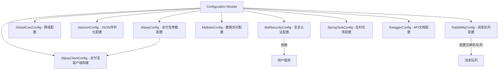
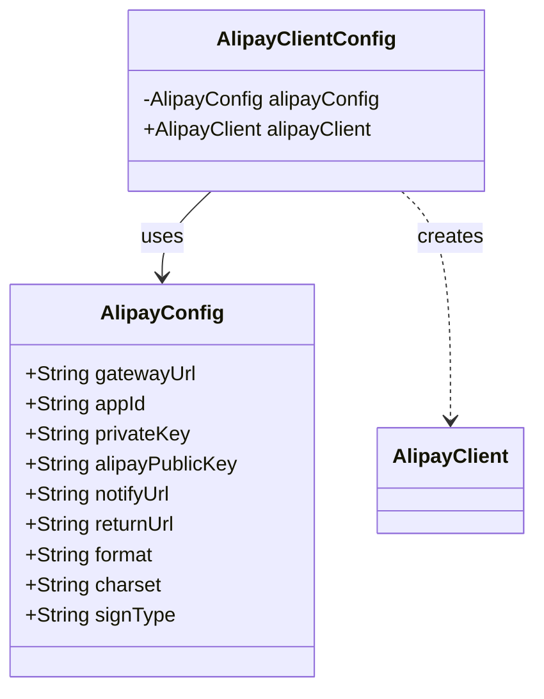
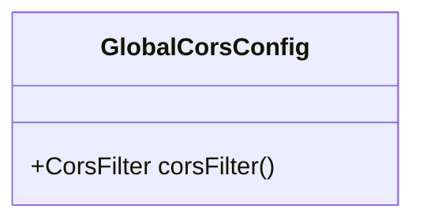
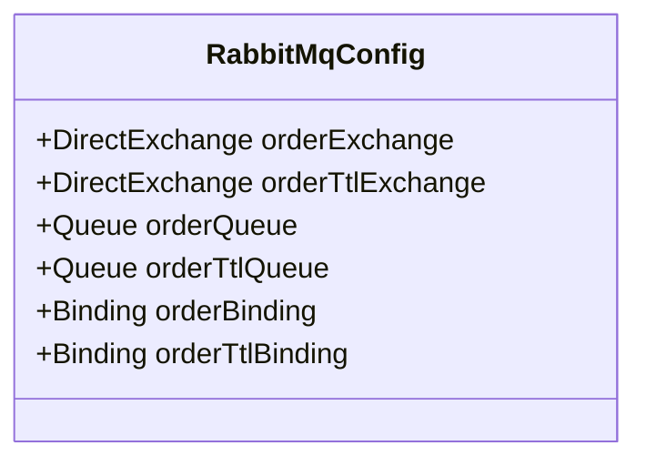
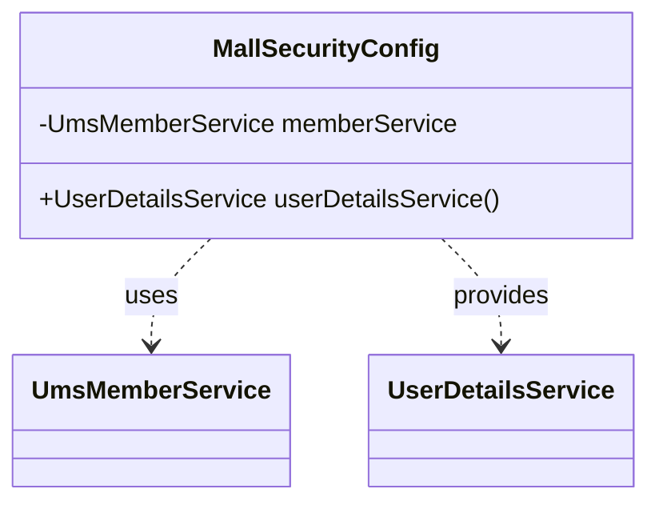
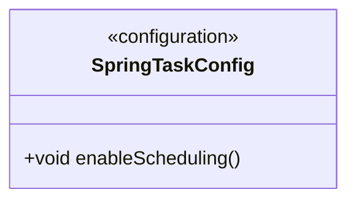

# Configuration Module

## 1. 模块所在目录

该模块位于项目的 `mall-portal/src/main/java/com/macro/mall/portal/config/` 目录下。

## 2. 模块介绍

> 非核心模块

Configuration Module负责集中管理商城门户系统的全局配置及支付宝支付相关配置，实现消息队列、安全、定时任务等关键服务的统一集成与灵活配置。该模块通过统一管理配置参数和客户端实例，确保系统在不同环境下的高效配置与稳定运行。

模块采用基于Spring依赖注入的设计理念，将支付宝支付参数与客户端解耦，提升了配置的灵活性和代码的可维护性。同时，集成mall-portal模块下的所有全局Spring配置类，包括MyBatis、RabbitMQ、Spring Security、CORS、Jackson、Swagger及定时任务，实现数据库持久化、消息队列、认证安全、跨域访问、JSON序列化、API文档生成与调度任务的统一管理，增强系统的模块化和开发效率。

## 3. 职责边界

Configuration Module专注于商城门户系统全局配置及支付宝支付相关配置的集中管理，负责整合消息队列、安全认证、定时任务等关键服务的统一配置与灵活集成，确保系统在不同运行环境下的高效配置和依赖解耦。该模块不涉及具体业务逻辑的实现，如商品管理、订单处理或搜索功能等，这些由mall-admin、mall-portal及mall-search等业务模块承担。支付宝支付功能的客户端实例创建及参数管理由本模块负责，与支付业务逻辑模块分离以提升配置灵活性和代码可维护性。同时，本模块通过集中整合mall-portal下的全局Spring配置，提供基础设施配置支持，依赖mall-common模块提供的基础服务，且与mall-security模块在安全配置方面相辅相成。模块间通过Spring依赖注入和配置管理保持职责清晰边界，确保系统模块化设计和高效协同。

## 4. 同级模块关联

Configuration Module在商城门户系统中承担着全局配置及支付宝支付相关配置的集中管理职责。为了实现系统服务的灵活集成与高效维护，该模块与多个同级模块存在密切关联，这些关联模块共同支撑商城门户系统的整体功能和性能优化。

### 4.1 mall-common基础模块

**模块介绍**
mall-common基础模块提供了项目通用的基础配置、接口响应规范、异常管理、日志采集及Redis服务等基础设施。该模块为配置模块提供了统一的基础支撑，确保业务模块的一致规范性和高复用性，是实现系统整体稳定性和可维护性的关键组成部分。

### 4.2 mall-mbg代码生成与数据模型模块

**模块介绍**
mall-mbg代码生成与数据模型模块封装了电商系统核心业务数据模型及其关联关系，提供基于MyBatis的标准Mapper接口和自动代码生成支持。配置模块通过整合MyBatis相关配置，间接支持该模块的数据访问层标准化与高效维护能力。

### 4.3 mall-security安全模块

**模块介绍**
mall-security安全模块构建了基于Spring Security的安全认证与权限控制体系，涵盖JWT认证、动态权限管理及安全异常统一处理。配置模块中安全相关配置（如MallSecurityConfig）与该模块协同工作，共同提升系统的安全性与灵活性。

### 4.4 mall-portal门户系统模块

**模块介绍**
mall-portal门户系统模块构建了商城门户的全栈体系，包括领域模型、配置管理、业务服务、数据访问及异步组件。Configuration Module作为该模块的重要组成部分，通过集中管理全局配置和支付宝支付配置，保障门户系统业务功能的稳定运行与灵活扩展。

### 4.5 mall-search搜索模块

**模块介绍**
mall-search搜索模块实现了基于Elasticsearch的商品搜索服务，涵盖数据结构定义、业务逻辑及系统配置。配置模块通过统一管理系统配置，为搜索模块的配置需求提供支持，促进搜索服务的高效与灵活。

### 4.6 mall-demo演示模块

**模块介绍**
mall-demo演示模块基于Spring Boot，展示商城系统主要功能的实现方式。配置模块提供的统一配置管理为演示模块的功能验证与展示提供了基础保障，确保演示环境的配置一致性和可靠性。

## 5. 模块内部架构

Configuration Module模块作为商城门户系统中非核心但关键的配置管理单元，**集中管理全局配置及支付宝支付相关配置**。该模块通过整合多种系统服务的配置，如消息队列、Spring Security安全、定时任务、跨域访问、JSON序列化及API文档生成，实现了对商城门户系统关键配置的统一管理与灵活适配。

该模块不包含子模块，但内部由多个独立的配置类组成，分别承担不同的职责：

- **AlipayConfig与AlipayClientConfig**：负责支付宝支付相关配置参数的集中管理及支付宝SDK客户端的构建，提供支付服务所需的接口支持。

- **GlobalCorsConfig**：配置全局跨域资源共享策略，支持任意域名请求，确保前端跨域访问的安全和便捷。

- **JacksonConfig**：定制JSON序列化行为，优化数据传输，忽略空字段，提升响应效率。

- **MallSecurityConfig**：安全配置类，集成用户认证服务，保障门户系统的访问安全。

- **MyBatisConfig**：负责MyBatis框架的集成配置，确保数据访问层接口的正确管理。

- **RabbitMqConfig**：定义与配置消息队列的交换机、队列及绑定关系，支持订单消息的异步处理与延迟执行。

- **SpringTaskConfig**：启用Spring定时任务调度，支持系统中定时执行的业务逻辑。

- **SwaggerConfig**：配置Swagger 2，实现API接口文档的自动生成与维护，提升接口管理效率。

以下Mermaid图示展示了Configuration Module的内部架构及关键组件的组织结构：

该架构体现了模块对多项系统配置的统一管理和灵活集成能力，支持商城门户系统在不同环境下的高效运行与维护。

## 6. 核心功能组件

Configuration Module包含若干**关键的核心功能组件**，这些组件共同实现了商城门户系统的全局配置管理与支付宝支付配置的集中管理。主要核心功能组件包括：支付宝支付配置组件、全局跨域资源共享配置组件、消息队列配置组件、安全认证配置组件以及定时任务调度配置组件。这些组件通过Spring框架的配置机制，确保了系统在支付集成、跨域访问、异步消息处理、安全认证和任务调度等方面的灵活性与高效性。

### 6.1 支付宝支付配置组件

支付宝支付配置组件由`AlipayConfig`和`AlipayClientConfig`两个Spring配置类组成，负责集中管理支付宝支付相关的配置参数，并基于这些参数创建支付宝SDK客户端实例。`AlipayConfig`类封装了支付宝网关地址、应用ID、私钥、公钥、回调地址等核心参数，确保支付参数的统一管理。`AlipayClientConfig`则通过依赖注入`AlipayConfig`，构造`DefaultAlipayClient`实例，为支付模块提供统一的支付宝客户端服务，提升支付功能的可维护性与环境适配能力。

**Sources Files**  
`mall-portal/src/main/java/com/macro/mall/portal/config/AlipayConfig.java`  
`mall-portal/src/main/java/com/macro/mall/portal/config/AlipayClientConfig.java`

### 6.2 全局跨域资源共享配置组件

全局跨域资源共享配置组件通过`GlobalCorsConfig`类实现，定义了一个全局的`CorsFilter` Bean，配置了允许任意域名的跨域请求，支持携带Cookie，放行所有请求头与HTTP方法，并应用于所有请求路径。这一配置保证了商城门户系统能够安全且灵活地处理来自不同来源的跨域访问请求，提高系统的开放性与兼容性。

**Sources Files**  
`mall-portal/src/main/java/com/macro/mall/portal/config/GlobalCorsConfig.java`

### 6.3 消息队列配置组件

消息队列配置组件由`RabbitMqConfig`类构成，负责定义和配置RabbitMQ消息队列的交换机、队列及其绑定关系。该组件具体配置了两个DirectExchange交换机和两个对应的队列，分别用于订单消息的实际消费和订单延迟（死信）处理。通过设置死信交换机和路由键，实现消息的延迟转发与异步订单取消业务的支持，显著增强了系统的异步处理能力与可靠性。

**Sources Files**  
`mall-portal/src/main/java/com/macro/mall/portal/config/RabbitMqConfig.java`

### 6.4 安全认证配置组件

安全认证配置组件由`MallSecurityConfig`类实现，定义了`UserDetailsService`类型的Bean，用于根据用户名加载用户详细信息，支持系统的用户认证流程。该配置通过自动注入会员服务，实现认证用户信息的动态加载，保障了商城门户系统的安全认证机制的灵活性与可靠性。

**Sources Files**  
`mall-portal/src/main/java/com/macro/mall/portal/config/MallSecurityConfig.java`

### 6.5 定时任务调度配置组件

定时任务调度配置组件由`SpringTaskConfig`类负责，通过`@EnableScheduling`注解启用Spring的定时任务调度功能，使得项目中所有标注了`@Scheduled`注解的方法能够被Spring容器识别并定时执行。此配置极大地支持了商城门户系统中各类定时任务的统一管理与调度执行。

**Sources Files**  
`mall-portal/src/main/java/com/macro/mall/portal/config/SpringTaskConfig.java`
