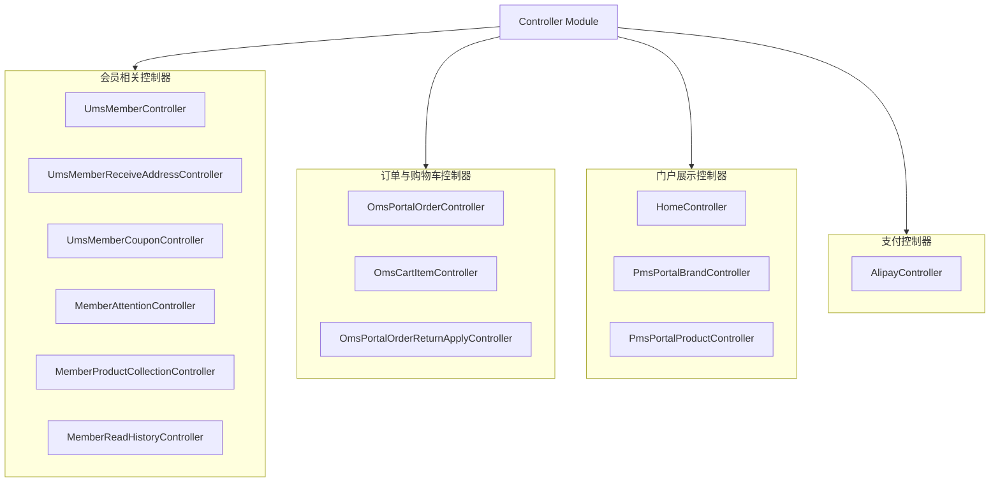
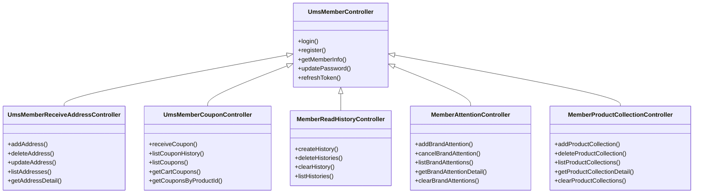
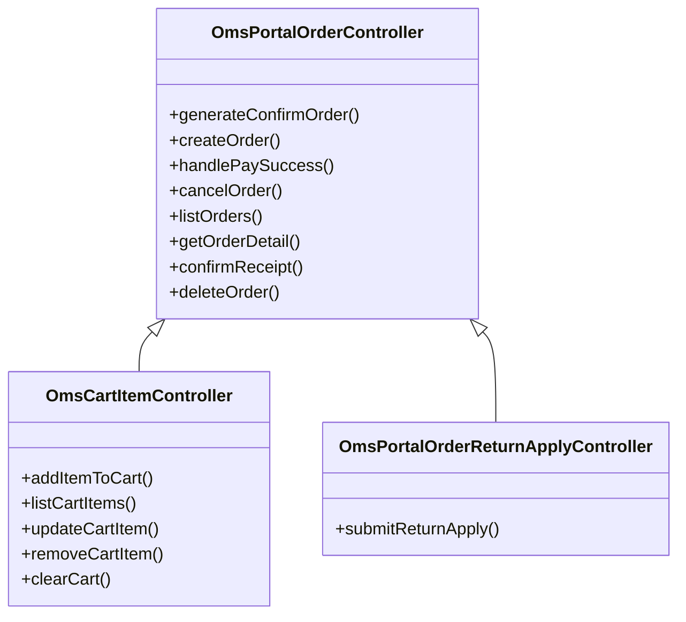
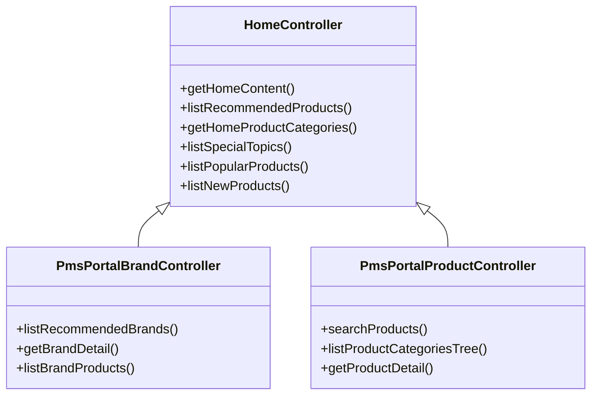
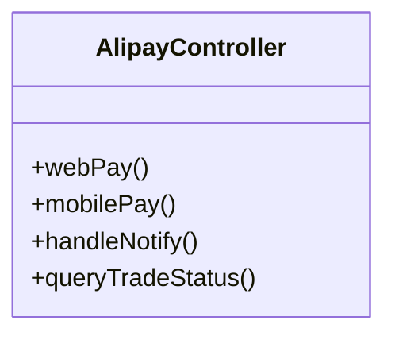

# Controller Module

## 1. 模块所在目录

该模块位于项目的 `mall-portal/src/main/java/com/macro/mall/portal/controller/` 目录下。

## 2. 模块介绍

> 非核心模块

Controller Module统一对外提供商城门户系统的RESTful接口，涵盖会员、订单购物车、门户展示及支付等核心业务领域，旨在提升系统接口的规范性和模块化水平，确保业务操作的统一入口和高效交互。

该模块通过接口聚合和职责分离的设计理念，实现了支付、会员、订单购物车和门户展示等核心业务的分层管理与整合，增强了系统的可维护性和一致性，便于前后端协作及未来功能扩展。

## 3. 职责边界

Controller Module专注于为商城门户系统提供统一且标准化的RESTful接口，涵盖会员管理、订单与购物车操作、门户展示及支付等核心业务的接口聚合与分层管理。该模块负责整合和规范对外API接口风格，提升系统的模块化和接口一致性，便于前后端协作及功能扩展。Controller Module不涉及底层业务逻辑实现、数据模型定义、安全认证及权限控制等职责，这些由mall-mbg、mall-security及后台管理等模块承担；同时，商品搜索功能由mall-search模块负责，基础设施和公共服务由mall-common模块提供。通过明确的职责划分，Controller Module专注于接口层的聚合与暴露，确保与其他模块职责单一且边界清晰，促进系统的高内聚与低耦合。

## 4. 同级模块关联

在商城门户系统中，Controller Module作为非核心模块，承担着统一对外提供RESTful接口的职责，涵盖会员、订单购物车、门户展示及支付等核心业务。与此模块紧密相关的同级模块主要围绕会员管理、订单处理、购物车操作以及门户内容展示等方面展开，共同支撑商城门户系统的业务需求，提升系统的模块化和接口规范性。

### 4.1 会员相关模块

**模块介绍**

该模块整合了**会员相关的所有RESTful控制器**，包括会员信息、收货地址、优惠券、浏览历史、品牌关注和商品收藏等功能。它统一对外提供会员操作的API接口，规范接口风格，便于前后端协作和系统维护，是商城门户会员业务的重要组成部分。

### 4.2 订单与购物车模块

**模块介绍**

该模块整合了**订单和购物车相关的RESTful接口**，涵盖订单管理、购物车操作以及订单退货申请等功能，构建了订单业务的全流程统一入口。此模块的设计提升了系统的一致性和模块化，使得订单和购物车业务能够高效协同工作。

### 4.3 门户展示模块

**模块介绍**

该模块聚合了首页内容、品牌展示和商品管理等**门户展示相关的RESTful接口**，统一面向前端或客户端提供门户展示数据服务。通过此模块，数据整合和页面开发变得更加便捷，增强了门户系统的用户体验和内容丰富度。

### 4.4 支付模块

**模块介绍**

该模块专注于支付相关接口的管理，尤其是支付宝支付功能。它提供电脑网站支付、手机网站支付、异步回调通知处理及订单交易状态查询等核心接口。作为商城门户系统中的支付入口，该模块通过与支付服务层的协作，保障了支付业务的稳定和安全。

## 5. 模块内部架构

Controller Module 作为商城门户系统的非核心模块，**统一对外提供标准化的RESTful接口**，涵盖会员管理、订单与购物车处理、门户内容展示以及支付等关键业务领域。通过聚合多个控制器类，实现对各业务场景的接口分层管理与职责分离，显著提升了系统的模块化程度与接口规范性，便于前后端的协作与系统的维护扩展。

该模块未包含子模块，但内部集成了多个基于Spring MVC框架的控制器类，这些控制器围绕不同的业务职责进行设计：

- **会员相关控制器**：涵盖会员信息、收货地址、优惠券、浏览历史、品牌关注及商品收藏，统一管理会员相关的API接口。
- **订单与购物车控制器**：实现订单管理、购物车操作及订单退货申请，提供订单业务全流程的接口支持。
- **门户展示控制器**：负责首页内容、品牌展示及商品管理，统一对外提供门户展示数据服务。
- **支付控制器**：专注于支付宝支付相关接口，包括支付发起、异步回调处理及交易状态查询。

以下Mermaid架构图直观展示了Controller Module的组织结构及其关键组件之间的关系：

## 6. 核心功能组件

Controller Module 提供了统一且标准化的RESTful接口，聚焦于商城门户系统的多个关键业务领域，包括会员管理、订单与购物车处理、门户内容展示以及支付服务。这些核心功能组件协同工作，确保系统接口的规范性和模块化，提升系统的维护性和扩展性。

### 6.1 会员管理组件

会员管理组件整合了所有与会员相关的控制器，涵盖会员信息、收货地址、优惠券、浏览历史、品牌关注和商品收藏等功能。该组件通过多个RESTful接口统一对外提供会员操作的API，规范接口风格，便于前后端协作和系统维护。

**Sources Files**

`mall-portal/src/main/java/com/macro/mall/portal/controller/UmsMemberController.java`

`mall-portal/src/main/java/com/macro/mall/portal/controller/UmsMemberReceiveAddressController.java`

`mall-portal/src/main/java/com/macro/mall/portal/controller/UmsMemberCouponController.java`

`mall-portal/src/main/java/com/macro/mall/portal/controller/MemberReadHistoryController.java`

`mall-portal/src/main/java/com/macro/mall/portal/controller/MemberAttentionController.java`

`mall-portal/src/main/java/com/macro/mall/portal/controller/MemberProductCollectionController.java`

### 6.2 订单与购物车管理组件

订单与购物车管理组件提供了订单管理、购物车操作及订单退货申请的RESTful接口，实现订单业务的全流程统一入口，提升系统一致性和模块化。该组件涵盖订单确认、创建、支付回调、取消、查询及退货申请等关键功能。

**Sources Files**

`mall-portal/src/main/java/com/macro/mall/portal/controller/OmsPortalOrderController.java`

`mall-portal/src/main/java/com/macro/mall/portal/controller/OmsCartItemController.java`

`mall-portal/src/main/java/com/macro/mall/portal/controller/OmsPortalOrderReturnApplyController.java`

### 6.3 门户展示组件

门户展示组件聚合了首页内容、品牌展示及商品管理相关的RESTful接口，统一对外提供门户展示数据服务。通过该组件，前端或客户端能够方便地获取首页综合内容、推荐商品、品牌列表及商品搜索等展示数据，支持商城门户的内容丰富性和用户交互体验。

**Sources Files**

`mall-portal/src/main/java/com/macro/mall/portal/controller/HomeController.java`

`mall-portal/src/main/java/com/macro/mall/portal/controller/PmsPortalBrandController.java`

`mall-portal/src/main/java/com/macro/mall/portal/controller/PmsPortalProductController.java`

### 6.4 支付服务组件

支付服务组件专注于处理与支付宝相关的支付请求，提供电脑网站支付、手机网站支付、异步回调通知处理及订单交易状态查询等核心接口。通过该组件，系统实现了与支付宝支付系统的有效交互，确保支付流程的顺畅与安全。

**Sources Files**

`mall-portal/src/main/java/com/macro/mall/portal/controller/AlipayController.java`
