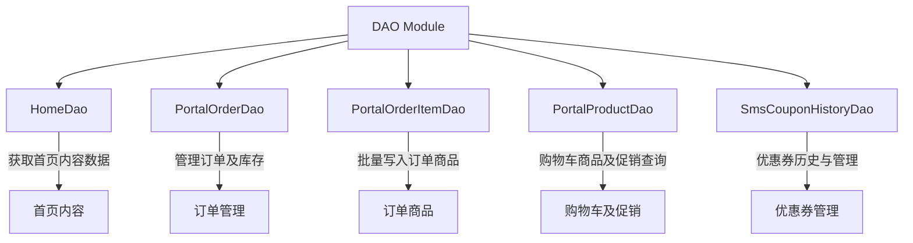
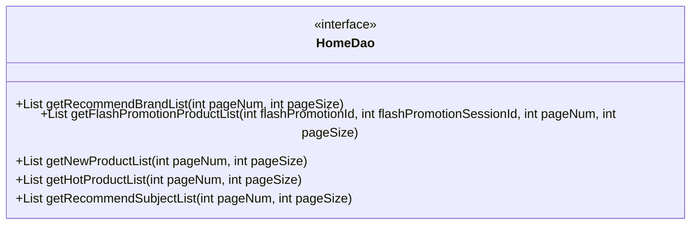
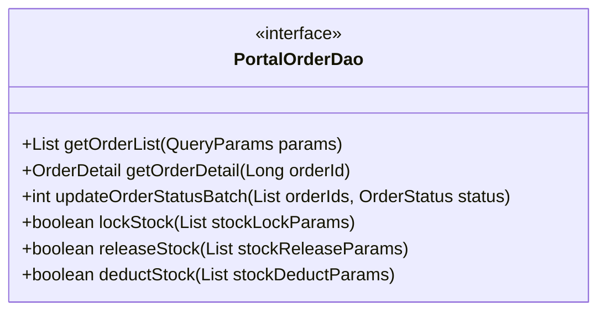
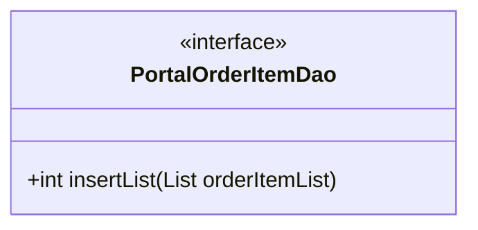
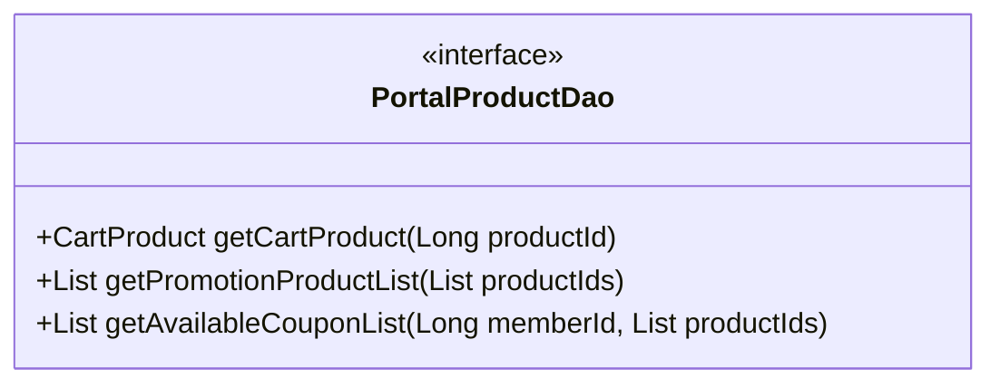
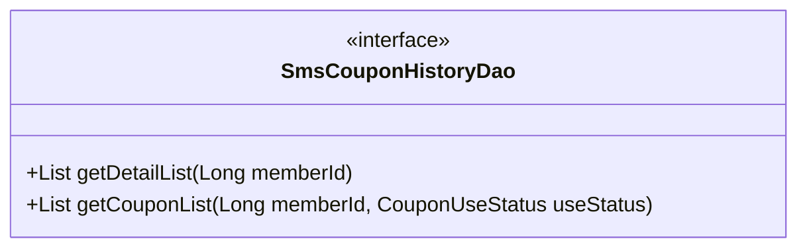

# DAO Module

## 1. 模块所在目录

该模块位于项目的 `mall-portal/src/main/java/com/macro/mall/portal/dao/` 目录下。

## 2. 模块介绍

> 非核心模块

DAO Module 提供商城前台核心业务的数据访问层接口，涵盖订单、购物车、首页内容及促销等关键领域，实现业务逻辑与数据持久化的有效解耦与高效维护。

该模块通过统一的接口抽象，整合订单管理、购物车商品操作及会员优惠券记录等功能，显著提升系统的可维护性和扩展性，确保商城前台业务数据查询与管理的高效性与一致性。

## 3. 职责边界

DAO模块专注于商城前台核心业务的数据访问层设计，负责订单、购物车、首页内容及促销等关键业务的数据查询与持久化操作，确保业务逻辑与数据存储的有效解耦。该模块不涉及业务逻辑实现、安全认证、权限控制或用户界面展示，相关功能分别由mall-portal、mall-security和mall-admin等模块承担。DAO模块依托mall-mbg提供的标准数据模型和Mapper接口，实现数据访问的标准化和高效维护，同时借助mall-common模块提供的基础设施支持。通过清晰划分数据访问职责，DAO模块为商城前台业务提供统一、高效且可扩展的数据层保障，促进系统整体的模块化与维护性。

## 4. 同级模块关联

在商城门户系统中，**DAO Module**作为非核心模块，承担着连接业务逻辑与数据持久化的关键职责。它与多个同级模块存在紧密关联，共同支持商城系统的稳定、高效运行。这些关联模块涵盖基础设施、数据模型、安全、后台管理、门户系统本身、搜索以及演示功能，为DAO模块提供了全方位的支撑和协同。

### 4.1 mall-common基础模块

**模块介绍**

mall-common基础模块提供了项目通用的基础配置、接口响应规范、异常管理、日志采集及Redis服务等基础设施。它确保了业务模块之间的统一规范和高复用性，是DAO Module依赖的核心基础，保障了数据访问层接口运行的稳定性和一致性。

### 4.2 mall-mbg代码生成与数据模型模块

**模块介绍**

mall-mbg代码生成与数据模型模块封装了电商系统核心业务的数据模型及其关联关系，提供基于MyBatis的标准Mapper接口和自动代码生成支持。该模块为DAO Module的数据访问层提供了标准化的数据结构和访问接口，显著提升了数据持久化操作的效率和维护性。

### 4.3 mall-admin后台管理模块

**模块介绍**

mall-admin后台管理模块涵盖了后台管理系统的配置管理、数据访问、业务服务实现、接口控制器及数据传输对象。它支持商品、订单、权限、促销、会员、内容推荐等核心业务功能。该模块与DAO Module协同，确保后台业务管理与前台数据访问的高内聚与模块化管理。

### 4.4 mall-portal门户系统模块

**模块介绍**

mall-portal门户系统模块构建商城门户系统的全栈体系，包括领域模型、配置管理、业务服务、数据访问、REST接口及异步组件。它支持会员、订单、支付、促销、内容展示等前端核心业务需求，与DAO Module紧密配合，实现了业务逻辑与数据层的有效分离与协作。

### 4.5 mall-search搜索模块

**模块介绍**

mall-search搜索模块基于Elasticsearch实现商品搜索服务，涵盖数据结构定义、数据访问层、业务逻辑及系统配置。该模块为DAO Module提供了高效、灵活的搜索及索引管理能力，增强了商城系统的商品检索性能和用户体验。

### 4.6 mall-demo演示模块

**模块介绍**

mall-demo演示模块是基于Spring Boot的电商演示应用，包含配置管理、业务服务、验证注解及REST控制器。它展示和验证了商城系统主要功能的使用和实现方式，为DAO Module的开发和测试提供了参考与辅助支持。

## 5. 模块内部架构

DAO Module 是商城前台核心业务的数据访问层接口集合，主要用于实现业务逻辑与数据持久化的解耦，支持订单、购物车、首页内容及促销等功能的高效维护。该模块通过定义统一的DAO接口，集中管理核心业务相关的数据访问操作，提升系统的可维护性和扩展性。

该模块未包含子模块，但内部由多个关键接口组成，分别承担不同业务领域的数据访问职责，具体如下：

- **HomeDao**：专注于首页内容的数据查询，提供推荐品牌、秒杀商品、新品推荐、人气推荐及专题列表等核心首页展示数据的接口。

- **PortalOrderDao**：负责订单管理相关的数据访问，包括订单查询、订单状态批量更新以及库存锁定释放等订单生命周期关键操作。

- **PortalOrderItemDao**：提供批量插入订单商品信息的接口，支持订单商品数据的高效写入。

- **PortalProductDao**：管理购物车商品及促销相关数据，支持购物车商品详情查询、促销商品列表获取及可用优惠券筛选。

- **SmsCouponHistoryDao**：访问会员优惠券领取历史及优惠券列表，支持按使用状态筛选优惠券数据。

下面通过Mermaid示意图展示DAO Module的组织结构及关键组件关系：

此架构体现了DAO Module通过接口分层实现业务职责划分，确保数据访问的统一性和高效性，为商城前台系统提供坚实的数据支持基础。

## 6. 核心功能组件

DAO Module主要包含若干核心功能组件，这些组件共同构成了商城前台核心业务的数据访问层。模块涵盖了首页内容管理、订单及订单商品操作、购物车商品及促销信息查询、以及会员优惠券领取历史管理等关键功能。通过这些组件，系统实现了业务逻辑与数据持久化的有效解耦，提升了系统的维护性和扩展性。

### 6.1 HomeDao

HomeDao组件专注于提供商城首页内容的数据库查询功能。该接口定义了获取推荐品牌、秒杀商品、新品推荐、人气推荐及推荐专题等首页核心内容的方法，支持分页和秒杀活动筛选。此组件为前端首页展示提供了丰富且动态的数据支持，确保用户能够获得及时且个性化的购物体验。

**Sources Files**

`mall-portal/src/main/java/com/macro/mall/portal/dao/HomeDao.java`

### 6.2 PortalOrderDao

PortalOrderDao组件承担商城门户订单管理相关的数据访问职责。它实现了订单及订单商品详情的查询，订单状态的批量更新，以及库存的锁定、释放和扣减等关键操作。该组件确保订单生命周期中数据库操作的高效执行与业务逻辑的清晰分离，保障商城订单处理的稳定性和准确性。

**Sources Files**

`mall-portal/src/main/java/com/macro/mall/portal/dao/PortalOrderDao.java`

### 6.3 PortalOrderItemDao

PortalOrderItemDao组件专门负责订单商品信息的批量写入操作。该接口定义了将多个订单商品记录一次性插入数据库的方法，优化了订单商品数据的持久化效率，支持订单商品数据的快速存储和管理。

**Sources Files**

`mall-portal/src/main/java/com/macro/mall/portal/dao/PortalOrderItemDao.java`

### 6.4 PortalProductDao

PortalProductDao组件提供了购物车商品及促销信息的访问接口。它支持获取购物车商品详细信息、促销商品列表以及可用优惠券列表的查询。通过对商品、促销及优惠券数据的整合访问，该组件为前端购物车展示和促销计算提供了数据基础，提升用户购物体验和促销活动的效果。

**Sources Files**

`mall-portal/src/main/java/com/macro/mall/portal/dao/PortalProductDao.java`

### 6.5 SmsCouponHistoryDao

SmsCouponHistoryDao组件用于管理会员优惠券领取历史及优惠券列表的访问。该接口支持获取指定会员的优惠券领取历史详细记录及根据使用状态筛选的优惠券列表，方便业务层对优惠券使用情况的查询与统计，推动优惠券管理的精细化运营。

**Sources Files**

`mall-portal/src/main/java/com/macro/mall/portal/dao/SmsCouponHistoryDao.java`
