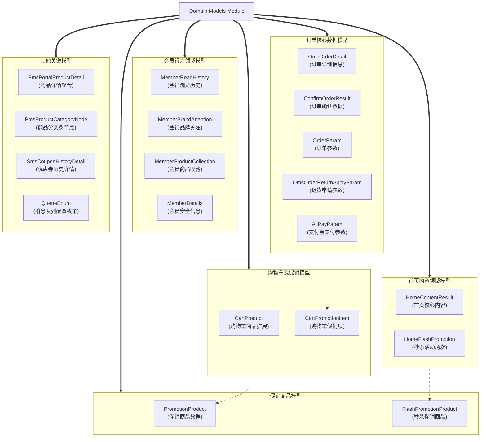
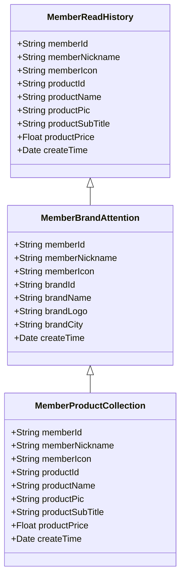
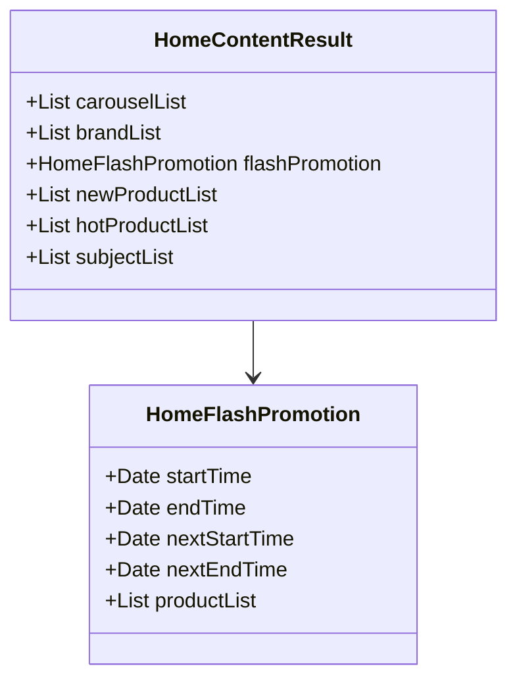
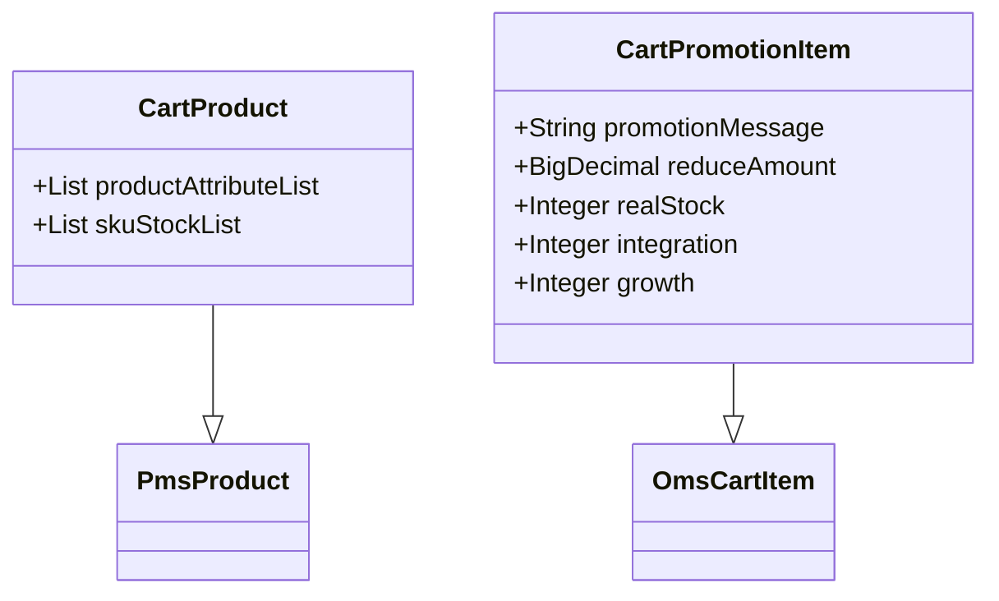
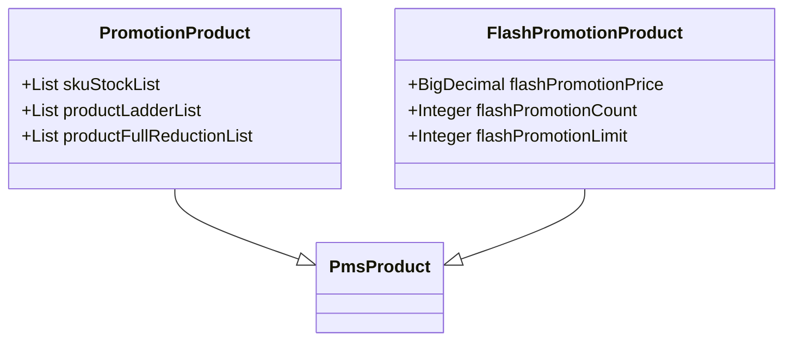
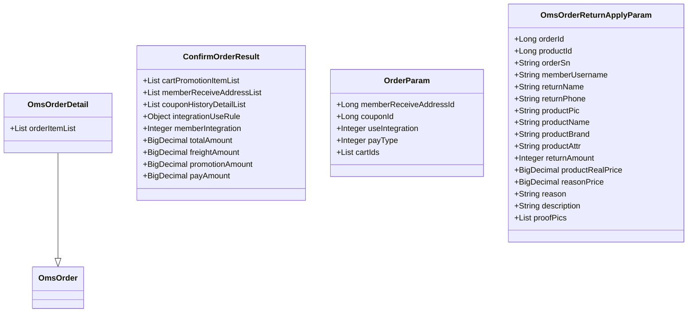

# Domain Models Module

## 1. 模块所在目录

该模块位于项目的 `mall-portal/src/main/java/com/macro/mall/portal/domain/` 目录下。

## 2. 模块介绍

> 非核心模块

Domain Models Module主要负责封装商城门户系统的核心领域模型，涵盖会员行为、首页内容、购物车商品及促销、订单等关键业务数据结构。该模块统一管理业务数据模型，确保系统业务数据的一致性和完整性，显著提升系统的可维护性与扩展能力。

该模块通过聚合和标准化商品、促销、订单、会员、支付及消息队列等多维度业务对象，优化前后端数据交互流程，提升业务处理效率。设计上充分考虑了数据结构的灵活性与扩展性，支持个性化推荐、秒杀活动管理及订单全流程处理，为商城门户系统构建了高效、规范的领域模型基础。

## 3. 职责边界

Domain Models Module负责封装商城门户系统的核心领域模型，涵盖会员行为、首页内容、购物车商品及促销、订单等关键业务数据结构，统一管理和标准化业务对象以提升系统的可维护性和扩展性。该模块不涉及具体业务逻辑的实现、数据持久化层的访问细节及安全认证和权限控制，这些功能由mall-mbg代码生成与数据模型模块、mall-security安全模块和其他相关模块承担。与mall-portal门户系统模块协同，提供前端业务所需的标准化领域模型支持；与mall-common基础模块配合，确保基础设施与规范的一致性；与mall-admin后台管理模块保持职责分离，聚焦于数据模型层而非业务管理实现。通过明确的职责划分，Domain Models Module保证了业务数据模型的统一和高效，支持系统整体架构的清晰和模块间的低耦合。

## 4. 同级模块关联

在商城门户系统的架构中，**Domain Models Module**作为非核心模块，主要负责封装商城门户系统的核心领域模型，涵盖会员行为、首页内容、购物车商品及促销、订单数据结构等关键业务数据模型。为了实现系统的高效运转和模块间的协同，**该模块与多个同级模块紧密关联**，共同支撑商城门户的业务需求和技术实现。

### 4.1 mall-common基础模块

**模块介绍**
mall-common基础模块提供了项目所需的通用基础配置，包括接口响应规范、异常管理、日志采集以及Redis服务等基础设施。通过提供统一的规范和高复用的基础服务，确保业务模块间的一致性和系统的稳定运行，为Domain Models Module提供坚实的技术支撑。

### 4.2 mall-mbg代码生成与数据模型模块

**模块介绍**
mall-mbg代码生成与数据模型模块封装了电商系统的核心业务数据模型及其关联关系，提供基于MyBatis的标准Mapper接口和自动代码生成支持。该模块的标准化数据访问层与Domain Models Module协同，确保业务数据模型的统一定义和高效维护，促进系统数据结构的一致性。

### 4.3 mall-security安全模块

**模块介绍**
mall-security安全模块基于Spring Security构建，涵盖安全认证、权限控制、JWT认证、动态权限管理及安全异常处理。该模块为商城门户系统提供完善的安全体系，Domain Models Module中的会员信息模型等与安全模块紧密配合，保障用户认证与授权的安全性和灵活性。

### 4.4 mall-admin后台管理模块

**模块介绍**
mall-admin后台管理模块涵盖后台系统的配置管理、数据访问、业务服务及接口控制器，支持商品、订单、权限、促销、会员及内容推荐等核心业务功能。该模块与Domain Models Module共享和交互核心业务数据模型，协助实现高内聚和模块化管理，促进业务流程的协同和数据一致。

### 4.5 mall-portal门户系统模块

**模块介绍**
mall-portal门户系统模块构建了商城门户的全栈体系，包含领域模型、配置管理、业务服务、数据访问、REST接口及异步组件等。作为Domain Models Module的直接依赖，该模块利用其封装的领域模型实现会员、订单、支付、促销和内容展示等前端核心业务，确保业务逻辑的完整性和数据交互的统一。

### 4.6 mall-search搜索模块

**模块介绍**
mall-search搜索模块基于Elasticsearch实现商品搜索服务，涵盖数据结构定义、数据访问层和业务逻辑。该模块与Domain Models Module在商品和促销数据模型上保持一致，通过标准化的数据结构支持高效灵活的搜索和索引管理，提升用户搜索体验。

### 4.7 mall-demo演示模块

**模块介绍**
mall-demo演示模块是基于Spring Boot的电商演示应用，包含配置管理、业务服务、验证注解及REST控制器。该模块通过调用Domain Models Module的业务模型展示商城系统的主要功能，作为系统功能的验证和示范平台，促进开发和测试的高效进行。

## 5. 模块内部架构

Domain Models Module 是商城门户系统中用于**封装核心领域模型**的非核心模块，主要负责会员行为、首页内容、购物车商品及促销、订单数据结构等业务数据模型的统一管理。通过标准化和聚合相关业务对象，该模块极大地提升了系统的**可维护性**与**扩展性**，保障了前后端交互的一致性和业务处理的高效性。

该模块目前不包含子模块，所有领域模型均在统一的包结构下实现，覆盖了商城门户系统的多个关键业务领域，包括会员行为数据的MongoDB模型、首页内容数据模型、购物车商品及促销数据模型、促销商品模型以及订单相关核心数据模型。

以下Mermaid图表展示了Domain Models Module的内部架构，体现了模块内各个关键领域模型的组织结构及其业务职能：

该架构体现了Domain Models Module通过聚合和封装多类领域模型，形成了覆盖**会员行为、首页内容、购物车促销、订单处理及商品促销**的完整业务数据模型体系，支撑商城门户系统的核心业务功能和数据交互需求。

## 6. 核心功能组件

本模块提供了商城门户系统的多个**核心功能组件**，涵盖了会员行为管理、首页内容展示、购物车及促销管理，以及订单处理等关键领域模型。这些组件通过标准化业务数据结构，提升了系统的可维护性和扩展能力，确保前后端数据交互的统一性和业务逻辑的高效协同。

### 6.1 会员行为管理组件

该组件主要封装会员的行为数据模型，包括商品浏览历史、品牌关注和商品收藏等信息，基于MongoDB实现文档存储。通过统一管理会员行为数据，支持行为分析和个性化推荐，提升用户体验和系统的扩展性。

**Sources Files**

`mall-portal/src/main/java/com/macro/mall/portal/domain/MemberReadHistory.java`

`mall-portal/src/main/java/com/macro/mall/portal/domain/MemberBrandAttention.java`

`mall-portal/src/main/java/com/macro/mall/portal/domain/MemberProductCollection.java`

### 6.2 首页内容展示组件

该组件封装商城门户首页所需的各类内容数据，包括轮播广告、推荐品牌、秒杀活动信息、新品及人气推荐商品列表等。通过整合首页主要展示内容，提升前后端数据交互的统一性和管理灵活性。

**Sources Files**

`mall-portal/src/main/java/com/macro/mall/portal/domain/HomeContentResult.java`

`mall-portal/src/main/java/com/macro/mall/portal/domain/HomeFlashPromotion.java`

### 6.3 购物车及促销管理组件

该组件围绕购物车商品及促销信息构建数据模型，既包含商品的详细属性和库存信息，又集成促销活动字段。它统一管理购物车商品和促销业务模型，支持促销展示、优惠计算及库存校验，确保购物车数据结构的完整性和业务扩展能力。

**Sources Files**

`mall-portal/src/main/java/com/macro/mall/portal/domain/CartProduct.java`

`mall-portal/src/main/java/com/macro/mall/portal/domain/CartPromotionItem.java`

### 6.4 促销商品管理组件

该组件统一封装促销商品的数据结构，继承基础商品模型并扩展促销相关字段，如SKU库存、阶梯优惠及满减优惠信息，支持秒杀及一般促销商品的统一管理和业务处理。

**Sources Files**

`mall-portal/src/main/java/com/macro/mall/portal/domain/PromotionProduct.java`

`mall-portal/src/main/java/com/macro/mall/portal/domain/FlashPromotionProduct.java`

### 6.5 订单处理组件

该组件集中封装订单相关的核心领域模型，包括订单详情、订单确认结果、下单参数及退货申请参数。通过标准化订单业务数据结构，提升订单处理、展示及业务逻辑的协同效率，便于前后端数据交互和后续功能扩展。

**Sources Files**

`mall-portal/src/main/java/com/macro/mall/portal/domain/OmsOrderDetail.java`

`mall-portal/src/main/java/com/macro/mall/portal/domain/ConfirmOrderResult.java`

`mall-portal/src/main/java/com/macro/mall/portal/domain/OrderParam.java`

`mall-portal/src/main/java/com/macro/mall/portal/domain/OmsOrderReturnApplyParam.java`
