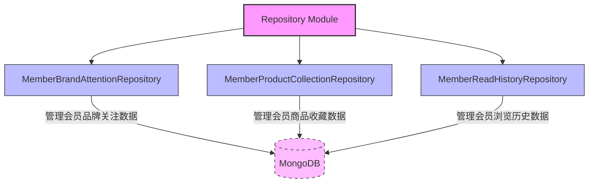
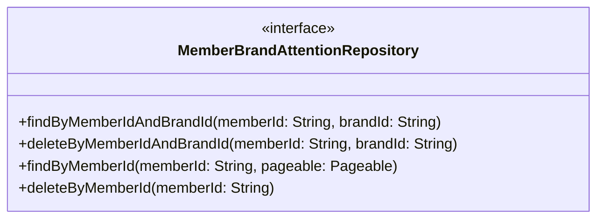
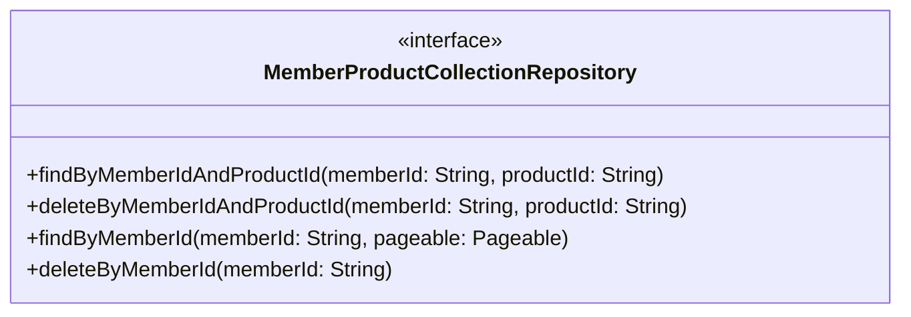
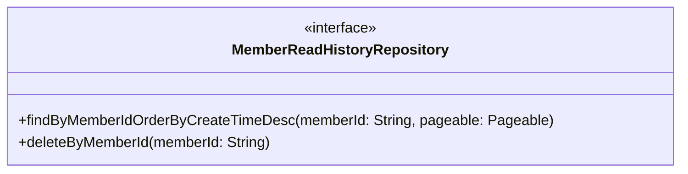

# Repository Module

## 1. 模块所在目录

该模块位于项目的 `mall-portal/src/main/java/com/macro/mall/portal/repository/` 目录下。

## 2. 模块介绍

> 非核心模块

Repository Module主要负责提供会员行为相关的MongoDB数据访问接口，支持会员商品浏览历史、品牌关注、商品收藏等多种行为数据的持久化操作。通过统一的增删查改及分页查询接口，该模块简化了数据访问逻辑，有效满足会员行为数据的持久化需求。

该模块聚焦于接口的统一和复用，采用Repository设计模式，实现了对不同会员行为数据的批量操作和分页查询功能，提升了开发效率和系统维护性。其设计理念强调模块化和扩展性，确保能够便捷地支持与会员行为相关的多样化数据处理场景。

## 3. 职责边界

Repository模块专注于为会员行为相关的数据提供MongoDB的持久化访问接口，负责统一封装会员商品浏览历史、品牌关注、商品收藏等行为数据的增删查改、分页查询及批量操作，简化数据访问逻辑并提升开发维护效率。该模块不涉及业务逻辑处理、安全认证、前端展示或后台管理功能，相关业务服务由mall-admin和mall-portal模块承担，安全控制由mall-security模块负责，通用基础设施支持依赖mall-common模块，数据模型定义和标准数据访问接口由mall-mbg模块提供。通过明确分工，Repository模块专注于数据访问层的职责，确保会员行为数据的高效持久化和统一管理。

## 4. 同级模块关联

在电商门户系统中，**Repository Module**负责会员行为相关的MongoDB数据访问，简化会员行为数据的持久化处理。该模块与多个其他同级模块存在紧密的业务和技术关联，共同支持商城门户的核心功能实现。以下内容介绍了与Repository Module实际关联的同级模块，帮助理解其在整体架构中的协同作用。

### 4.1 mall-portal门户系统模块

**模块介绍**

mall-portal门户系统模块构建了商城门户的全栈体系，涵盖领域模型、配置管理、业务服务、数据访问、REST接口及异步组件等关键部分。该模块支持会员、订单、支付、促销、内容展示等前端核心业务需求，提供了完整的业务链路和技术支撑。Repository Module作为数据访问层的重要组成部分，直接服务于mall-portal模块中会员相关业务的数据持久化需求，确保会员行为数据的有效管理与调用。

### 4.2 mall-admin后台管理模块

**模块介绍**

mall-admin后台管理模块致力于后台系统的高内聚与模块化管理，涵盖配置管理、数据访问、业务服务实现、接口控制器及数据传输对象。该模块支持商品、订单、权限、促销、会员、内容推荐等核心业务功能。Repository Module提供的会员行为数据访问接口，支撑了后台对会员品牌关注、商品收藏及浏览历史等行为数据的管理与维护，促进后台管理系统的业务执行与数据准确性。

### 4.3 mall-common基础模块

**模块介绍**

mall-common基础模块提供了项目通用的基础配置、接口响应规范、异常管理、日志采集及Redis服务等基础设施，确保业务模块的一致性和高复用性。作为各业务模块的基础支撑，mall-common模块为Repository Module提供了规范和工具支持，使其在数据访问和异常处理等方面达到统一标准，提升整体系统的稳定性和可维护性。

## 5. 模块内部架构

Repository Module **内部结构聚焦于会员行为数据的MongoDB持久化访问**，通过一系列基于Spring Data MongoDB的Repository接口，实现对会员行为相关数据的统一管理。该模块不包含独立的子模块，而是由多个专门的Repository接口组成，每个接口负责特定的会员行为数据操作，确保数据访问的职责明确且高效。

本模块聚合了以下关键组件：

- **MemberBrandAttentionRepository**：负责会员品牌关注信息的持久化操作，支持基于会员ID和品牌ID的查询及删除，以及分页查询和批量删除功能。

- **MemberProductCollectionRepository**：专注于会员商品收藏数据的管理，提供单条记录查询、删除及分页查询和批量删除接口。

- **MemberReadHistoryRepository**：管理会员商品浏览历史数据，支持分页查询（按浏览时间倒序）及删除所有浏览历史记录。

这些组件通过继承Spring Data MongoRepository接口，统一了数据访问规范，简化了业务层对会员行为数据的操作，提升了开发效率和代码维护性。

此架构图清晰展示了模块内部的组织结构及各关键组件之间的关系，体现了模块以Repository接口为核心，面向不同会员行为数据类型提供专门的数据访问服务。

## 6. 核心功能组件

Repository Module 包含若干针对会员行为数据的核心功能组件，主要负责处理会员品牌关注、商品收藏以及浏览历史的MongoDB数据访问与管理。通过这些组件，模块统一实现了会员行为数据的增删查改和分页查询功能，极大简化了数据访问逻辑，满足会员行为数据的持久化需求。

### 6.1 MemberBrandAttentionRepository

MemberBrandAttentionRepository 是一个基于 Spring Data MongoDB 的仓库接口，专注于会员品牌关注信息的持久化操作。该组件提供了根据会员ID和品牌ID进行查询和删除的能力，同时支持基于会员ID的分页查询和批量删除操作，便于高效管理会员对品牌的关注数据。

**Sources Files**

`mall-portal/src/main/java/com/macro/mall/portal/repository/MemberBrandAttentionRepository.java`

### 6.2 MemberProductCollectionRepository

MemberProductCollectionRepository 是用于操作会员商品收藏数据的MongoDB仓库接口。它支持根据会员ID和商品ID查询单条收藏记录，删除指定收藏，分页查询会员所有收藏记录，并能批量删除某会员的全部收藏，确保收藏数据的管理与访问高效且灵活。

**Sources Files**

`mall-portal/src/main/java/com/macro/mall/portal/repository/MemberProductCollectionRepository.java`

### 6.3 MemberReadHistoryRepository

MemberReadHistoryRepository 负责会员商品浏览历史数据的持久化管理。该接口继承自 Spring Data MongoRepository，提供基于会员ID的浏览历史分页查询（按浏览时间倒序）及全部浏览历史删除功能，方便对会员的浏览行为进行高效存取和管理。

**Sources Files**

`mall-portal/src/main/java/com/macro/mall/portal/repository/MemberReadHistoryRepository.java`
