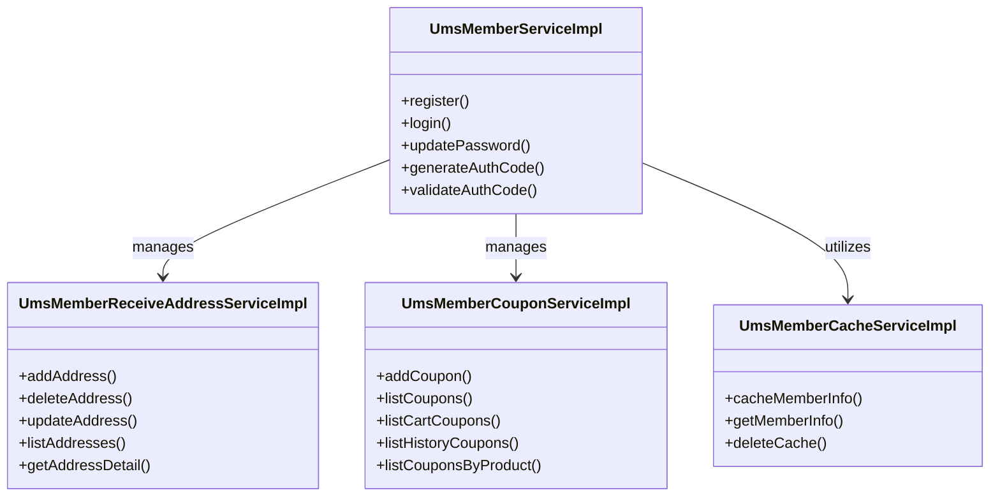
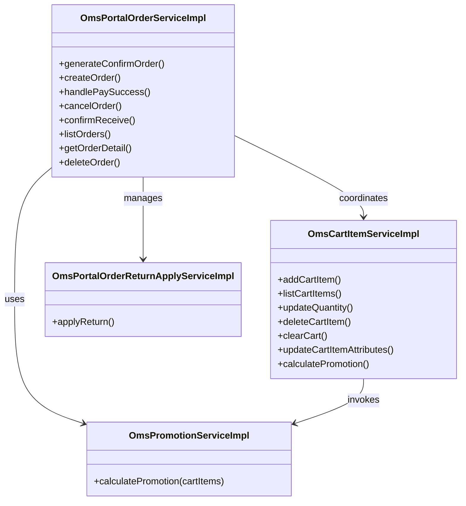
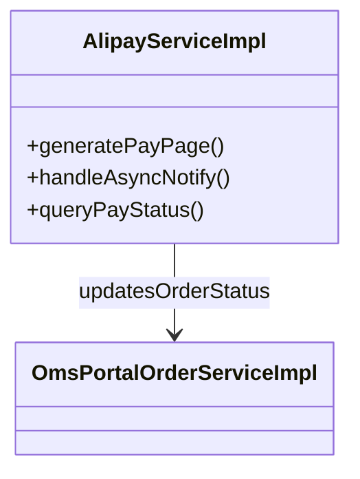
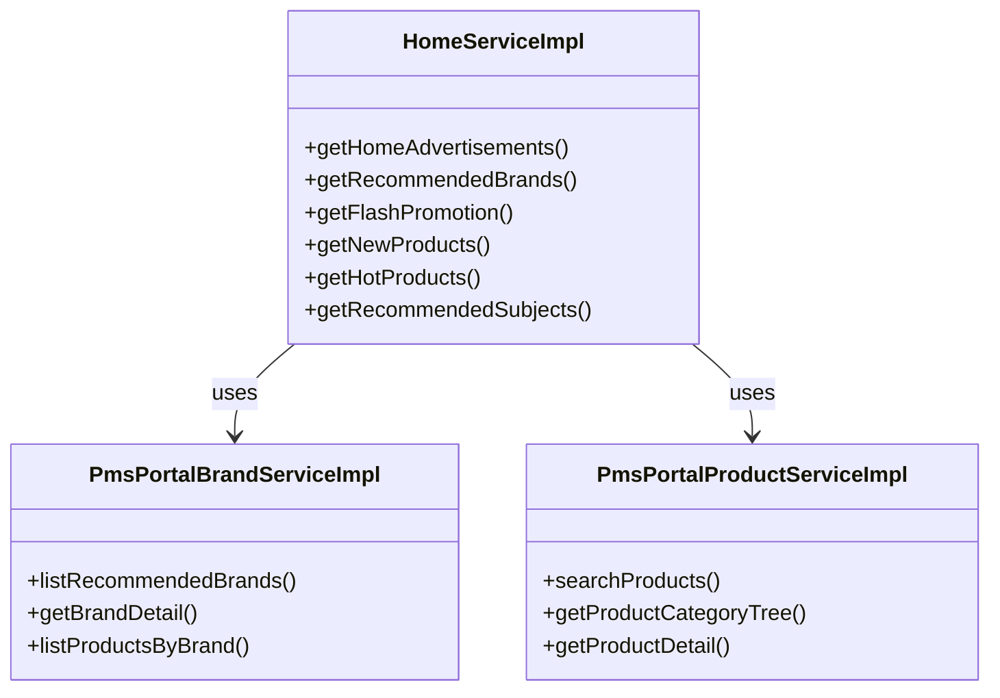

# Service Implementation Module

## 1. 模块所在目录

该模块位于项目的 `mall-portal/src/main/java/com/macro/mall/portal/service/impl/` 目录下。

## 2. 模块介绍

> 非核心模块

Service Implementation Module 实现了商城门户前台的核心业务逻辑，涵盖会员管理、订单与促销处理、商品与内容管理等关键功能。该模块通过集中封装业务逻辑，提升系统业务的整体集中性和扩展性，确保前端业务流程的完整性和数据一致性。

该模块设计注重业务逻辑的统一管理与维护，支持多种数据库的数据存取，并通过封装会员行为数据及订单生命周期管理等关键业务，优化系统的可维护性、安全性和用户体验。通过整合商品及内容管理服务，提升前端内容渲染效率与系统的业务扩展能力。

## 3. 职责边界

Service Implementation Module专注于商城门户前台核心业务逻辑的实现，涵盖会员管理、订单与促销处理、商品与内容管理等关键业务功能，旨在通过业务逻辑的集中封装提升系统的可维护性、扩展性和数据一致性。该模块负责会员行为数据管理、会员账户及相关业务操作、订单全生命周期及促销优惠计算，以及商品品牌和首页内容的核心业务逻辑实现。它不负责底层的数据模型定义、基础设施服务、安全认证及权限控制、后台管理功能以及搜索服务，这些职责分别由mall-mbg、mall-common、mall-security、mall-admin和mall-search模块承担。Service Implementation Module通过与mall-portal门户系统模块紧密配合，提供面向前端的完整业务服务接口，保持模块职责的清晰划分，确保系统高内聚低耦合并优化用户体验。

## 4. 同级模块关联

当前模块是商城门户前台业务逻辑实现的重要组成部分，涉及会员管理、订单处理、促销活动、商品与内容管理等关键功能。与之相关的同级模块主要涵盖基础设施支持、安全认证、后台管理以及门户系统的整体架构，为业务模块提供统一规范、安全保障及高效的数据访问支持。以下内容介绍了与本模块有实际关联的同级模块，帮助理解整体系统架构及模块间的协作关系。

### 4.1 mall-common基础模块

**模块介绍**

mall-common基础模块提供了项目通用的基础配置和核心设施支持，包括接口响应规范、异常管理、日志采集以及Redis服务等功能。该模块确保了业务模块间的统一规范和高复用性，是系统稳定运行和高效开发的重要基础支撑。

### 4.2 mall-mbg代码生成与数据模型模块

**模块介绍**

mall-mbg模块封装了电商系统的核心业务数据模型及其关联关系，提供基于MyBatis的标准Mapper接口和自动代码生成支持。通过实现数据访问层的标准化和高效维护，该模块为业务逻辑模块的数据操作提供了坚实基础。

### 4.3 mall-security安全模块

**模块介绍**

mall-security模块构建了基于Spring Security的安全认证与权限控制体系，包含JWT认证、动态权限管理、安全异常统一处理及缓存异常监控。该模块为商城门户的业务模块提供了强有力的安全保障，提升系统的安全性和灵活性。

### 4.4 mall-admin后台管理模块

**模块介绍**

mall-admin模块涵盖后台管理系统的配置管理、数据访问、业务服务实现、接口控制器及数据传输对象。它支持商品、订单、权限、促销、会员和内容推荐等核心业务功能，实现高内聚与模块化管理，辅助门户前台业务的高效运营。

### 4.5 mall-portal门户系统模块

**模块介绍**

mall-portal门户系统模块构建了商城门户系统的全栈体系，包括领域模型、配置管理、业务服务、数据访问、REST接口及异步组件。该模块支持会员、订单、支付、促销、内容展示等前端核心业务需求，是商城门户前台业务实现的基础框架。

### 4.6 mall-search搜索模块

**模块介绍**

mall-search模块实现了基于Elasticsearch的商品搜索服务，涵盖数据结构定义、数据访问层、业务逻辑及系统配置。该模块为商城门户提供高效、灵活的搜索及索引管理能力，优化用户的商品检索体验。

### 4.7 mall-demo演示模块

**模块介绍**

mall-demo模块基于Spring Boot实现，作为电商演示应用，包含配置管理、业务服务、验证注解及REST控制器。该模块展示和验证了商城系统主要功能的使用和实现方式，为开发和测试提供了参考示例。

## 5. 模块内部架构

**Service Implementation Module**作为商城门户前台的非核心模块，承担着实现商城门户前台核心业务逻辑的职责。该模块集中封装了会员管理、订单与促销处理、商品与内容管理等关键业务流程，旨在提升系统业务逻辑的集中性、可维护性及扩展性，优化用户体验并保障数据一致性。

该模块不包含进一步划分的子模块，但内部通过多个实现具体业务功能的服务类协作完成整体业务需求。这些服务类涵盖了会员行为数据管理、会员账户及优惠券管理、订单生命周期管理、促销计算、商品与品牌管理、支付处理、首页内容管理等多方面的业务逻辑，实现了功能的细粒度分工与高度内聚。

下图使用Mermaid图示展示了该模块的组织结构及关键组件的相互关系：

```mermaid
graph TD
    A[Service Implementation Module]
    A --> B[会员行为管理]
    A --> C[会员管理]
    A --> D[订单与购物车管理]
    A --> E[促销计算]
    A --> F[商品与品牌管理]
    A --> G[支付处理]
    A --> H[首页内容管理]
    A --> I[会员缓存管理]
    A --> J[会员优惠券管理]
    
    B --> B1[MemberAttentionServiceImpl]
    B --> B2[MemberCollectionServiceImpl]
    B --> B3[MemberReadHistoryServiceImpl]
    
    C --> C1[UmsMemberServiceImpl]
    C --> C2[UmsMemberReceiveAddressServiceImpl]
    
    D --> D1[OmsPortalOrderServiceImpl]
    D --> D2[OmsCartItemServiceImpl]
    D --> D3[OmsPortalOrderReturnApplyServiceImpl]
    
    E --> E1[OmsPromotionServiceImpl]
    
    F --> F1[PmsPortalProductServiceImpl]
    F --> F2[PmsPortalBrandServiceImpl]
    
    G --> G1[AlipayServiceImpl]
    
    H --> H1[HomeServiceImpl]
    
    I --> I1[UmsMemberCacheServiceImpl]
    
    J --> J1[UmsMemberCouponServiceImpl]

    style A fill:#f9f,stroke:#333,stroke-width:1.5px
    style B fill:#bbf,stroke:#333,stroke-width:1px
    style C fill:#bbf,stroke:#333,stroke-width:1px
    style D fill:#bbf,stroke:#333,stroke-width:1px
    style E fill:#bbf,stroke:#333,stroke-width:1px
    style F fill:#bbf,stroke:#333,stroke-width:1px
    style G fill:#bbf,stroke:#333,stroke-width:1px
    style H fill:#bbf,stroke:#333,stroke-width:1px
    style I fill:#bbf,stroke:#333,stroke-width:1px
    style J fill:#bbf,stroke:#333,stroke-width:1px

    style B1 fill:#ddf,stroke:#333,stroke-width:1px
    style B2 fill:#ddf,stroke:#333,stroke-width:1px
    style B3 fill:#ddf,stroke:#333,stroke-width:1px

    style C1 fill:#ddf,stroke:#333,stroke-width:1px
    style C2 fill:#ddf,stroke:#333,stroke-width:1px

    style D1 fill:#ddf,stroke:#333,stroke-width:1px
    style D2 fill:#ddf,stroke:#333,stroke-width:1px
    style D3 fill:#ddf,stroke:#333,stroke-width:1px

    style E1 fill:#ddf,stroke:#333,stroke-width:1px

    style F1 fill:#ddf,stroke:#333,stroke-width:1px
    style F2 fill:#ddf,stroke:#333,stroke-width:1px

    style G1 fill:#ddf,stroke:#333,stroke-width:1px

    style H1 fill:#ddf,stroke:#333,stroke-width:1px

    style I1 fill:#ddf,stroke:#333,stroke-width:1px

    style J1 fill:#ddf,stroke:#333,stroke-width:1px
```



该架构图清晰展现了模块内各服务实现类的职责归属，体现了模块对商城门户前台各核心业务领域的全面覆盖及细致划分。

## 6. 核心功能组件

Service Implementation Module 包含多个**核心功能组件**，主要涵盖会员管理、订单与促销处理、支付服务、商品与内容管理等关键业务逻辑。这些组件通过模块化设计，实现了业务逻辑的集中封装与高效扩展，保证系统的可维护性和用户体验提升。以下将详细介绍五个代表性核心功能组件。

### 6.1 会员管理组件

会员管理组件负责商城门户前台会员领域的核心业务逻辑实现，包括会员账户管理、收货地址管理、优惠券管理及会员缓存等功能。该组件通过统一封装会员相关的增删改查操作和缓存策略，保障会员数据的一致性、安全性和高效访问。



**Sources Files**

`mall-portal/src/main/java/com/macro/mall/portal/service/impl/UmsMemberServiceImpl.java`  
`mall-portal/src/main/java/com/macro/mall/portal/service/impl/UmsMemberReceiveAddressServiceImpl.java`  
`mall-portal/src/main/java/com/macro/mall/portal/service/impl/UmsMemberCouponServiceImpl.java`  
`mall-portal/src/main/java/com/macro/mall/portal/service/impl/UmsMemberCacheServiceImpl.java`

### 6.2 会员行为数据管理组件

该组件专注于管理会员的行为数据，包括品牌关注、商品浏览历史及商品收藏功能。它提供会员行为数据的增删查清操作，结合当前登录会员身份，支持MongoDB及关系型数据库的数据持久化，确保数据一致性与扩展性。

```mermaid
classDiagram
    class MemberAttentionServiceImpl {
        +addAttention()
        +cancelAttention()
        +listAttentions()
        +getAttentionDetail()
        +clearAttentions()
    }
    class MemberReadHistoryServiceImpl {
        +createReadHistory()
        +deleteReadHistoryBatch()
        +listReadHistory()
        +clearReadHistory()
    }
    class MemberCollectionServiceImpl {
        +addCollection()
        +removeCollection()
        +listCollections()
        +clearCollections()
    }
    MemberAttentionServiceImpl ..> "MongoDB" : persists
    MemberReadHistoryServiceImpl ..> "MongoDB" : persists
    MemberCollectionServiceImpl ..> "MongoDB" : persists
    MemberCollectionServiceImpl ..> UmsMemberServiceImpl : uses
```

**Sources Files**

`mall-portal/src/main/java/com/macro/mall/portal/service/impl/MemberAttentionServiceImpl.java`  
`mall-portal/src/main/java/com/macro/mall/portal/service/impl/MemberReadHistoryServiceImpl.java`  
`mall-portal/src/main/java/com/macro/mall/portal/service/impl/MemberCollectionServiceImpl.java`

### 6.3 订单与促销管理组件

订单与促销管理组件集中实现商城门户前台订单全生命周期管理、购物车业务、促销优惠计算及订单退货申请等核心服务。其统一整合订单与促销相关业务逻辑，确保订单处理流程的完整性与灵活性，提升系统维护效率。



**Sources Files**

`mall-portal/src/main/java/com/macro/mall/portal/service/impl/OmsPortalOrderServiceImpl.java`  
`mall-portal/src/main/java/com/macro/mall/portal/service/impl/OmsCartItemServiceImpl.java`  
`mall-portal/src/main/java/com/macro/mall/portal/service/impl/OmsPromotionServiceImpl.java`  
`mall-portal/src/main/java/com/macro/mall/portal/service/impl/OmsPortalOrderReturnApplyServiceImpl.java`

### 6.4 支付服务组件

支付服务组件主要实现支付宝支付业务逻辑，支持电脑网站支付和手机网站支付两种方式。该组件负责生成支付请求页面、接收并校验支付异步通知、查询订单支付状态，并调用订单服务同步更新订单状态，确保支付流程安全及业务数据一致。



**Sources Files**

`mall-portal/src/main/java/com/macro/mall/portal/service/impl/AlipayServiceImpl.java`

### 6.5 商品与内容管理组件

商品与内容管理组件负责商城门户前台商品管理、品牌管理及首页内容展示的核心业务逻辑。它通过集中处理商品检索、品牌推荐、首页广告及专题推荐等服务，优化内容渲染效率，提升系统的业务扩展能力和用户体验。



**Sources Files**

`mall-portal/src/main/java/com/macro/mall/portal/service/impl/PmsPortalProductServiceImpl.java`  
`mall-portal/src/main/java/com/macro/mall/portal/service/impl/PmsPortalBrandServiceImpl.java`  
`mall-portal/src/main/java/com/macro/mall/portal/service/impl/HomeServiceImpl.java`
