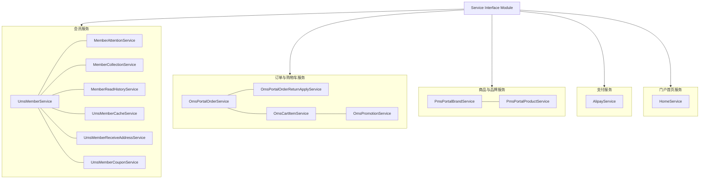
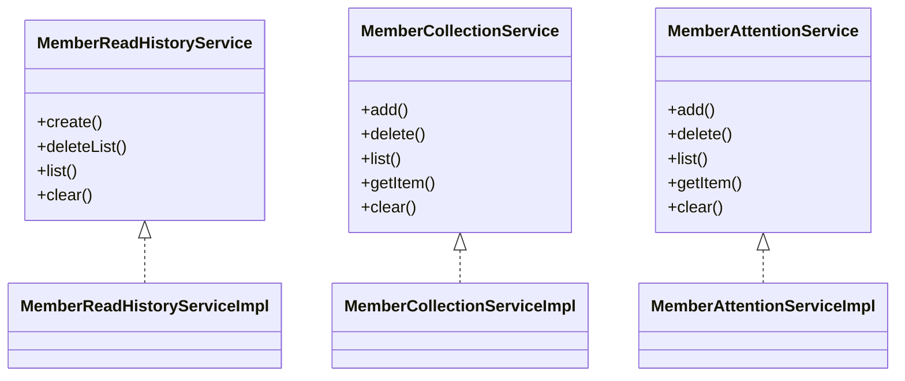
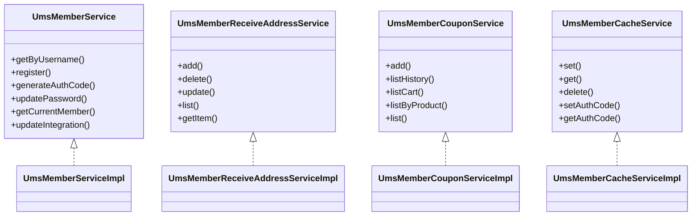
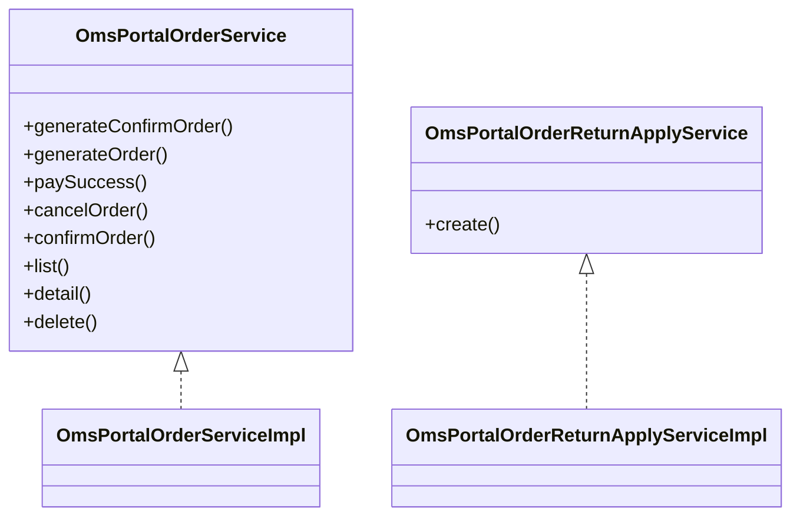
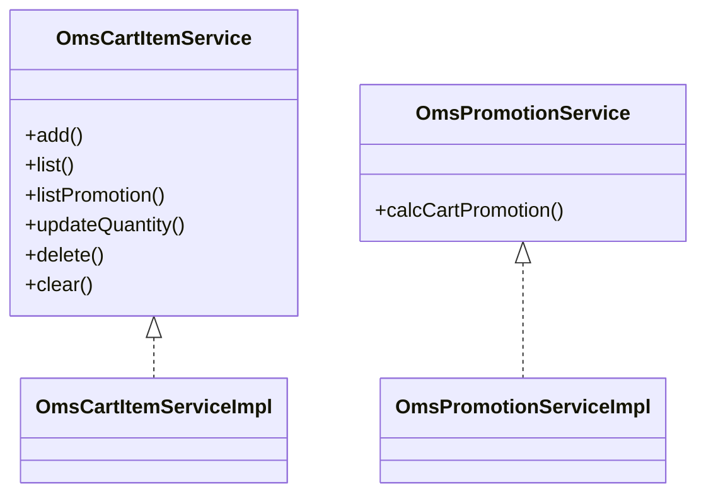
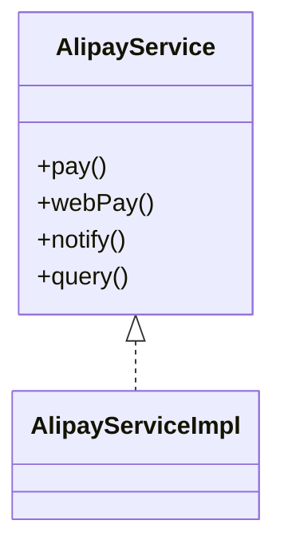

# Service Interface Module

## 1. 模块所在目录

该模块位于项目的 `mall-portal/src/main/java/com/macro/mall/portal/service/` 目录下。

## 2. 模块介绍

> 非核心模块

Service Interface Module 定义了商城门户前台的核心业务服务接口，涵盖品牌、商品、会员、订单及促销等关键领域，实现了前后端的解耦与统一的服务抽象，支撑商城业务的高效协同与扩展。

该模块采用接口和模块化设计，集中封装业务逻辑，统一对外服务，提升系统的可维护性和可扩展性。通过整合会员行为数据管理、会员账户核心逻辑、订单全生命周期及退货管理，以及购物车与促销计算功能，实现业务操作的一体化和简化，确保前端数据交互的一致性和系统整体的稳定性。

## 3. 职责边界

Service Interface Module负责定义和实现商城门户前台核心业务服务接口，涵盖品牌、商品、会员、订单、促销等关键业务领域，致力于实现前后端解耦和统一服务抽象。该模块专注于提供统一的业务逻辑封装和接口服务，支持会员个性化行为数据管理、会员账户核心业务、订单全生命周期及退货管理，以及购物车商品与促销计算等功能。它不负责底层数据模型定义、数据库访问细节、安全认证和权限控制、后台管理功能以及搜索服务实现，这些职责分别由mall-mbg、mall-common、mall-security、mall-admin和mall-search等模块承担。通过明确的接口设计，Service Interface Module与门户系统（mall-portal）紧密协作，作为前端核心业务服务的统一抽象层，同时依赖基础模块提供的通用配置和基础设施，确保业务逻辑集中、高效且模块职责清晰，促进系统的可维护性和扩展性。

## 4. 同级模块关联

在商城门户系统中，**Service Interface Module**与多个同级模块紧密协作，共同构建了商城门户的完整业务体系。这些模块涵盖了基础设施、数据模型、安全认证、后台管理、门户核心业务、搜索服务以及演示应用，彼此之间通过清晰的职责划分和接口契约，实现了系统的高内聚与模块化管理，保障了业务功能的高效实现和维护。

### 4.1 mall-common基础模块

**模块介绍**

mall-common基础模块提供了项目通用的基础配置、接口响应规范、异常管理、日志采集及Redis服务等基础设施。该模块确保了业务模块的统一规范和高复用性，是整个商城系统的基础支撑层，为上层业务模块提供了稳定可靠的公共服务。

### 4.2 mall-mbg代码生成与数据模型模块

**模块介绍**

mall-mbg代码生成与数据模型模块封装了电商系统核心业务数据模型及其关联关系，提供基于MyBatis的标准Mapper接口和自动代码生成支持。通过实现数据访问层的标准化与高效维护，该模块为业务模块的数据交互和持久化操作提供了坚实基础。

### 4.3 mall-security安全模块

**模块介绍**

mall-security安全模块构建了基于Spring Security的安全认证与权限控制体系，涵盖JWT认证、动态权限管理、安全异常统一处理及缓存异常监控。此模块提升了系统的安全性和灵活性，保障商城门户系统的安全运行和用户数据的安全保护。

### 4.4 mall-admin后台管理模块

**模块介绍**

mall-admin后台管理模块包含后台管理系统的配置管理、数据访问、业务服务实现、接口控制器及数据传输对象。它支持商品、订单、权限、促销、会员、内容推荐等核心业务功能，实现了高内聚与模块化管理，是商城业务管理的重要支撑。

### 4.5 mall-portal门户系统模块

**模块介绍**

mall-portal门户系统模块构建了商城门户系统的全栈体系，包括领域模型、配置管理、业务服务、数据访问、REST接口及异步组件。该模块支持会员、订单、支付、促销、内容展示等前端核心业务需求，是商城门户业务功能的核心实现层。

### 4.6 mall-search搜索模块

**模块介绍**

mall-search搜索模块实现了基于Elasticsearch的商品搜索服务，涵盖数据结构定义、数据访问层、业务逻辑及系统配置。该模块提供高效、灵活的搜索及索引管理能力，满足商城系统对商品搜索的性能和准确性要求。

### 4.7 mall-demo演示模块

**模块介绍**

mall-demo演示模块基于Spring Boot构建，包含配置管理、业务服务、验证注解及REST控制器。该模块用于展示和验证商城系统主要功能的使用和实现方式，是系统功能演示和测试的重要工具。

## 5. 模块内部架构

**Service Interface Module** 作为商城门户前台核心业务服务接口的定义层，承担着**前后端解耦与统一服务抽象**的关键职责。该模块集中封装了涵盖品牌、商品、会员、订单、促销、支付和内容管理等领域的核心业务接口，为门户系统提供统一且规范的业务服务契约，确保前端能够通过标准接口高效调用后端业务逻辑。

该模块没有进一步的子模块划分，但其内部由多个接口定义及其对应的实现类组成，分别负责不同的业务领域和功能职责。这些接口涵盖了会员管理（包括关注、收藏、浏览历史、优惠券、缓存、收货地址）、订单管理（订单生命周期及退货申请）、购物车管理、促销管理、品牌及商品管理、支付服务以及门户首页内容管理等核心服务。实现类具体封装了业务逻辑、数据访问及与外部系统的交互细节，保障模块的高内聚和职责单一。

总体来看，**Service Interface Module**通过接口与实现分离的设计，保障了业务逻辑的模块化和可维护性，同时通过统一的服务抽象提升了系统的扩展性和前端调用的一致性。

## 6. 核心功能组件

Service Interface Module模块定义了商城门户前台的**核心业务服务接口**，实现了前后端的解耦与统一服务抽象。该模块的核心功能组件涵盖了**会员个性化行为管理**、**会员账户聚合服务**、**订单全生命周期管理**、**购物车及促销业务整合**以及**支付服务接口**等多个关键领域，支持商城系统的前端数据交互和业务逻辑的高效封装。

### 6.1 会员个性化行为管理组件

该功能组件统一管理会员的个性化行为数据，主要包括浏览历史、商品收藏和品牌关注等。通过提供丰富的增删查改和清空接口，实现对会员行为数据的集中管理，支持个性化推荐、兴趣分析以及会员行为追踪，显著提升会员体验和业务数据价值。

**Sources Files**

`mall-portal/src/main/java/com/macro/mall/portal/service/MemberReadHistoryService.java`

`mall-portal/src/main/java/com/macro/mall/portal/service/MemberCollectionService.java`

`mall-portal/src/main/java/com/macro/mall/portal/service/MemberAttentionService.java`

### 6.2 会员账户聚合服务组件

该组件聚合了会员账户的核心业务逻辑，包括会员基本信息管理、收货地址管理、优惠券管理及会员缓存等功能。它为门户系统提供统一且高效的会员服务抽象接口，支持会员数据的全生命周期管理和高速访问，提升系统模块聚合度和维护性。

**Sources Files**

`mall-portal/src/main/java/com/macro/mall/portal/service/UmsMemberService.java`

`mall-portal/src/main/java/com/macro/mall/portal/service/UmsMemberReceiveAddressService.java`

`mall-portal/src/main/java/com/macro/mall/portal/service/UmsMemberCouponService.java`

`mall-portal/src/main/java/com/macro/mall/portal/service/UmsMemberCacheService.java`

### 6.3 订单全生命周期管理组件

该组件统一抽象了门户订单的全生命周期管理及退货管理相关业务逻辑，涵盖订单的创建、支付、取消、确认收货、查询、删除以及退货申请等功能。为前端提供一站式订单操作接口，简化业务调用流程，增强维护性和扩展性。

**Sources Files**

`mall-portal/src/main/java/com/macro/mall/portal/service/OmsPortalOrderService.java`

`mall-portal/src/main/java/com/macro/mall/portal/service/OmsPortalOrderReturnApplyService.java`

### 6.4 购物车及促销业务整合组件

该组件整合了购物车商品管理与促销计算的全部业务逻辑，支持商品的增删改查及促销信息的计算。为前端提供一体化的购物车及促销操作接口，简化购物车与促销业务的整合与维护。

**Sources Files**

`mall-portal/src/main/java/com/macro/mall/portal/service/OmsCartItemService.java`

`mall-portal/src/main/java/com/macro/mall/portal/service/OmsPromotionService.java`

### 6.5 支付服务接口组件

该组件定义并实现了支付宝支付相关的核心业务功能，覆盖电脑端和手机端支付页面的生成、异步回调通知处理及交易状态查询。通过统一的支付服务抽象，支持订单支付流程的完整闭环，便于业务层调用支付宝支付能力，实现支付状态同步与回调处理。

**Sources Files**

`mall-portal/src/main/java/com/macro/mall/portal/service/AlipayService.java`

