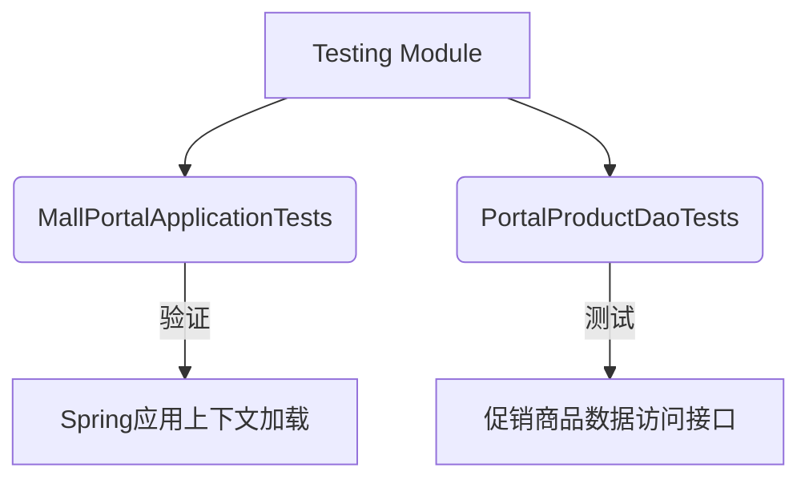
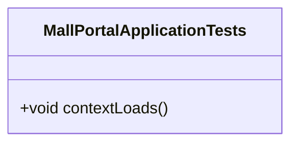
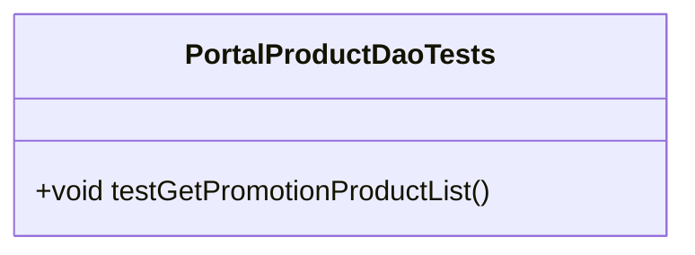

# Testing Module

## 1. 模块所在目录

该模块位于项目的 `mall-portal/src/test/java/com/macro/mall/portal/` 目录下。

## 2. 模块介绍

> 非核心模块

自动化测试模块旨在确保Spring Boot应用的顺利启动及关键数据访问逻辑的正确执行，保障系统的基础稳定性和核心业务功能的可靠性。通过系统化的测试流程，该模块有效降低了运行风险，提升了整体系统的稳定性。

该模块采用高效的自动化测试框架，紧密集成于开发周期中，强调测试覆盖的全面性与执行的自动化。设计上注重与Spring Boot生态的兼容性，确保测试过程简洁且高效，助力快速定位问题并提升开发效率。

## 3. 职责边界

Testing Module专注于通过自动化测试确保Spring Boot应用的正常启动及关键数据访问逻辑的正确执行，从而保障系统的基础稳定性和核心业务功能的可靠性。该模块不承担业务逻辑开发、数据模型设计、安全认证或前端展示功能，相关职责分别由mall-mbg模块、mall-security模块和mall-portal模块承担。Testing Module依托于mall-common模块提供的基础设施支持，验证各业务模块如mall-admin、mall-portal及mall-search等的功能实现是否符合预期，通过测试保障整体系统的高质量和稳定运行，维持明确的职责边界，避免跨领域重叠。

## 4. 同级模块关联

在电商系统中，Testing Module与多个核心业务模块及基础模块紧密相关。这些同级模块共同构建了系统的整体功能框架和基础设施，通过相互协作确保系统的稳定性、安全性及业务的高效运行。以下介绍与Testing Module有实际关联的同级模块，展示它们在系统中的职责和作用。

### 4.1 mall-common基础模块

**模块介绍**

mall-common基础模块提供了项目通用的基础配置、接口响应规范、异常管理、日志采集及Redis服务等基础设施。该模块确保了业务模块的统一规范和高复用性，是系统稳定运行的基石。对于Testing Module而言，mall-common模块提供了关键的支持环境和公共服务，使得自动化测试能够在统一规范下执行，提升测试的准确性和一致性。

### 4.2 mall-mbg代码生成与数据模型模块

**模块介绍**

mall-mbg代码生成与数据模型模块封装了电商系统核心业务数据模型及其关联关系，并提供基于MyBatis的标准Mapper接口和自动代码生成支持。该模块实现了数据访问层的标准化与高效维护。Testing Module依赖此模块的数据模型与接口，通过自动化测试验证数据访问层的正确性，确保数据操作符合业务规范。

### 4.3 mall-portal门户系统模块

**模块介绍**

mall-portal门户系统模块构建了商城门户系统的全栈体系，包括领域模型、配置管理、业务服务、数据访问、REST接口及异步组件。它支持会员、订单、支付、促销、内容展示等前端核心业务需求。Testing Module中的自动化测试主要针对mall-portal模块的启动及关键数据访问逻辑，确保门户系统的基础稳定性与业务功能的可靠性。

### 4.4 mall-admin后台管理模块

**模块介绍**

mall-admin后台管理模块涵盖了后台管理系统的配置管理、数据访问、业务服务实现、接口控制器及数据传输对象，支持商品、订单、权限、促销、会员、内容推荐等核心业务功能。该模块与Testing Module关联紧密，自动化测试覆盖后台管理的关键业务逻辑，保障后台系统的稳定运行与功能正确性。

## 5. 模块内部架构

**Testing Module** 是一个专注于自动化测试的非核心模块，旨在通过测试验证Spring Boot应用的启动和关键数据访问逻辑的正确性，从而保障系统的基础稳定性和核心业务功能的可靠性。该模块主要包含针对应用上下文加载和数据访问层功能的测试类，确保应用的基础配置及业务接口的正确实现。

该模块**不包含子模块**，其内部架构主要由两个关键测试类构成：

- **MallPortalApplicationTests**：位于`com.macro.mall.portal`包下，基于Spring Boot的测试类，包含的空测试方法`contextLoads`用于验证Spring应用程序上下文能否成功启动和加载，确保基础配置无误。

- **PortalProductDaoTests**：同样基于Spring Boot框架，专门测试前台商品促销查询数据访问层接口`PortalProductDao`的`getPromotionProductList`方法。该测试通过传入商品ID列表并断言返回促销商品数量的一致性，验证促销商品查询功能的正确性及数据访问层的正常工作。

以下Mermaid图示展示了Testing Module的内部组织结构及关键组件：

该架构清晰体现了模块的测试职责和关键组件，聚焦于确保应用启动稳定性及核心数据访问功能的正确执行。

## 6. 核心功能组件

本模块包含多个**核心功能组件**，主要负责自动化测试工作，确保Spring Boot应用的正确启动及关键数据访问逻辑的准确执行。其核心功能组件包括：应用启动测试组件和数据访问层功能测试组件。这些组件通过系统化的测试用例，保障系统基础稳定性和核心业务功能的可靠性。

### 6.1 应用启动测试组件

应用启动测试组件主要用于验证Spring Boot应用程序上下文是否能够成功启动和加载。该组件通过执行空测试方法`contextLoads`，确保应用程序的基础配置正确无误，防止因配置错误导致的启动失败。

**Sources Files**

`mall-portal/src/test/java/com/macro/mall/portal/MallPortalApplicationTests.java`

### 6.2 数据访问层功能测试组件

数据访问层功能测试组件专注于验证前台商品促销查询的数据访问接口功能。通过测试`PortalProductDao`的`getPromotionProductList`方法，传入商品ID列表并断言返回促销商品数量与输入数量一致，从而确保数据访问层接口的正确性和稳定性。

**Sources Files**

`mall-portal/src/test/java/com/macro/mall/portal/PortalProductDaoTests.java`
