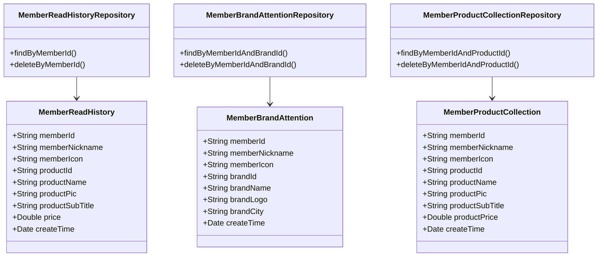
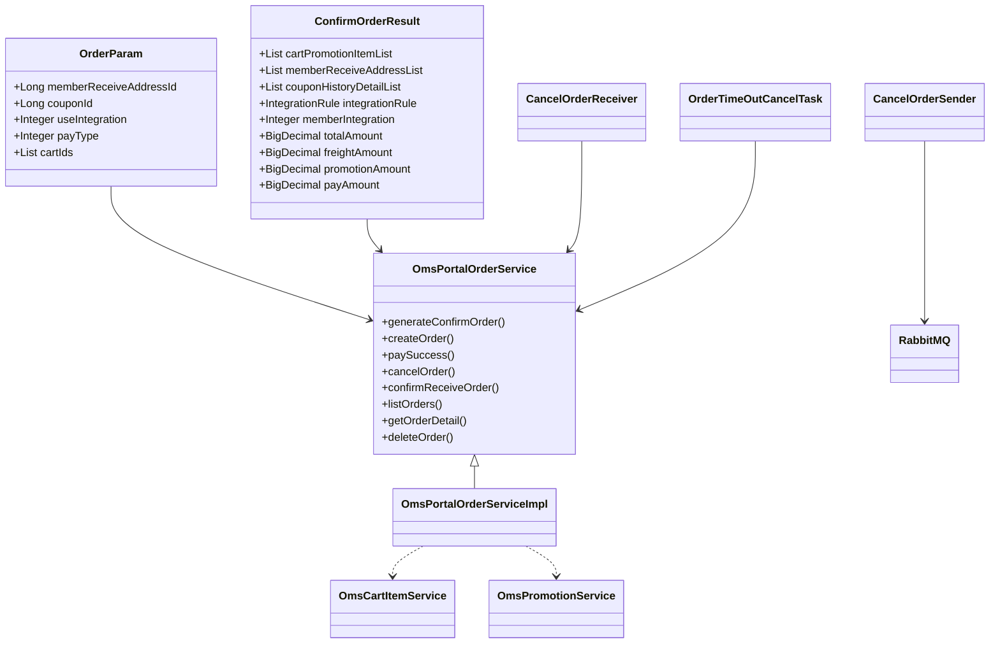
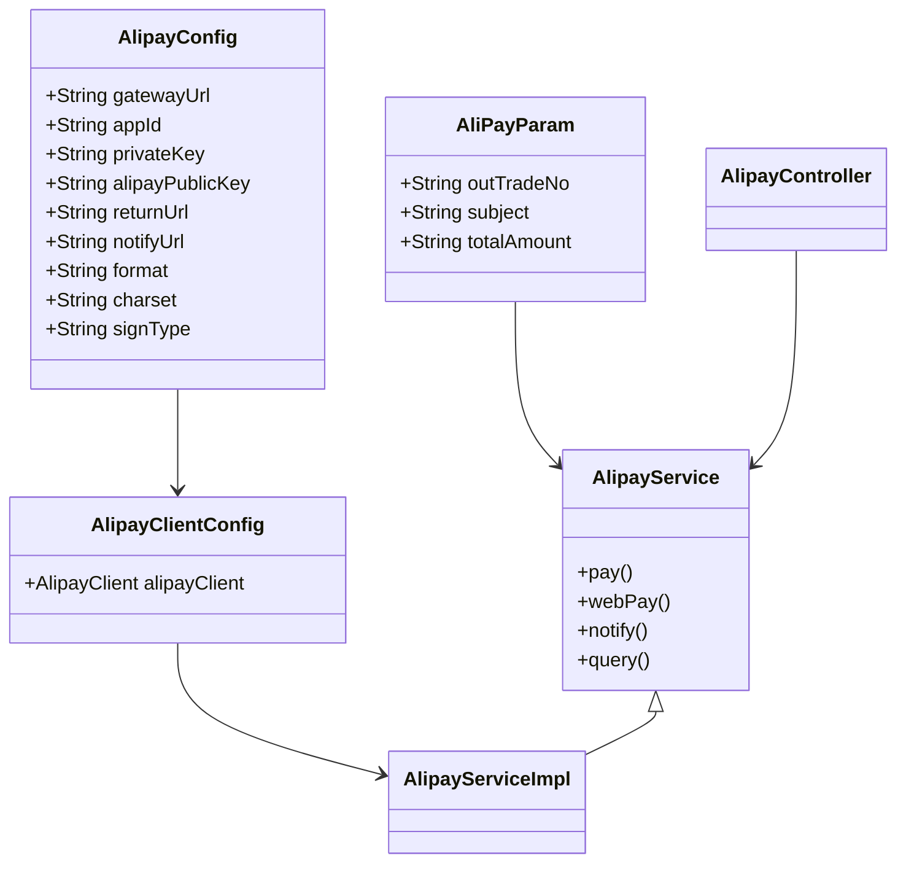
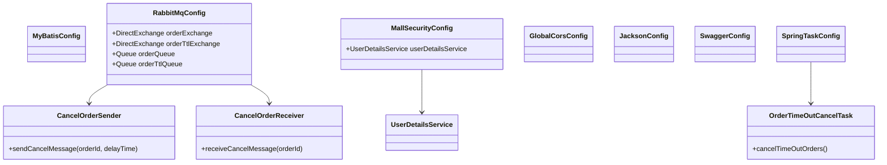

# mall-portal门户系统模块

## 1. 模块所在目录

该模块包含以下目录：

- `mall-portal/src/main/java/com/macro/mall/portal/domain/`
- `mall-portal/src/main/java/com/macro/mall/portal/repository/`
- `mall-portal/src/main/java/com/macro/mall/portal/config/`
- `mall-portal/src/main/java/com/macro/mall/portal/component/`
- `mall-portal/src/main/java/com/macro/mall/portal/controller/`
- `mall-portal/src/main/java/com/macro/mall/portal/dao/`
- `mall-portal/src/main/java/com/macro/mall/portal/service/`
- `mall-portal/src/main/java/com/macro/mall/portal/service/impl/`
- `mall-portal/src/main/java/com/macro/mall/portal/util/`

## 2. 模块介绍

> 核心模块

mall-portal门户系统模块构建了商城门户系统的全栈体系，涵盖领域模型、配置管理、业务服务、数据访问、REST接口及异步组件，全面支持会员、订单、支付、促销及内容展示等前端核心业务需求，确保系统业务流程的高效协同与稳定运行。

该模块采用分层与模块化设计理念，通过统一封装核心领域模型和业务逻辑，实现前后端解耦与接口标准化，集成灵活的配置管理及异步处理机制，提升系统的可维护性、扩展性和开发效率，满足复杂业务场景和多环境部署需求。

## 3. 职责边界

mall-portal门户系统模块专注于商城前台业务的全栈实现，负责构建和封装会员、订单、支付、促销、内容展示等核心业务的领域模型、业务服务、数据访问及REST接口，支持前端业务需求的统一交互与高效处理。该模块不涉及后台管理功能、系统安全认证及权限控制，这些职责由mall-admin和mall-security模块承担；商品搜索功能由mall-search模块实现，基础设施和通用配置由mall-common模块提供，代码生成及数据模型的基础由mall-mbg模块支撑。mall-portal模块通过清晰的职责划分和模块化设计，实现前后端解耦与业务逻辑集中，同时通过标准化接口与其他模块协作，确保系统整体的高效、灵活与可维护性。

## 4. 同级模块关联

在商城门户系统模块的生态中，存在多个与其紧密相关的同级模块，这些模块在功能层面各有侧重，但共同构建了商城系统的完整业务链和技术基础。通过与这些模块的协作，商城门户系统能够实现高效的业务整合、数据共享与安全保障，确保前端用户体验和后端服务的稳定性与扩展性。以下内容将详细介绍与商城门户系统模块有实际关联的各同级模块。

### 4.1 mall-common基础模块

**模块介绍**

mall-common基础模块承担着整个项目的基础设施职责，提供了统一的基础配置、接口响应规范、异常管理、日志采集及Redis服务等关键功能。该模块的设计保障了业务模块之间的统一规范性和复用性，成为商城门户系统及其他业务模块的底层依赖，确保了系统运行的稳定性和一致性。

### 4.2 mall-mbg代码生成与数据模型模块

**模块介绍**

mall-mbg模块专注于电商系统的核心业务数据模型封装，涵盖了商品、订单、会员等基础数据结构及其关联关系。它基于MyBatis提供了标准的Mapper接口和自动化代码生成支持，有效提升了数据访问层的开发效率和维护便捷性。商城门户系统依赖该模块的数据模型实现业务数据的标准化处理。

### 4.3 mall-security安全模块

**模块介绍**

mall-security模块构建了基于Spring Security的安全认证与权限控制体系，涵盖了JWT认证机制、动态权限管理、安全异常统一处理及缓存异常监控等核心安全功能。该模块为商城门户系统提供了坚实的安全保障，确保用户身份验证的安全性和系统权限管理的灵活性，防范安全风险。

### 4.4 mall-admin后台管理模块

**模块介绍**

mall-admin模块负责商城后台管理系统的整体业务支撑，涵盖配置管理、数据访问、业务服务、接口控制器及数据传输对象。它支持商品、订单、权限、促销、会员和内容推荐等核心业务功能，通过高内聚和模块化的设计，提供了强大的后台管理能力，与商城门户系统协同支持商城的前后端业务需求。

### 4.5 mall-search搜索模块

**模块介绍**

mall-search模块实现了基于Elasticsearch的商品搜索服务，涵盖了数据结构定义、数据访问层、业务逻辑及系统配置。该模块为商城门户系统提供高效、灵活的搜索能力和索引管理，支持复杂的搜索需求和快速响应，增强了前端用户的商品检索体验。

### 4.6 mall-demo演示模块

**模块介绍**

mall-demo模块是基于Spring Boot的电商演示应用，包含配置管理、业务服务、验证注解及REST控制器。该模块主要用于展示和验证商城系统的主要功能实现方式，为开发和测试提供示范和参考，辅助商城门户系统的开发和验证过程。

## 5. 模块内部架构

mall-portal门户系统模块作为商城门户的核心模块，**构建了全面的全栈体系结构**，涵盖领域模型、配置管理、业务服务、数据访问、REST接口以及异步组件等关键层次。该模块通过分层设计与模块化组织，实现了系统的高内聚与低耦合，保障了业务的高效处理和系统的可维护性。

该模块细分为多个子模块，每个子模块均承担着明确的职责：

- **Domain Models Module**：封装商城门户系统的核心领域模型，包含会员行为、首页内容、购物车商品及促销、订单数据结构等，统一管理业务数据模型，提升系统的可维护性和扩展性。

- **Repository Module**：提供会员行为相关的MongoDB数据访问接口，支持统一的增删查改及分页查询，简化数据访问逻辑，满足会员行为数据的持久化需求。

- **Configuration Module**：集中管理商城门户系统的全局配置及支付宝支付相关配置，实现消息队列、安全、定时任务等服务的统一集成与灵活配置。

- **Controller Module**：统一对外暴露商城门户系统的RESTful接口，涵盖会员、订单购物车、门户展示及支付等核心业务，提升接口规范性与模块化。

- **DAO Module**：提供商城前台核心业务的数据访问层接口，包括订单、购物车、首页内容及促销等，实现业务逻辑与数据持久化的解耦。

- **Service Interface Module**与**Service Implementation Module**：定义并实现商城门户前台核心业务服务接口，涵盖品牌、商品、会员、订单、促销等领域，实现业务逻辑的集中封装与前后端解耦。

- **Component Module**：负责订单自动取消相关的异步处理逻辑，包括消息发送、队列监听及超时订单扫描，实现业务流程自动化与库存管理效率提升。

- **Testing Module**：自动化测试模块，确保Spring Boot应用启动及关键数据访问逻辑的正确性，保障系统基础稳定性和核心业务功能的可靠性。

以下Mermaid示意图展示了mall-portal门户系统模块的内部架构，体现了模块的组织结构及关键组件之间的关系：

```mermaid
graph TD
    A[mall-portal门户系统模块]
    
    A --> B[Domain Models Module]
    B --> B1[会员行为模型]
    B --> B2[首页内容模型]
    B --> B3[购物车商品及促销模型]
    B --> B4[订单相关模型]

    A --> C[Repository Module]
    C --> C1[会员品牌关注数据访问]
    C --> C2[会员商品收藏数据访问]
    C --> C3[会员浏览历史数据访问]

    A --> D[Configuration Module]
    D --> D1[支付宝支付配置]
    D --> D2[消息队列配置]
    D --> D3[安全与定时任务配置]
    D --> D4[CORS与Jackson配置]
    D --> D5[Swagger API文档配置]

    A --> E[Controller Module]
    E --> E1[会员相关REST接口]
    E --> E2[订单与购物车REST接口]
    E --> E3[门户展示REST接口]
    E --> E4[支付相关REST接口]

    A --> F[DAO Module]
    F --> F1[首页内容数据访问]
    F --> F2[订单与库存数据访问]
    F --> F3[购物车商品及促销数据访问]
    F --> F4[优惠券历史及列表访问]

    A --> G[Service Interface Module]
    G --> G1[品牌服务接口]
    G --> G2[商品服务接口]
    G --> G3[会员服务接口]
    G --> G4[订单服务接口]
    G --> G5[促销服务接口]

    A --> H[Service Implementation Module]
    H --> H1[品牌服务实现]
    H --> H2[商品服务实现]
    H --> H3[会员服务实现]
    H --> H4[订单服务实现]
    H --> H5[促销服务实现]
    H --> H6[支付服务实现]

    A --> I[Component Module]
    I --> I1[订单自动取消消息发送]
    I --> I2[订单自动取消消息监听]
    I --> I3[超时订单定时扫描任务]

    A --> J[Testing Module]
    J --> J1[应用启动及数据访问自动化测试]

    style A fill:#f9f,stroke:#333,stroke-width:4px
    style B fill:#bbf,stroke:#333,stroke-width:2px
    style C fill:#bbf,stroke:#333,stroke-width:2px
    style D fill:#bbf,stroke:#333,stroke-width:2px
    style E fill:#bbf,stroke:#333,stroke-width:2px
    style F fill:#bbf,stroke:#333,stroke-width:2px
    style G fill:#bbf,stroke:#333,stroke-width:2px
    style H fill:#bbf,stroke:#333,stroke-width:2px
    style I fill:#bbf,stroke:#333,stroke-width:2px
    style J fill:#bbf,stroke:#333,stroke-width:2px
```

该架构图清晰展示了mall-portal模块内部各子模块的组成及其相互关系，体现了系统层次分明、职责明晰的设计理念。

## 6. 核心功能组件

mall-portal门户系统模块作为商城门户的核心模块，包含了多个关键的功能组件，涵盖会员行为管理、商品与促销管理、订单处理、支付集成和系统配置等方面。这些组件通过分层设计与模块化实现，支持商城门户系统的前端核心业务需求，确保系统的高效运行和良好的用户体验。主要核心功能组件包括会员行为管理组件、订单管理组件、商品与促销管理组件、支付服务组件以及系统配置与异步处理组件。

### 6.1 会员行为管理组件

会员行为管理组件负责处理会员的个性化行为数据，包括商品浏览历史、品牌关注和商品收藏。通过MongoDB的领域模型以及统一的Repository接口实现数据的增删查改和分页操作，支持会员行为数据的高效存取与管理，促进个性化推荐和用户行为分析。

**Sources Files**

`mall-portal/src/main/java/com/macro/mall/portal/domain/MemberReadHistory.java`
`mall-portal/src/main/java/com/macro/mall/portal/domain/MemberBrandAttention.java`
`mall-portal/src/main/java/com/macro/mall/portal/domain/MemberProductCollection.java`
`mall-portal/src/main/java/com/macro/mall/portal/repository/MemberReadHistoryRepository.java`
`mall-portal/src/main/java/com/macro/mall/portal/repository/MemberBrandAttentionRepository.java`
`mall-portal/src/main/java/com/macro/mall/portal/repository/MemberProductCollectionRepository.java`
`mall-portal/src/main/java/com/macro/mall/portal/service/MemberReadHistoryService.java`
`mall-portal/src/main/java/com/macro/mall/portal/service/MemberAttentionService.java`
`mall-portal/src/main/java/com/macro/mall/portal/service/MemberCollectionService.java`
`mall-portal/src/main/java/com/macro/mall/portal/service/impl/MemberReadHistoryServiceImpl.java`
`mall-portal/src/main/java/com/macro/mall/portal/service/impl/MemberAttentionServiceImpl.java`
`mall-portal/src/main/java/com/macro/mall/portal/service/impl/MemberCollectionServiceImpl.java`

### 6.2 订单管理组件

订单管理组件涵盖订单全生命周期的业务逻辑，包括订单确认、创建、支付回调、取消、确认收货、分页查询、详情查看及订单退货申请。该组件协调购物车服务、库存管理、优惠券和积分系统，确保订单业务流程的完整性和数据一致性，并支持自动取消超时未支付订单的异步处理。

**Sources Files**

`mall-portal/src/main/java/com/macro/mall/portal/domain/OrderParam.java`
`mall-portal/src/main/java/com/macro/mall/portal/domain/ConfirmOrderResult.java`
`mall-portal/src/main/java/com/macro/mall/portal/service/OmsPortalOrderService.java`
`mall-portal/src/main/java/com/macro/mall/portal/service/impl/OmsPortalOrderServiceImpl.java`
`mall-portal/src/main/java/com/macro/mall/portal/service/OmsCartItemService.java`
`mall-portal/src/main/java/com/macro/mall/portal/service/OmsPromotionService.java`
`mall-portal/src/main/java/com/macro/mall/portal/service/impl/OmsCartItemServiceImpl.java`
`mall-portal/src/main/java/com/macro/mall/portal/service/impl/OmsPromotionServiceImpl.java`
`mall-portal/src/main/java/com/macro/mall/portal/component/CancelOrderSender.java`
`mall-portal/src/main/java/com/macro/mall/portal/component/CancelOrderReceiver.java`
`mall-portal/src/main/java/com/macro/mall/portal/component/OrderTimeOutCancelTask.java`
`mall-portal/src/main/java/com/macro/mall/portal/controller/OmsPortalOrderController.java`
`mall-portal/src/main/java/com/macro/mall/portal/service/OmsPortalOrderReturnApplyService.java`
`mall-portal/src/main/java/com/macro/mall/portal/service/impl/OmsPortalOrderReturnApplyServiceImpl.java`
`mall-portal/src/main/java/com/macro/mall/portal/domain/OmsOrderReturnApplyParam.java`
`mall-portal/src/main/java/com/macro/mall/portal/controller/OmsPortalOrderReturnApplyController.java`

### 6.3 商品与促销管理组件

商品与促销管理组件负责商城门户前台的商品展示、品牌管理、首页内容聚合以及促销业务逻辑的实现。它涵盖商品搜索、商品分类树形结构构建、商品详情展示，品牌列表及详情管理，以及购物车商品和促销信息维护。通过统一的领域模型和服务接口，支持前端的高效数据请求和灵活展示。

```mermaid
classDiagram
    class PmsPortalProductDetail {
        +PmsProduct product
        +PmsBrand brand
        +List<PmsProductAttribute> productAttributeList
        +List<PmsProductAttributeValue> productAttributeValueList
        +List<PmsSkuStock> skuStockList
        +List<PmsProductLadder> productLadderList
        +List<PmsProductFullReduction> productFullReductionList
        +List<SmsCoupon> couponList
    }
    class PromotionProduct {
        +List<PmsSkuStock> skuStockList
        +List<PmsProductLadder> productLadderList
        +List<PmsProductFullReduction> productFullReductionList
    }
    class CartProduct {
        +List<PmsProductAttribute> productAttributeList
        +List<PmsSkuStock> skuStockList
    }
    class CartPromotionItem {
        +String promotionMessage
        +BigDecimal reduceAmount
        +Integer realStock
        +Integer integration
        +Integer growth
    }
    class FlashPromotionProduct {
        +BigDecimal flashPromotionPrice
        +Integer flashPromotionCount
        +Integer flashPromotionLimit
    }
    class HomeContentResult {
        +List banners
        +List brands
        +HomeFlashPromotion flashPromotion
        +List newProducts
        +List hotProducts
        +List subjects
    }
    class HomeFlashPromotion {
        +Date startTime
        +Date endTime
        +Date nextStartTime
        +Date nextEndTime
        +List<FlashPromotionProduct> productList
    }
    class PmsPortalProductService
    class PmsPortalBrandService
    class HomeService
    class OmsCartItemService
    class OmsPromotionService

    PmsPortalProductDetail --> PmsPortalProductService
    PromotionProduct --> OmsPromotionService
    CartProduct --> OmsCartItemService
    CartPromotionItem --> OmsPromotionService
    FlashPromotionProduct --> HomeService
    HomeContentResult --> HomeService
    HomeFlashPromotion --> HomeService
    PmsPortalBrandService --> PmsPortalBrandServiceImpl
    PmsPortalProductService --> PmsPortalProductServiceImpl
    HomeService --> HomeServiceImpl
    OmsCartItemService --> OmsCartItemServiceImpl
    OmsPromotionService --> OmsPromotionServiceImpl
```

**Sources Files**

`mall-portal/src/main/java/com/macro/mall/portal/domain/PmsPortalProductDetail.java`
`mall-portal/src/main/java/com/macro/mall/portal/domain/PromotionProduct.java`
`mall-portal/src/main/java/com/macro/mall/portal/domain/CartProduct.java`
`mall-portal/src/main/java/com/macro/mall/portal/domain/CartPromotionItem.java`
`mall-portal/src/main/java/com/macro/mall/portal/domain/FlashPromotionProduct.java`
`mall-portal/src/main/java/com/macro/mall/portal/domain/HomeContentResult.java`
`mall-portal/src/main/java/com/macro/mall/portal/domain/HomeFlashPromotion.java`
`mall-portal/src/main/java/com/macro/mall/portal/service/PmsPortalProductService.java`
`mall-portal/src/main/java/com/macro/mall/portal/service/PmsPortalBrandService.java`
`mall-portal/src/main/java/com/macro/mall/portal/service/HomeService.java`
`mall-portal/src/main/java/com/macro/mall/portal/service/OmsCartItemService.java`
`mall-portal/src/main/java/com/macro/mall/portal/service/OmsPromotionService.java`
`mall-portal/src/main/java/com/macro/mall/portal/service/impl/PmsPortalProductServiceImpl.java`
`mall-portal/src/main/java/com/macro/mall/portal/service/impl/PmsPortalBrandServiceImpl.java`
`mall-portal/src/main/java/com/macro/mall/portal/service/impl/HomeServiceImpl.java`
`mall-portal/src/main/java/com/macro/mall/portal/service/impl/OmsCartItemServiceImpl.java`
`mall-portal/src/main/java/com/macro/mall/portal/service/impl/OmsPromotionServiceImpl.java`
`mall-portal/src/main/java/com/macro/mall/portal/controller/PmsPortalProductController.java`
`mall-portal/src/main/java/com/macro/mall/portal/controller/PmsPortalBrandController.java`
`mall-portal/src/main/java/com/macro/mall/portal/controller/HomeController.java`
`mall-portal/src/main/java/com/macro/mall/portal/controller/OmsCartItemController.java`

### 6.4 支付服务组件

支付服务组件集成了支付宝支付功能，提供电脑网站支付、手机网站支付、异步通知处理和交易状态查询等接口。通过配置类创建支付宝客户端实例，封装支付请求和回调业务逻辑，保证支付流程的安全性和数据一致性，为商城系统提供稳定的支付解决方案。

**Sources Files**

`mall-portal/src/main/java/com/macro/mall/portal/domain/AliPayParam.java`
`mall-portal/src/main/java/com/macro/mall/portal/config/AlipayConfig.java`
`mall-portal/src/main/java/com/macro/mall/portal/config/AlipayClientConfig.java`
`mall-portal/src/main/java/com/macro/mall/portal/service/AlipayService.java`
`mall-portal/src/main/java/com/macro/mall/portal/service/impl/AlipayServiceImpl.java`
`mall-portal/src/main/java/com/macro/mall/portal/controller/AlipayController.java`

### 6.5 系统配置与异步处理组件

该组件集中管理商城门户系统的全局配置和异步任务处理，包括MyBatis配置、RabbitMQ消息队列配置、安全认证配置、跨域配置、JSON序列化配置、Swagger文档配置以及定时任务调度。异步处理方面，涵盖订单自动取消的消息发送和接收及定时扫描超时订单，提升系统的模块化、可维护性和业务自动化水平。

**Sources Files**

`mall-portal/src/main/java/com/macro/mall/portal/config/MyBatisConfig.java`
`mall-portal/src/main/java/com/macro/mall/portal/config/RabbitMqConfig.java`
`mall-portal/src/main/java/com/macro/mall/portal/config/MallSecurityConfig.java`
`mall-portal/src/main/java/com/macro/mall/portal/config/GlobalCorsConfig.java`
`mall-portal/src/main/java/com/macro/mall/portal/config/JacksonConfig.java`
`mall-portal/src/main/java/com/macro/mall/portal/config/SwaggerConfig.java`
`mall-portal/src/main/java/com/macro/mall/portal/config/SpringTaskConfig.java`
`mall-portal/src/main/java/com/macro/mall/portal/component/CancelOrderSender.java`
`mall-portal/src/main/java/com/macro/mall/portal/component/CancelOrderReceiver.java`
`mall-portal/src/main/java/com/macro/mall/portal/component/OrderTimeOutCancelTask.java`
