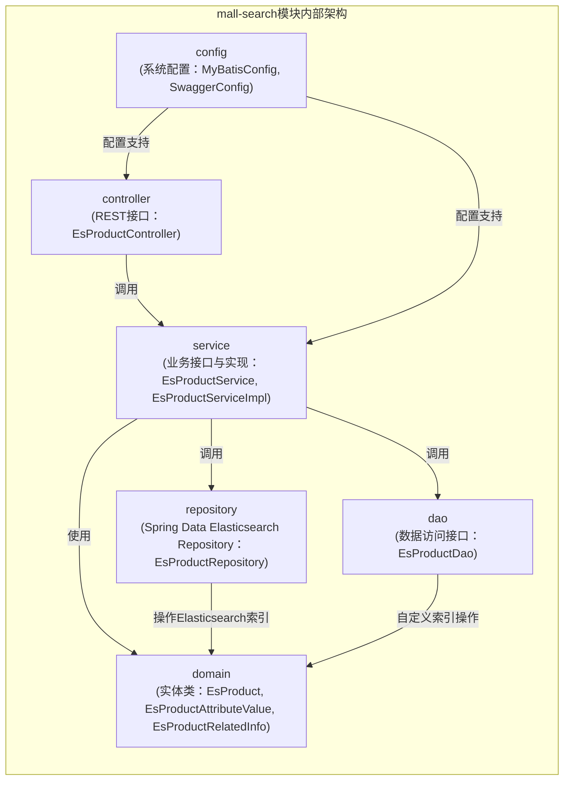
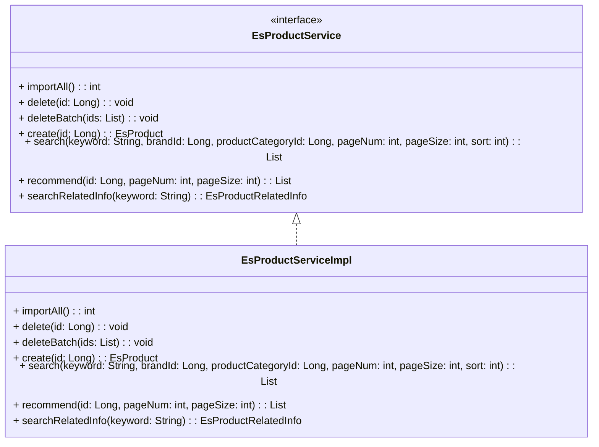
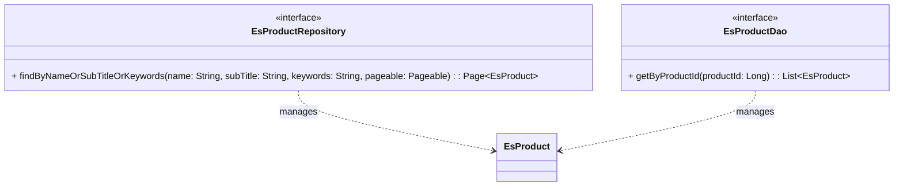
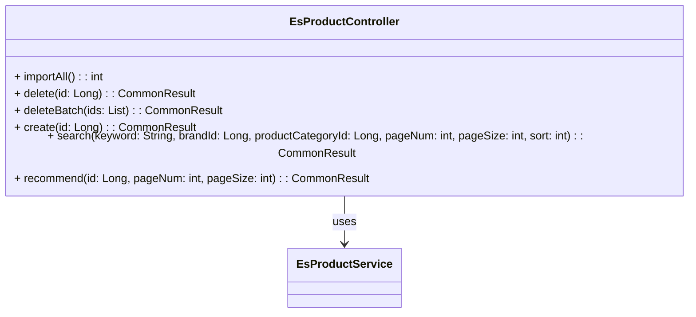
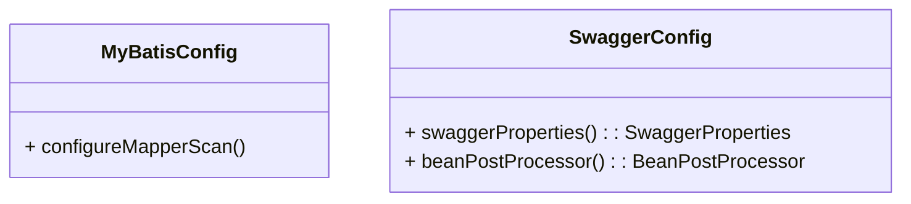

# mall-search搜索模块

## 1. 模块所在目录

该模块包含以下目录：

- `mall-search/src/main/java/com/macro/mall/search/service/`
- `mall-search/src/main/java/com/macro/mall/search/domain/`
- `mall-search/src/main/java/com/macro/mall/search/config/`
- `mall-search/src/main/java/com/macro/mall/search/dao/`
- `mall-search/src/main/java/com/macro/mall/search/repository/`
- `mall-search/src/main/java/com/macro/mall/search/controller/`

## 2. 模块介绍

> 非核心模块

mall-search搜索模块基于Elasticsearch实现商品搜索服务，涵盖商品数据结构定义、数据访问层、业务逻辑及系统配置，提供高效且灵活的商品检索与索引管理能力。该模块整合商品主实体及关联信息的数据结构，支持复杂条件分页搜索、批量导入删除、推荐与信息聚合功能，确保搜索服务的完整性与易用性。

模块设计注重职责清晰与模块解耦，统一封装数据访问接口和系统配置，集成Spring Boot、Spring Data Elasticsearch及第三方框架，提升系统的可维护性与扩展性。通过严格的单元测试保障系统稳定性，实现了高效、灵活且可扩展的商品搜索解决方案。

## 3. 职责边界

mall-search搜索模块专注于基于Elasticsearch技术实现高效、灵活且可扩展的商品搜索服务，负责商品搜索相关的数据结构定义、数据访问层实现、业务逻辑处理及系统配置管理。该模块负责商品索引的同步管理、批量导入删除、复杂条件分页搜索、推荐与信息聚合等核心搜索功能，但不涉及商品核心数据模型的定义与维护，这部分由mall-mbg代码生成与数据模型模块承担；同时，不负责安全认证与权限控制，由mall-security安全模块保障；后台管理业务逻辑和操作由mall-admin模块处理，门户系统的前端展示和用户交互由mall-portal模块负责。mall-search模块通过统一封装与第三方框架集成的配置以及标准化的Repository和DAO接口，为上层业务提供稳定的搜索能力，确保搜索服务的完整性和独立性，同时通过清晰的职责划分与其他模块协同，保障系统的高内聚低耦合。

## 4. 同级模块关联

mall-search搜索模块作为商品搜索服务的关键组成部分，依赖并与多个同级模块协同工作，以确保整体系统的功能完整性和性能优化。以下介绍与mall-search模块存在实际关联的同级模块，这些模块提供了基础设施支持、核心数据模型、安全保障及后台管理等关键能力，助力商品搜索服务的高效运行和系统间的良好协同。

### 4.1 mall-common基础模块

**模块介绍**

mall-common基础模块提供了项目的通用基础设施，包括基础配置、接口响应规范、异常管理、日志采集及Redis服务等。通过这些统一的基础能力，mall-search模块能够实现业务逻辑的规范化处理和高复用性，确保搜索功能在稳定的基础设施支持下平稳运行。

### 4.2 mall-mbg代码生成与数据模型模块

**模块介绍**

mall-mbg代码生成与数据模型模块封装了电商系统的核心业务数据模型及其关联关系，提供基于MyBatis的标准Mapper接口和自动代码生成支持。该模块为mall-search模块的数据访问层提供了标准化的数据模型和访问接口，促进了数据操作的高效维护和一致性。

### 4.3 mall-security安全模块

**模块介绍**

mall-security安全模块构建了基于Spring Security的安全认证和权限控制体系，涵盖JWT认证、动态权限管理以及安全异常统一处理。该模块为mall-search模块提供了必要的安全保障，确保搜索服务在权限控制和认证机制下安全、灵活地运行。

### 4.4 mall-admin后台管理模块

**模块介绍**

mall-admin后台管理模块涵盖后台管理系统的配置管理、数据访问、业务服务实现、接口控制器及数据传输对象。它支持商品、订单、权限、促销、会员、内容推荐等核心业务功能。与mall-search模块紧密配合，该模块实现了商品搜索相关的后台管理功能，保障搜索服务的数据管理和业务流程的高内聚与模块化。

### 4.5 mall-portal门户系统模块

**模块介绍**

mall-portal门户系统模块构建了商城门户的全栈体系，包括领域模型、配置管理、业务服务、数据访问、REST接口及异步组件。该模块为mall-search模块提供了前端展示与交互的业务需求支持，使商品搜索功能能有效服务于前端用户的购物体验。

### 4.6 mall-demo演示模块

**模块介绍**

mall-demo演示模块是基于Spring Boot的电商演示应用，包含配置管理、业务服务、验证注解及REST控制器。该模块通过演示和验证商城系统主要功能的实现方式，为mall-search模块的集成和功能测试提供了示范和参考，促进开发和测试工作的高效开展。

## 5. 模块内部架构

mall-search搜索模块的内部架构设计以实现基于Elasticsearch的高效商品搜索服务为核心，涵盖商品数据结构定义、数据访问层、业务逻辑处理及系统配置等关键部分。模块通过分层组织，将搜索业务的各个功能模块化，确保职责清晰、易于维护和扩展。

该模块当前**不包含子模块**，但其内部结构通过多个包和组件协同实现完整的商品搜索功能：

- **domain** 包负责封装商品及其相关信息的Java实体类，映射Elasticsearch索引结构，支持复杂的搜索和聚合需求。
- **dao** 与 **repository** 负责数据访问层，分别通过自定义DAO接口和Spring Data Elasticsearch Repository实现商品索引的数据操作。
- **service** 包定义和实现商品搜索的核心业务接口，提供商品索引的导入、删除、搜索和推荐功能。
- **controller** 包通过Spring MVC暴露REST接口，供外部系统调用搜索服务。
- **config** 包集中管理与第三方框架集成的系统配置，如MyBatis和Swagger，保证系统配置一致性和文档生成。

整体架构以Spring Boot为基础，整合Elasticsearch强大的搜索能力，支持多维度条件搜索、聚合和分词功能，保障商品搜索的灵活性和高性能。



## 6. 核心功能组件

mall-search搜索模块包含多个**核心功能组件**，它们共同实现了基于Elasticsearch的商品搜索服务。主要组件包括：商品搜索服务组件，商品数据实体组件，数据访问组件，控制器组件，以及系统配置组件。这些组件紧密协作，涵盖商品数据的结构定义、业务逻辑处理、数据访问、接口暴露和系统配置，保障搜索功能的完整性和高效性。

### 6.1 商品搜索服务组件

商品搜索服务组件以EsProductService接口及其实现类EsProductServiceImpl为核心，负责实现商品搜索的业务逻辑。该组件支持商品数据的批量导入Elasticsearch索引、单条及批量删除、基于关键词及多条件的分页搜索、商品推荐，以及商品相关信息的聚合查询。通过整合Spring Data Elasticsearch的Repository和ElasticsearchRestTemplate，实现复杂搜索查询和多维度条件筛选，提升搜索效率和灵活性。



**Sources Files**

`mall-search/src/main/java/com/macro/mall/search/service/EsProductService.java`

`mall-search/src/main/java/com/macro/mall/search/service/impl/EsProductServiceImpl.java`

### 6.2 商品数据实体组件

商品数据实体组件统一封装商品及其相关信息的Java类，满足基于Elasticsearch的检索和聚合需求。核心实体包括EsProduct表示商品主信息，EsProductAttributeValue封装商品属性值，以及EsProductRelatedInfo用于承载搜索关联的品牌、分类及属性信息。实体设计结合多种Elasticsearch字段类型和分词策略，支持精准且高效的商品搜索和过滤。

```mermaid
classDiagram
    class EsProduct {
        + id: Long
        + productSn: String
        + brandId: Long
        + brandName: String
        + productCategoryId: Long
        + productCategoryName: String
        + pic: String
        + name: String
        + subTitle: String
        + keywords: String
        + price: BigDecimal
        + sale: Integer
        + newStatus: Integer
        + recommandStatus: Integer
        + stock: Integer
        + promotionType: Integer
        + sort: Integer
        + attrValueList: List~EsProductAttributeValue~
    }
    class EsProductAttributeValue {
        + id: Long
        + productAttributeId: Long
        + value: String
        + type: Integer
        + name: String
    }
    class EsProductRelatedInfo {
        + brandNames: List~String~
        + productCategoryNames: List~String~
        + productAttrs: List~ProductAttr~
        class ProductAttr {
            + attrId: Long
            + attrName: String
            + attrValues: List~String~
        }
    }

    EsProduct *-- EsProductAttributeValue : contains
    EsProductRelatedInfo o-- ProductAttr : contains
```

**Sources Files**

`mall-search/src/main/java/com/macro/mall/search/domain/EsProduct.java`

`mall-search/src/main/java/com/macro/mall/search/domain/EsProductAttributeValue.java`

`mall-search/src/main/java/com/macro/mall/search/domain/EsProductRelatedInfo.java`

### 6.3 数据访问组件

数据访问组件负责商品搜索数据与Elasticsearch的交互。EsProductRepository基于Spring Data Elasticsearch提供标准的CRUD及分页搜索接口，EsProductDao定义自定义数据访问方法，支持根据商品ID批量获取搜索数据，确保数据访问层的灵活性和可扩展性。



**Sources Files**

`mall-search/src/main/java/com/macro/mall/search/repository/EsProductRepository.java`

`mall-search/src/main/java/com/macro/mall/search/dao/EsProductDao.java`

### 6.4 控制器组件

控制器组件以EsProductController为核心，基于Spring MVC框架，负责处理商品搜索相关的HTTP请求。该组件提供商品数据批量导入、创建、删除、搜索及推荐的API接口，调用服务层实现具体业务逻辑，并结合Swagger注解生成接口文档，支持前后端交互和接口管理。



**Sources Files**

`mall-search/src/main/java/com/macro/mall/search/controller/EsProductController.java`

### 6.5 系统配置组件

系统配置组件集中管理mall-search模块与第三方框架集成的Spring配置。MyBatisConfig配置了MyBatis的Mapper接口扫描路径，确保数据库操作接口被正确加载；SwaggerConfig配置了Swagger 2的API文档生成，定制模块的API文档元信息并解决Springfox与Spring版本兼容性，提升配置一致性和系统可维护性。



**Sources Files**

`mall-search/src/main/java/com/macro/mall/search/config/MyBatisConfig.java`

`mall-search/src/main/java/com/macro/mall/search/config/SwaggerConfig.java`
