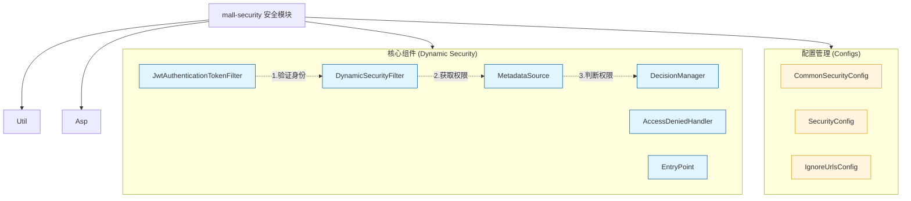
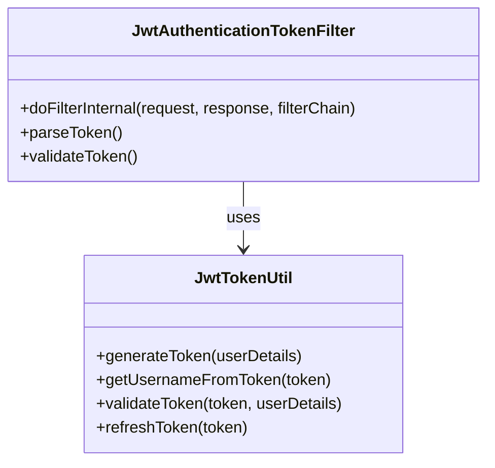
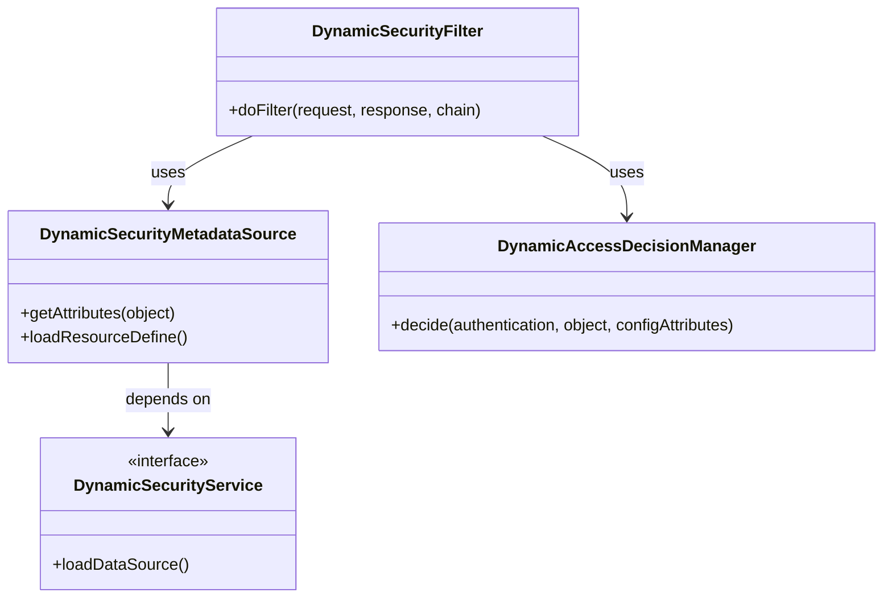
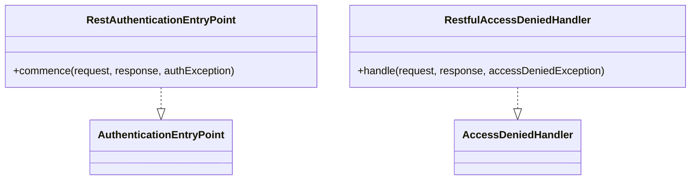
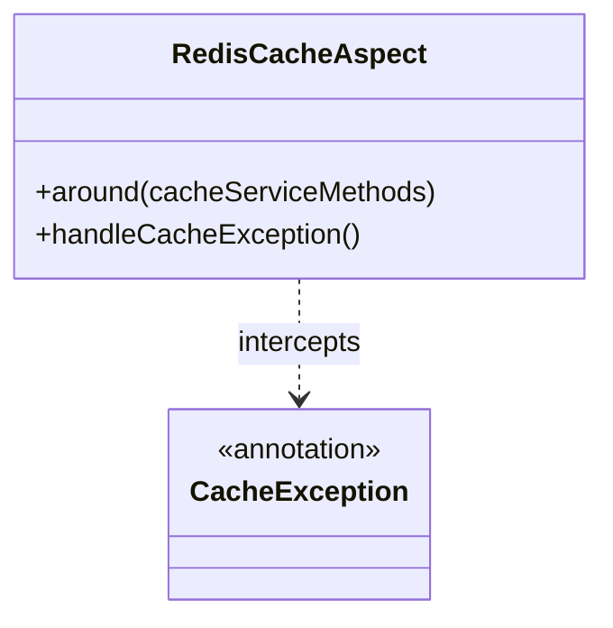

# mall-security安全模块

## 1. 模块所在目录

该模块包含以下目录：

- `mall-security/src/main/java/com/macro/mall/security/`
- `mall-security/src/main/java/com/macro/mall/security/component/`
- `mall-security/src/main/java/com/macro/mall/security/config/`
- `mall-security/src/main/java/com/macro/mall/security/util/`
- `mall-security/src/main/java/com/macro/mall/security/aspect/`
- `mall-security/src/main/java/com/macro/mall/security/annotation/`

## 2. 模块介绍

> 核心模块

mall-security安全模块构建了基于Spring Security的安全认证与权限控制体系，涵盖JWT无状态认证、动态权限管理、安全异常统一处理及缓存异常监控，确保系统具备高效且灵活的安全保障能力。该模块通过整合相关安全组件，实现安全配置的统一管理和核心功能的集中控制，为复杂分布式业务环境提供坚实的安全基础。

该模块设计注重动态权限的实时校验与管理，集成动态权限决策管理器、过滤器及权限元数据加载，满足权限频繁变更的需求。同时，采用RESTful风格的安全异常响应机制，提升前后端分离架构下的异常处理一致性和用户体验。缓存异常监控机制的加入进一步增强了系统稳定性，整体设计兼顾灵活性、可维护性与系统性能，全面支撑项目的安全框架构建。

## 3. 职责边界

mall-security安全模块专注于构建基于Spring Security的安全认证与权限控制体系，核心职责包括实现JWT无状态身份认证、动态权限管理与校验、安全异常的统一RESTful响应处理以及缓存异常的监控与处理。该模块负责整合和管理安全相关的核心配置，如安全策略、免认证路径白名单及Redis缓存集成，确保系统安全性、灵活性及稳定性的提升。该模块不涉及具体业务逻辑的实现，如商品管理、订单处理或搜索功能，这些由mall-admin、mall-portal及mall-search等业务模块承担。mall-security通过提供统一的安全认证和权限控制服务，支持其他业务模块的安全需求，保持了职责的单一性和边界的清晰，有效促进系统的模块化与高内聚低耦合设计。

## 4. 同级模块关联

在mall-security安全模块的体系中，与其紧密相关的同级模块共同支持电商系统的整体架构与功能实现。这些模块涵盖了基础设施、业务模型、后台管理、门户系统、搜索功能及演示应用等方面，彼此协作以确保系统的稳定性、灵活性和高效性。以下为与mall-security安全模块具有关联性的同级模块介绍。

### 4.1 mall-common基础模块

**模块介绍**  
mall-common基础模块提供了项目通用的基础配置、接口响应规范、异常管理、日志采集及Redis服务等基础设施。它确保了业务模块的统一规范和高复用性，为安全模块在身份认证、权限控制及缓存管理等方面提供了坚实的基础支持和依赖保障。

### 4.2 mall-admin后台管理模块

**模块介绍**  
mall-admin后台管理模块涵盖后台管理系统的配置管理、数据访问、业务服务实现、接口控制器及数据传输对象。该模块支持商品、订单、权限、促销、会员、内容推荐等核心业务功能，依赖安全模块提供的认证授权能力以实现高内聚与模块化管理，确保后台业务操作的安全性和权限的合理分配。

### 4.3 mall-portal门户系统模块

**模块介绍**  
mall-portal门户系统模块构建了商城门户系统的全栈体系，包括领域模型、配置管理、业务服务、数据访问、REST接口及异步组件。它支持会员、订单、支付、促销、内容展示等前端核心业务需求，依赖mall-security模块的安全认证与权限控制体系保障用户访问安全和业务流程的合规性。

### 4.4 mall-search搜索模块

**模块介绍**  
mall-search搜索模块实现基于Elasticsearch的商品搜索服务，涵盖数据结构定义、数据访问层、业务逻辑及系统配置。该模块通过与安全模块的配合，确保搜索请求在认证授权框架下进行，提升系统的安全性与搜索服务的可靠性。

### 4.5 mall-demo演示模块

**模块介绍**  
mall-demo演示模块是基于Spring Boot的电商演示应用，包含配置管理、业务服务、验证注解及REST控制器。此模块通过调用安全模块提供的认证与权限服务，展示和验证商城系统主要功能的使用和实现方式，便于开发者理解和学习安全机制的应用。

## 5. 模块内部架构

mall-security安全模块**构建了基于Spring Security的完整安全认证与权限控制体系**，涵盖了JWT认证、动态权限管理、安全异常统一处理及缓存异常监控等关键功能。模块内部通过多个包组织核心组件、配置类、工具类、切面以及注解，协同实现系统的安全保障与灵活管理。

该模块目前**无子模块划分**，所有功能均在统一模块内实现，确保安全策略的集中管理与高效执行。

模块内主要组成包括：

- **组件层（component）**：实现动态权限决策管理器（DynamicAccessDecisionManager）、动态权限过滤器（DynamicSecurityFilter）、权限元数据加载器（DynamicSecurityMetadataSource）、JWT认证过滤器（JwtAuthenticationTokenFilter）、安全异常处理器（RestfulAccessDeniedHandler、RestAuthenticationEntryPoint）等核心安全组件。

- **配置层（config）**：包含通用安全配置（CommonSecurityConfig）、核心安全过滤链配置（SecurityConfig）、免认证URL白名单配置（IgnoreUrlsConfig）及Redis缓存统一配置（RedisConfig），实现安全组件的注册与策略统一管理。

- **工具类（util）**：提供Spring容器访问工具（SpringUtil）和JWT令牌生成验证管理工具（JwtTokenUtil），简化认证流程。

- **切面与注解（aspect、annotation）**：通过RedisCacheAspect切面实现缓存异常的统一捕获处理，CacheException注解标识缓存相关异常方法，增强缓存操作的稳定性与容错能力。

整体架构设计**紧密集成Spring Security机制**，并结合Redis缓存服务，形成了安全认证、动态权限管理、异常处理及缓存异常监控的全链路安全体系，提升系统的安全性、灵活性和稳定性。

## 6. 核心功能组件

mall-security安全模块**集成了多个核心功能组件**，构建了基于Spring Security的安全认证与权限控制体系。主要包括：JWT身份认证组件、动态权限管理组件、安全异常统一处理组件，以及缓存异常监控组件。这些组件相互协作，实现了无状态身份认证、动态权限校验、统一异常响应及缓存稳定性保障，显著提升了系统的安全性、灵活性和用户体验。

### 6.1 JWT身份认证组件

JWT身份认证组件通过解析和验证HTTP请求中的JWT令牌，实现无状态的用户身份认证与授权。核心在于从请求头提取令牌，校验其有效性，并将认证信息注入Spring Security上下文，确保后续请求安全处理的准确性和高效性。

**Sources Files**

`mall-security/src/main/java/com/macro/mall/security/component/JwtAuthenticationTokenFilter.java`

`mall-security/src/main/java/com/macro/mall/security/util/JwtTokenUtil.java`

### 6.2 动态权限管理组件

动态权限管理组件负责系统资源的动态权限控制，通过实时加载权限元数据、动态决策访问权限以及过滤请求，满足复杂业务场景下频繁变更和灵活授权的需求。组件实现了权限规则的全链路动态管理和校验，确保系统访问安全且灵活。

**Sources Files**

`mall-security/src/main/java/com/macro/mall/security/component/DynamicSecurityService.java`

`mall-security/src/main/java/com/macro/mall/security/component/DynamicSecurityMetadataSource.java`

`mall-security/src/main/java/com/macro/mall/security/component/DynamicAccessDecisionManager.java`

`mall-security/src/main/java/com/macro/mall/security/component/DynamicSecurityFilter.java`

### 6.3 安全异常统一处理组件

该组件统一处理安全认证及权限异常，覆盖无权限访问和认证失败场景，返回标准化的RESTful JSON错误响应。通过自定义认证入口点和访问拒绝处理器，提升前后端分离架构下异常处理的一致性和用户体验，同时支持跨域访问及安全响应头配置。

**Sources Files**

`mall-security/src/main/java/com/macro/mall/security/component/RestAuthenticationEntryPoint.java`

`mall-security/src/main/java/com/macro/mall/security/component/RestfulAccessDeniedHandler.java`

### 6.4 缓存异常监控组件

缓存异常监控组件通过自定义注解和AOP切面技术，实现对缓存操作异常的识别与统一处理。该机制捕获Redis缓存服务异常，防止缓存宕机影响业务流程，增强系统的稳定性和容错能力。

**Sources Files**

`mall-security/src/main/java/com/macro/mall/security/annotation/CacheException.java`

`mall-security/src/main/java/com/macro/mall/security/aspect/RedisCacheAspect.java`
