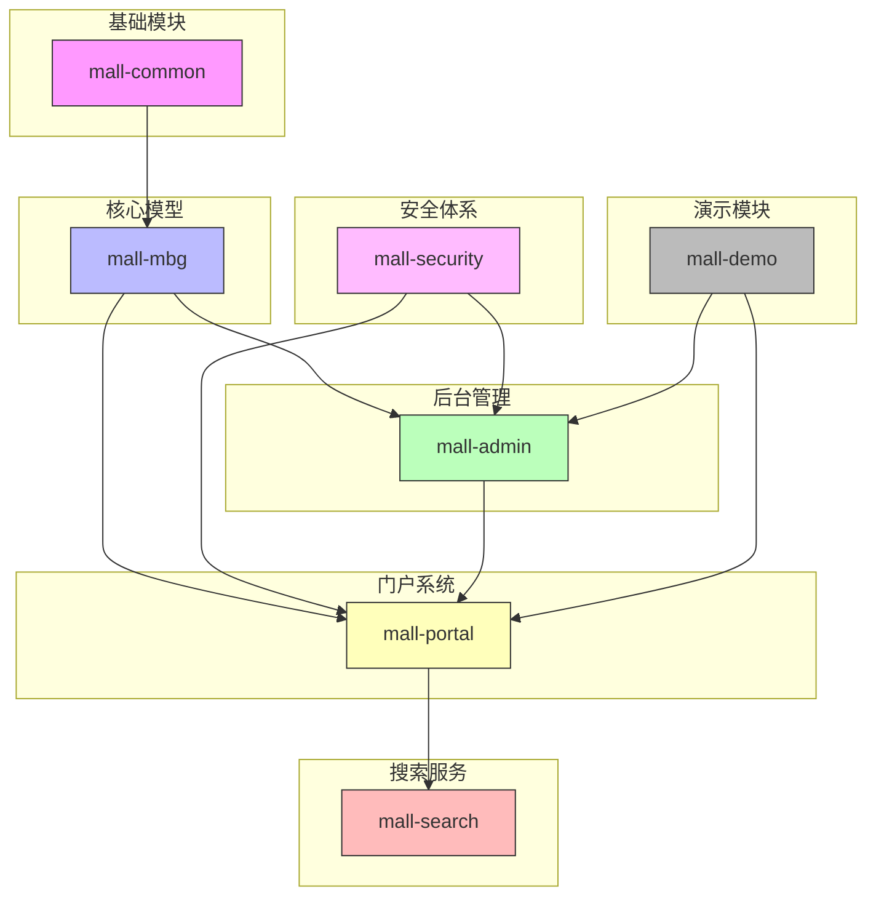

# 项目总体介绍

## 1. 项目介绍

本项目旨在构建一个全面且模块化的电商系统，涵盖从基础设施到前端门户的各个业务层面。通过整合多个核心模块，如基础配置管理、数据模型生成、安全认证以及后台和门户系统，确保系统具备高度的可维护性和扩展性。项目依托于先进技术框架，提供统一规范的接口响应和异常管理机制，保障系统的稳定运行。

项目的主要目标是实现一个功能完备的商城平台，支持商品管理、订单处理、权限控制、促销活动及会员服务等核心业务。通过引入基于Spring Security的安全体系及动态权限管理，提升系统的安全性与灵活性。同时，利用代码自动生成技术标准化数据访问层，降低开发成本，提高开发效率。

该系统集成了高效的搜索模块，采用Elasticsearch实现商品的快速检索和索引管理，满足用户多样化的搜索需求。门户系统模块和后台管理模块协同工作，分别负责前端用户交互和后台业务处理，确保业务流程的顺畅与数据的一致。整体架构设计注重模块内聚与解耦，支持异步处理和日志采集，提升系统性能和监控能力。

## 2. 项目模块架构

### 2.1 mall-common基础模块

*对应目录: mall-common/src/main/java/com/macro/mall/common/, mall-common/src/main/java/com/macro/mall/common/api/, mall-common/src/main/java/com/macro/mall/common/exception/, mall-common/src/main/java/com/macro/mall/common/service/, mall-common/src/main/java/com/macro/mall/common/config/, mall-common/src/main/java/com/macro/mall/common/domain/, mall-common/src/main/java/com/macro/mall/common/log/*

#### 2.1.1 设计目的

本模块旨在提供项目的**通用基础设施支持**，包括统一的配置管理、接口响应规范、异常管理、日志采集及Redis服务等，确保各业务模块的**统一规范与高复用性**。

#### 2.1.2 核心功能

实现了基础配置加载、标准化接口响应结构定义、异常捕获与处理机制、日志采集与管理功能，以及对Redis缓存服务的统一封装。

### 2.2 mall-mbg代码生成与数据模型模块

*对应目录: mall-mbg/src/main/java/com/macro/mall/model/, mall-mbg/src/main/java/com/macro/mall/mapper/*

#### 2.2.1 设计目的

本模块封装了电商系统核心业务的数据模型及其关联关系，旨在通过基于MyBatis的代码生成工具，实现数据访问层的**标准化和高效维护**。

#### 2.2.2 核心功能

提供电商业务模型定义、自动生成Mapper接口及对应的SQL映射文件，支持统一的数据访问操作规范。

### 2.3 mall-security安全模块

*对应目录: mall-security/src/main/java/com/macro/mall/security/, mall-security/src/main/java/com/macro/mall/security/component/, mall-security/src/main/java/com/macro/mall/security/config/, mall-security/src/main/java/com/macro/mall/security/util/, mall-security/src/main/java/com/macro/mall/security/aspect/, mall-security/src/main/java/com/macro/mall/security/annotation/*

#### 2.3.1 设计目的

构建基于Spring Security的安全认证与权限控制体系，提升系统整体的**安全性和灵活性**。

#### 2.3.2 核心功能

实现JWT认证机制、动态权限管理、安全异常统一处理及缓存异常监控，保障系统的访问安全与权限细粒度控制。

### 2.4 mall-admin后台管理模块

*对应目录: mall-admin/src/main/java/com/macro/mall/dao/, mall-admin/src/main/java/com/macro/mall/dto/, mall-admin/src/main/java/com/macro/mall/validator/, mall-admin/src/main/java/com/macro/mall/config/, mall-admin/src/main/java/com/macro/mall/controller/, mall-admin/src/main/java/com/macro/mall/service/, mall-admin/src/main/java/com/macro/mall/service/impl/, mall-admin/src/main/java/com/macro/mall/bo/*

#### 2.4.1 设计目的

实现后台管理系统的核心业务功能，支持高内聚与模块化管理，满足商品、订单、权限、促销、会员及内容推荐等业务需求。

#### 2.4.2 核心功能

提供后台配置管理、数据访问、业务逻辑实现、接口控制及数据传输，涵盖商品管理、订单处理、用户权限控制、促销活动及会员管理等。

### 2.5 mall-portal门户系统模块

*对应目录: mall-portal/src/main/java/com/macro/mall/portal/domain/, mall-portal/src/main/java/com/macro/mall/portal/repository/, mall-portal/src/main/java/com/macro/mall/portal/config/, mall-portal/src/main/java/com/macro/mall/portal/component/, mall-portal/src/main/java/com/macro/mall/portal/controller/, mall-portal/src/main/java/com/macro/mall/portal/dao/, mall-portal/src/main/java/com/macro/mall/portal/service/, mall-portal/src/main/java/com/macro/mall/portal/service/impl/, mall-portal/src/main/java/com/macro/mall/portal/util/*

#### 2.5.1 设计目的

构建商城门户系统全栈体系，满足前端核心业务需求，支持会员、订单、支付、促销及内容展示。

#### 2.5.2 核心功能

实现领域模型设计、配置管理、业务服务、数据访问、REST接口及异步组件，保障门户系统功能的完整与高效。

### 2.6 mall-search搜索模块

*对应目录: mall-search/src/main/java/com/macro/mall/search/service/, mall-search/src/main/java/com/macro/mall/search/domain/, mall-search/src/main/java/com/macro/mall/search/config/, mall-search/src/main/java/com/macro/mall/search/dao/, mall-search/src/main/java/com/macro/mall/search/repository/, mall-search/src/main/java/com/macro/mall/search/controller/*

#### 2.6.1 设计目的

实现基于Elasticsearch的商品搜索服务，提供高效灵活的搜索及索引管理能力。

#### 2.6.2 核心功能

包含数据结构定义、数据访问层、业务逻辑处理及系统配置，支持商品搜索的快速响应与精准匹配。

### 2.7 mall-demo演示模块

*对应目录: mall-demo/src/main/java/com/macro/mall/demo/config/, mall-demo/src/main/java/com/macro/mall/demo/validator/, mall-demo/src/main/java/com/macro/mall/demo/controller/, mall-demo/src/main/java/com/macro/mall/demo/service/, mall-demo/src/main/java/com/macro/mall/demo/service/impl/*

#### 2.7.1 设计目的

基于Spring Boot，展示和验证商城系统主要功能的实现方式与使用效果。

#### 2.7.2 核心功能

提供配置管理、业务服务、验证注解及REST控制器，作为系统功能的演示和测试平台。

### 2.8 模块架构关系图

本项目的模块架构采用**分层与职责明确的设计**，基础模块mall-common提供统一基础设施支持，核心数据模型由mall-mbg定义。安全模块mall-security为系统提供安全保障。后台管理模块mall-admin负责业务管理与控制，门户系统mall-portal面向前端用户提供业务接口。搜索模块mall-search作为独立服务支持高效商品检索。演示模块mall-demo用于功能展示与验证。模块之间通过清晰的接口和依赖关系协同工作，保证系统的可维护性和扩展性。

